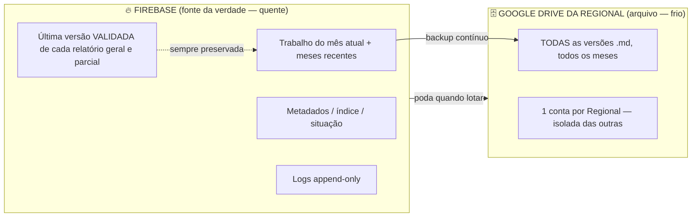

# MAPA — Armazenamento, Retenção, Recuperação e Editor de Checklist
## Documento de análise e desenho (v1 — 20/07/2026) · complementa o MAPA_PERMISSOES_RELATORIOS_v1

> **É desenho, não código.** Consolida as decisões novas do dono (20/07/2026): fonte da verdade
> no Firebase com gestão de cota + backup no Drive da Regional; retenção variável (6 meses a 2 anos);
> alertas de espaço; recuperação do superusuário; e o **editor de checklist** (partes/seções/itens).

---

## 1. Estimativa de capacidade (a pergunta-chave do dono)

**Cota grátis do Firebase Realtime Database ≈ 1 GB armazenado** (e 10 GB/mês de download).
Estimando o tamanho de dados por **ponto de atendimento por mês** (checklist + fechamento +
relatórios .md com versões + logs), em três cenários:

| Escala | enxuto (~50 KB) | médio (~100 KB) | pesado (~200 KB) |
|---|---|---|---|
| **1 RML (25 pontos)** — 2 anos | 0,03 GB | 0,1 GB | 0,1 GB |
| **1 Regional (750 pontos)** — 2 anos | 0,9 GB | 1,7 GB | 3,4 GB |
| **Estadual (20×30×25 = 15.000)** — 2 anos | 17 GB | 34 GB | 69 GB |
| **Estadual ×4 (60.000)** — 2 anos | 69 GB | 137 GB | 275 GB |

### Conclusão honesta
- ✅ **Uma RML, ou poucos pontos:** cabe folgado no Firebase grátis por 2 anos. Sem problema.
- ⚠️ **Uma Regional inteira:** passa de 1 GB em algum ponto entre ~9 meses e ~2 anos. Precisa
  **arquivar** parte no Drive.
- ❌ **Estadual (e além):** **impossível** guardar tudo só no Firebase grátis — falta de **17× a 275×**
  o espaço. Aqui o **backup no Drive da Regional é obrigatório**, com **poda** do Firebase.

> Portanto: sua intuição estava certa. A resposta não é "só Firebase" nem "só Drive", e sim
> **armazenamento em dois níveis** (quente + frio), descrito abaixo.

---

## 2. Arquitetura de armazenamento reformulada (dois níveis)



### Regras (do dono, refinadas)
1. **Firebase = fonte da verdade** do trabalho corrente e do que o sistema mostra na tela.
2. **Drive da Regional = backup/arquivo** de TODA a documentação (todas as versões .md). É uma
   conta **da Regional** (ou da administração local, que tem a guarda física), **não** pessoal.
   Cada Regional guarda **apenas os seus** relatórios (isolamento).
3. **Poda automática:** quando o uso do Firebase chegar a **95%** de um **orçamento configurável**,
   o sistema (a) confirma que o backup no Drive está **atualizado**, depois (b) remove os dados
   **mais antigos** até voltar a **50%** — **sempre preservando no Firebase a última versão
   validada** de cada relatório **geral e parcial** de cada mês. Ou seja: o histórico completo vai
   para o Drive; no Firebase fica sempre "o mais recente e válido" para não sumir da tela.
4. **Retenção variável:** de **6 meses a 2 anos** (configurável pelo superusuário/regional).
   Passado o prazo, o Firebase mantém só a última versão; o Drive mantém o histórico enquanto houver espaço.
5. **Alertas de espaço aos administradores:** em **50%, 75%, 90%, 95%** (e 98% crítico) do orçamento.
6. **PDF nunca é armazenado** — sempre gerado na hora a partir do .md. **Reimpressão não gera versão.**

### Custódia e responsabilidade (do dono)
- A **administração local** tem a guarda física dos documentos → é a **responsável** e a dona
  natural do Drive de backup da sua área. A **Regional** orienta e coordena.
- **Todos os usuários**, mesmo do menor nível, são responsáveis pela informação que lançam.
- **Segurança forte no digital** (Security Rules + isolamento por localidade); o físico já tem
  seus próprios controles.

### ⚠️ Ponto técnico honesto (Drive)
Ler/escrever no Drive exige o **Google Apps Script** (grátis, já previsto) ou OAuth. Como agora é
**uma conta por Regional** (e não dezenas de pessoais), isso fica **viável e gerenciável** — foi o
que destravou a ideia. A limpeza automática dos 6 meses–2 anos também roda por Apps Script agendado.

---

## 3. Recuperação de acesso do superusuário

> Realidade: como o app roda no navegador, **não** há um cofre de senhas próprio. A base é o
> **login Google + Firebase Auth**. Proponho 3 camadas, da mais forte para a de emergência:

1. **Camada 1 — Conta Google com verificação em 2 etapas (2FA).** É a proteção mais forte e
   **gratuita**. Recomendação: exigir/orientar 2FA na conta Google do superusuário. A própria
   recuperação de conta do Google é a 1ª linha se ele perder acesso.
2. **Camada 2 — Segredo de recuperação.** Um código/senha de recuperação definido pelo superusuário,
   guardado **apenas como "impressão digital" (hash)** no Firebase (nunca o texto puro). Serve para
   provar identidade ao promover um novo superusuário. *(Caveat honesto: em app client-side isso é
   proteção média, não perfeita; por isso vem depois do 2FA.)*
3. **Camada 3 — Superusuários de emergência (break-glass).** O sistema mantém **2 indicados
   automáticos**: os **dois supervisores com maior volume de trabalho nos últimos 3 meses**. Se o
   superusuário sumir, esses dois, **em conjunto** (os dois confirmando), podem promover um novo
   superusuário. Exigir os **dois juntos** evita golpe de um só.
> Toda recuperação/promoção gera **registro no log append-only**.

---

## 4. Editor de Checklist (resolve ARQ-01) — o superusuário edita tudo

Hoje as 14 seções e 90 itens estão **fixos no código**. O objetivo: o superusuário **cria, edita,
renomeia, remove e reordena** partes, seções e itens — por tela, a qualquer tempo. Passa a morar em
`/appConfig/checklistDef` no Firebase, com **semente** = `checklist_def.json` (na raiz) e fallback
no código. Já criei os arquivos `CHECKLIST_CONTEUDO.md` (legível) e `checklist_def.json` (estruturado).

### 4.1 Três coisas que você NÃO pediu, mas são essenciais (senão corrompe o histórico)
1. **IDs estáveis e imutáveis.** Cada item tem um **ID interno fixo** (ex.: `it_a1b2`), separado do
   **número visível** (1.1, 1.2) e da **ordem**. Reordenar ou renumerar muda a exibição, **não** o
   ID. Isso é vital porque os relatórios antigos guardam respostas **por ID** — sem isso, reorganizar
   o checklist embaralharia respostas de meses passados.
2. **Versão da definição + "vale a partir de".** Editar o checklist cria uma **nova versão** da
   definição, que vale para os **meses futuros**. Meses já fechados guardam a versão que usaram —
   **nunca reescrevemos o passado**. Cada checklist mensal anota qual versão da definição usou.
3. **Arquivar em vez de apagar (soft-delete).** Remover um item não destrói respostas antigas: o item
   vira **"descontinuado"** (some dos novos meses, mas o histórico continua íntegro e legível).

### 4.2 Modelo de dados (checklistDef)
```
/appConfig/checklistDef
  version, updatedAt, updatedBy, status(rascunho|publicado)
  parts[]  → { id, nome, ordem }
  sections[] → { id, partId, titulo, ordem, momentoPadrão, visibilidadePadrão }
  items[]  → { id, sectionId, numero, momento, texto, orientação?, ordem, ativo }
```

### 4.3 Como o superusuário edita (UX — sóbrio, moderno, com requinte)
- **Árvore** Partes → Seções → Itens, expansível.
- **Reordenar:** por setas ▲▼ (confiável) — e, como evolução, **arrastar-e-soltar** (mais elegante).
- **Renomear / editar:** clique no texto → edita ali mesmo (inline), com salvar/cancelar.
- **Criar:** botões "+ Parte", "+ Seção", "+ Item" no nível certo.
- **Remover:** com **aviso de impacto** ("este item tem respostas em N relatórios; será arquivado,
  não apagado").
- **Rascunho → Publicar:** as edições ficam em rascunho e só valem quando o superusuário **publica**
  (evita usuários pegarem um checklist meio-editado). Publicar **incrementa a versão**.
- **Pré-visualizar** o checklist como o usuário verá, antes de publicar.

### 4.4 Extras sugeridos (provável necessidade futura)
- **Orientação por item** (texto/vídeo/link) — semente do futuro "Sistema de Orientação aos
  Trabalhos" (ARQ-06). O editor já deixa o campo pronto.
- **Importar/exportar** a definição (o próprio `checklist_def.json`) — para editar em massa,
  versionar, ou compartilhar entre instalações.
- **Validações**: número único por seção, sem seção vazia, sem item órfão.
- **Histórico de mudanças** da definição (quem mudou o quê e quando) — no log append-only.
- **Momento e criticidade** editáveis por item; filtro/etiquetas por momento.

---

## 5. Princípio de design (tom de TODO o sistema)
Sóbrio, profissional, moderno, com requinte — como ficou o cabeçalho e a identificação do relatório.
Isso vira **regra de UX**: espaçamento generoso, paleta institucional (azul CCB + cinzas), tipografia
limpa, estados claros, e **nada de "clica e nada acontece"** (todo erro é visível e específico).

---

## 6. Decisões pendentes (para fechar o desenho desta parte)
1. **Orçamento do Firebase**: definir o "teto" (ex.: 0,8 GB) que dispara alertas e poda — concorda?
2. **Quem é dono do Drive de backup:** a **Regional** ou a **administração local**? (Você indicou a
   local como responsável pela guarda; a Regional coordena.) Qual das duas hospeda a conta Drive?
3. **Retenção padrão** dentro da faixa 6–24 meses (sugiro **12 meses** como padrão inicial).
4. **2FA obrigatório** para superusuário e admins (recomendo **sim**).
5. **Editor de checklist:** reordenar começa por **setas ▲▼** (recomendo) e arrastar-soltar depois?

> Continuamos em **modo desenho** (sem mexer no código do sistema). Quando o desenho geral estiver
> fechado, voltamos ao início e implementamos fase a fase, testando — com baixo risco de reviravolta.
