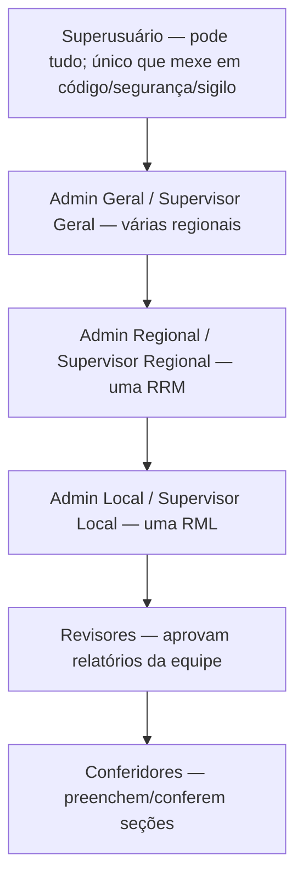
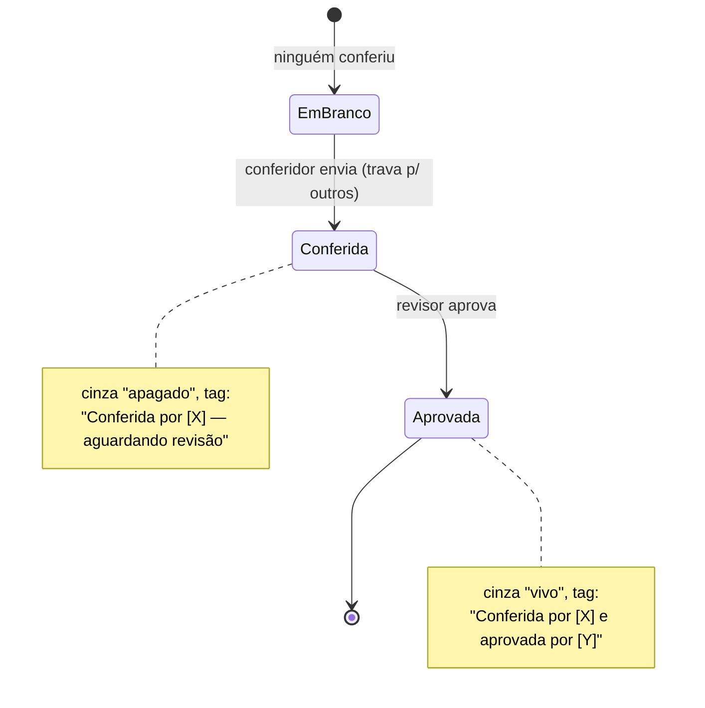
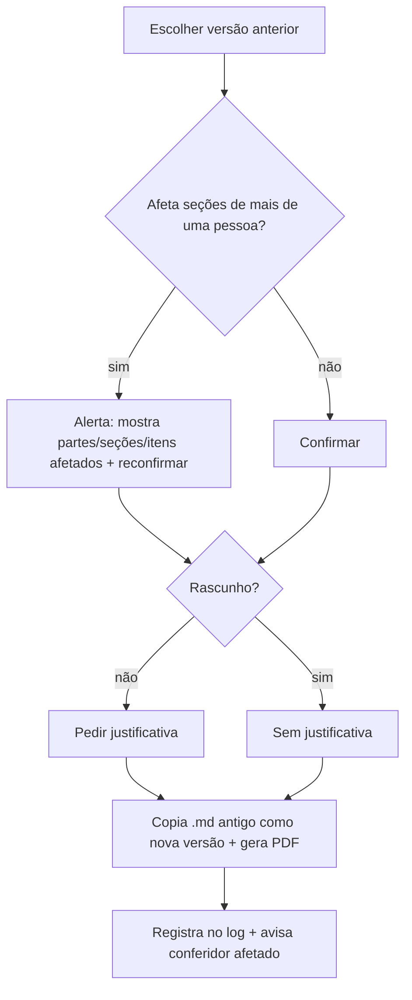

# MAPA INTEGRATIVO — Permissões, Relatórios por Seção e Armazenamento
## Documento de análise e desenho (v1 — 20/07/2026)

> **O que é este documento:** uma leitura organizada de TUDO o que o dono descreveu sobre
> hierarquia, colaboração por seção, armazenamento e supervisão — com análise crítica,
> simplificações, alertas honestos e um roteiro realista. **É desenho, não implementação.**
> Serve para alinharmos antes de escrever qualquer código.
>
> **Para o dono (leigo):** leia a Parte 0 e a Parte 7 (decisões). O resto é o "porquê".

---

## 0. Como ler (resumo em 6 linhas)

Você descreveu, na prática, **três sistemas novos** entrelaçados: (1) uma **hierarquia de
pessoas e permissões** por área (local/regional/geral); (2) um **fluxo colaborativo por
seção** (várias pessoas conferem partes diferentes do mesmo mês, com trava e aprovação por
seção); e (3) um **arquivo de relatórios versionado** (guardar todas as versões por 6 meses,
restaurar com justificativa). Cada um é grande sozinho. Minha função aqui é: **simplificar**,
apontar onde a ideia atual tem **furo de segurança** ou **retrabalho**, propor um modelo
**mais simples e mais forte**, e sugerir o que você ainda não pediu mas vai precisar.

---

## 1. Mapa do que você descreveu (4 domínios)

### A. Pessoas & Permissões (hierarquia)



- **Administrador** = papel de *gestão de pessoas* (inserir usuário, atribuir cargo/função).
- **Supervisor** = papel de *coordenação da produção* (acompanhar/aprovar relatórios da equipe,
  ver logs da sua área). Todo admin nasce supervisor; pode desligar o supervisor (liga-desliga).
- **Só o superusuário** cria admins/supervisores e define o domínio (local/regional/geral).
- **Revisor** e **Conferidor** = papéis de *fluxo do relatório* (não institucionais).

### B. Ciclo de vida do relatório — agora **por seção** (a grande novidade)

- Um usuário pode **ligar/desligar seções** e gerar um **relatório parcial** (só as suas seções).
- Ao enviar um parcial para revisão, aquelas seções **travam** para os outros conferidores.
- Estados visíveis de cada seção (para qualquer usuário da localidade):



- O **relatório geral do mês** = consolidação de todos os parciais.
- Cada seção pode ser conferida por uma pessoa e aprovada por um (ou vários) revisores.

### C. Armazenamento & versões

- Guardar **.md** do relatório geral e de cada parcial, **e de cada versão**.
- **.pdf** só da versão mais recente (substituído a cada evolução). Reimpressões **não** geram versão.
- **Retenção:** todas as versões por **6 meses**; depois, só a última.
- **Restauração:** copia o .md desejado → vira a "versão mais recente" → gera novo PDF; não apaga
  os .md antigos; exige **justificativa** (menos em rascunho); **alertas** quando afeta seções de
  mais de uma pessoa; conferidor só restaura o que **ele** conferiu; revisor/supervisor podem mais.

### D. Logs & supervisão

- Supervisor tem página com **logs de acesso** e **logs de relatórios** da sua área.
- Tabela paginada (10–100 linhas), cada linha = um mês de referência, abre o relatório mais atual.
- "Ver como" (impersonation): um nível maior pode operar como um menor (supervisor regional →
  local → revisor → conferidor).

---

## 2. Análise crítica — a sua necessidade real, tensões e riscos

### 2.1 ⚠️ "Segurança de verdade" ≠ "esconder o botão"
Hoje o sistema é **100% no navegador** (HTML no GitHub Pages + Firebase). Qualquer checagem de
permissão feita no navegador **pode ser burlada** por quem entende de computador — some com a
tela, mas os **dados continuam acessíveis**. A ÚNICA barreira real são as **Security Rules do
Firebase** (regras no servidor do Google) e as permissões de compartilhamento do Google Drive.
**Conclusão:** sua exigência "conferidor nunca vê outra localidade" **só é cumprida de verdade se
for escrita nas Security Rules do Firebase** — não basta a interface. Isso molda todo o desenho.

### 2.2 ⚠️ Google Drive pessoal × acesso do supervisor = conflito sério
Você propôs guardar os relatórios em **Drives pessoais** de cada localidade. Mas você também quer
que **supervisores acessem, à distância, os relatórios da equipe inteira**. Esses dois pedidos
**brigam entre si**:
- Para o supervisor ler dezenas de Drives pessoais, cada dono teria que **autorizar (OAuth) e
  compartilhar** manualmente — frágil, fácil de quebrar, e **furo de sigilo** (uma vez
  compartilhado, some o controle).
- Drives pessoais grátis **não** têm gestão centralizada, log de quem acessou, nem garantia de que
  o arquivo não foi movido/apagado pelo dono.
- Você depende da boa vontade e da organização de cada pessoa manter a pasta certa.

### 2.3 ⭐ Minha recomendação principal (muda o jogo)
**Guarde os relatórios (.md) DENTRO do Firebase**, em nós protegidos por Security Rules, como
**fonte da verdade**. O Google Drive vira **cópia opcional** (backup pessoal), não o cofre.
Por quê isso resolve quase tudo de uma vez:
- **Sigilo real e por localidade** — as Security Rules garantem que conferidor só lê a dele.
- **Acesso do supervisor** — natural: as mesmas regras liberam a visão por área (local/regional).
- **Versões e retenção de 6 meses** — simples, tudo num lugar controlado.
- **Logs** — o Firebase registra e protege os logs; ninguém "some" com eles.
- **Custo** — os .md são texto pequeno; cabem folgado no plano **grátis** do Firebase.
- **PDF** continua gerado **na hora** a partir do .md (como já é hoje) — não precisa guardar PDF.
> Ou seja: **o Drive pessoal deixa de ser obrigatório**. Fica como "☁ salvar uma cópia no meu
> Drive" para quem quiser. Isso elimina o maior risco de segurança e de retrabalho do plano.

### 2.4 Simplificação de papéis e terminologia (tirar redundância)
Você tem 6 nomes circulando (superusuário, admin, supervisor, revisor, conferidor, + níveis).
Proponho enxugar para **2 eixos independentes**:
- **Eixo 1 — Alçada de gestão (quem você é no sistema):** `superusuário` · `admin` · `membro`.
  Cada admin tem um **domínio**: local (RML) / regional (RRM) / geral. Admin traz junto o
  "supervisor" (liga-desliga). Isso cobre PERM-01 a PERM-05 sem 6 caixinhas.
- **Eixo 2 — O que você faz num relatório (por seção):** `conferir` e `aprovar`. São **capacidades**,
  não cargos. Um mesmo membro pode conferir a seção A e aprovar a seção B de outro (respeitada a
  regra de não aprovar a própria conferência). "Conferidor" e "revisor" viram *o papel que a
  pessoa exerce naquela seção*, não um crachá fixo.
> Ganho: menos cadastro, menos confusão, e o "ver como nível menor" fica de graça (é só filtrar o
> que a pessoa enxerga — ela já tem a permissão maior).

---

## 3. Modelo recomendado (mais simples, mais seguro)

### 3.1 Papéis & escopo (no `/users/{uid}`)
- `tipo`: `superusuario` | `admin` | `membro`
- `dominio`: `{ nivel: local|regional|geral, rrmIds:[...], rmaIds:[...] }` (só para admin)
- `supervisorAtivo`: true/false (liga-desliga; default true para admin)
- `cargo`: diacono | irma_piedade | auxiliar · `funcoes[]` · `funcoesRelatorio[]` (CARGOS)

### 3.2 Matriz de permissões (o coração do módulo)
| Ação | Conferidor (membro) | Revisor (membro c/ capacidade) | Admin/Supervisor (no seu domínio) | Superusuário |
|---|---|---|---|---|
| Preencher/conferir seção | ✅ (sua localidade) | ✅ | ✅ | ✅ |
| Aprovar seção | ❌ | ✅ (não a própria conferência) | ✅ | ✅ |
| Ver relatórios | só a sua localidade | equipe dele | toda a área (local/reg/geral) | tudo |
| Reabrir/Restaurar | só o que ele conferiu | o que revisou | o da sua área | tudo |
| Gerir pessoas/cargos | ❌ | ❌ | ✅ (no domínio) | ✅ |
| Criar admin/supervisor | ❌ | ❌ | ❌ | ✅ |
| Código/segurança/sigilo | ❌ | ❌ | ❌ | ✅ |

> Tudo isso é **calculado** por uma função única `pode(usuario, acao, alvo)` e **espelhado nas
> Security Rules** — módulo isolado, como você pediu.

### 3.3 Armazenamento & versões (no Firebase)
```
/reports/{rrm}/{rml}/{ponto}/{AAAA_MM}/
   geral/          → versões do .md geral (v1, v2, ...) + ponteiro "atual"
   secoes/{sec}/   → versões do .md parcial daquela seção + estado + quem conferiu/aprovou
   meta            → código, situação, prazo, conferidores[], aprovadores[]
   log             → append-only: quem fez o quê e quando (inclui restaurações)
```
- Guarda **todas as versões 6 meses**; rotina de limpeza mantém só a última depois (ver 4.4).
- PDF **não** é guardado — gerado na hora a partir do .md "atual".

### 3.4 Restauração (fluxo com salvaguardas)

- Restauração global pode ser **corrigida ponto a ponto**: se uma seção foi revertida por engano,
  dá para reentrar naquela seção e restaurá-la de volta sem mexer no resto.

### 3.5 Estados da seção (reaproveitando o que já existe)
Hoje o fluxo é do checklist inteiro (rascunho→revisão→publicado). O novo é **por seção**. Isso
**substitui** o fluxo atual por um mais fino — é uma mudança grande, mas é a espinha dorsal do
que você quer (colaboração). Cores: em branco → cinza-apagado (aguardando) → cinza-vivo (aprovada).

---

## 4. Coisas que você NÃO pediu, mas quase certamente vai precisar

1. **Log de auditoria imparcial (append-only).** Você citou "logs"; o essencial é que ninguém
   possa **editar/apagar** o log — senão não serve para auditoria. Firebase faz isso com regras.
2. **Avisos/notificações** — "seção enviada para revisão", "sua seção foi aprovada", "alguém
   restaurou uma seção sua". Sem isso, ninguém sabe que precisa agir. (E-mail via Apps Script.)
3. **Recuperação do superusuário** — se você perder a conta Google, ninguém administra. Precisa
   de um plano (2º superusuário de emergência, ou processo de recuperação). **Crítico.**
4. **Limpeza automática dos 6 meses** — alguém/algo precisa rodar a exclusão. Sem servidor pago,
   isso vira uma rotina que roda quando alguém abre o sistema, ou um Apps Script agendado.
5. **LGPD / dados sensíveis** — há dados financeiros e pessoais. Vale definir: quem pode ver o quê,
   por quanto tempo guardamos, e como apagar a pedido. (Você já intui isso — "dados sensíveis".)
6. **Bloqueio de edição simultânea** — dois conferidores na mesma seção. Já há "presença"; falta a
   trava por seção (que o seu próprio fluxo B já resolve).
7. **Exportação/backup total** — baixar tudo periodicamente, caso o Firebase gratuito falhe.
8. **Modo offline mínimo / aviso de conexão** — o dia 20 é prazo; se cair a internet, avisar.

---

## 5. Riscos e limitações honestas

- **Escopo.** Somado ao que já existe, isto é praticamente **um aplicativo novo por dentro**. Não é
  "mais uma rodada" — são **muitas** rodadas. Feito aos poucos, dá; de uma vez, quebra.
- **Conta gratuita (Firebase Spark).** Aguenta bem texto (.md) e uso de uma regional. Se o uso
  crescer muito (muitas regionais, muitos acessos), pode bater limite. Monitorável.
- **Sem servidor próprio** = algumas coisas (limpeza dos 6 meses, e-mails, cópia no Drive) dependem
  do **Google Apps Script** (grátis) já previsto no projeto — precisa ser configurado.
- **"Ver como nível menor"** é útil, mas adiciona complexidade de teste; sugiro deixar para depois.

---

## 6. Roteiro proposto (do essencial ao avançado)

> Regra de ouro: entregar **valor cedo**, cada fase testável, sem quebrar o que funciona.

- **Fase P0 — Fundação de permissões (MVP seguro).** Módulo `pode()` isolado + `tipo/dominio` no
  usuário + **Security Rules por localidade** (o item mais importante de sigilo). Migra o
  `isSiteAdmin/isSuperUser` atual. *Sem UI nova ainda.*
- **Fase P1 — CARGOS** (as 5 sub-rodadas já planejadas), apoiado no `pode()`.
- **Fase P2 — Fluxo por seção** (ligar/desligar seções, travar, estados/cores/tags, parcial +
  geral). É o maior módulo.
- **Fase P3 — Arquivo no Firebase** (versões, retenção 6 meses, restauração com salvaguardas).
- **Fase P4 — Páginas de supervisão** (tabela de logs paginada, ver relatórios da área).
- **Fase P5 — Extras** (notificações, "ver como", cópia no Drive, limpeza automática).

---

## 7. Decisões que preciso de você (antes de começar a P0)

1. **Fonte da verdade = Firebase (recomendado) ou Drive pessoal?** (2.3) — muda todo o desenho.
   Recomendo Firebase; Drive como cópia opcional.
2. **Aceita a simplificação de papéis** (2 eixos: gestão × capacidade por seção)? (2.4)
3. **Aceita o roteiro em fases** (P0 segurança primeiro, extras por último)?
4. **Recuperação do superusuário:** quer um **2º superusuário de emergência**? (4.3)
5. **"Ver como nível menor":** entra agora ou fica para a Fase P5?

> Quando você responder essas 5, eu detalho a **Fase P0** (a fundação de segurança) e começamos —
> em sub-rodadas pequenas, cada uma testável, do jeito que vimos funcionando.
