# MANUAL DE FECHAMENTO DA OBRA DA PIEDADE — Documento de Consulta Definitivo
## Tudo o que é obrigatório para um fechamento perfeito · CCB · Regional Coxim-MS

> **Para que serve:** reunir, num só lugar e de forma navegável, **tudo o que precisa acontecer
> para o fechamento mensal da Piedade sair perfeito** — prazos, documentos, conferências,
> conciliações, regras por conta e por processo, itens de checklist e controles anti-erro/fraude.
>
> **Como foi construído (transparência):** confronto de **27 arquivos-fonte** (compilados
> integralmente em `FONTES_FECHAMENTO_PIEDADE_COMPILADO.txt`) com as **fontes primárias**:
> - `FASE5_MapaProcessos_Contas_CCB_Piedade_v1.0.md` — síntese **auditada** do `super_manual_piedade_ccb.md`
>   (198 processos/contas, com citações literais das 24 DOCs);
> - `Plano de Contas Comentado` (DOC-21, jul/2020);
> - Instruções Técnicas oficiais `IT.TES.03` e `IT.TES.05` (jan/2025);
> - anotações de campo/treinamento (Dales, Cristiane) e os 8 fluxos operacionais.
>
> `[NOTA]` O `super_manual_piedade_ccb.md` **bruto** não foi fornecido; ele está representado aqui
> **através do FASE 5** (seu derivado auditado). Se um dia o super manual completo for enviado,
> faremos um **passe final de reconciliação**.
>
> **Convenções:** ⏰ prazo · ✅ obrigatório · ⚠️ atenção/risco · `[CONFLITO]` fontes divergem ·
> `[LACUNA]` falta confirmar. **Nada aqui decide sozinho:** é guia de conferência; a palavra final
> é sempre de um Diácono responsável.

---

## Índice
1. [O ciclo mensal em uma olhada (linha do tempo)](#1-o-ciclo-mensal-em-uma-olhada)
2. [Prazos obrigatórios](#2-prazos-obrigatórios)
3. [Antes do fechamento — pré-requisitos](#3-antes-do-fechamento--pré-requisitos)
4. [Durante o mês — reuniões e ciclo da Ficha C-1](#4-durante-o-mês--reuniões-e-ciclo-da-ficha-c-1)
5. [Conferências e conciliações obrigatórias](#5-conferências-e-conciliações-obrigatórias)
6. [Os documentos obrigatórios do fechamento (e como anexar)](#6-os-documentos-obrigatórios-do-fechamento)
7. [Regras por conta (saldos e contas que zeram)](#7-regras-por-conta)
8. [Regras por processo](#8-regras-por-processo)
9. [Coletas especiais (IT.TES.03) e importação de extrato (IT.TES.05)](#9-coletas-especiais-e-importação-de-extrato)
10. [Itens de checklist do SIGA (4.x / 5.x / 6.x)](#10-itens-de-checklist-do-siga)
11. [Controles anti-erro e anti-fraude](#11-controles-anti-erro-e-anti-fraude)
12. [Plano de contas de Coxim (vivo) + contas-chave](#12-plano-de-contas-de-coxim)
13. [Conflitos e pontos em aberto (confirmar com a equipe)](#13-conflitos-e-pontos-em-aberto)
14. [Mapa de fontes](#14-mapa-de-fontes)

---

## 1. O ciclo mensal em uma olhada

```mermaid
graph LR
  A["Início do mês: inventário lojinha + cadastros"] --> B["Durante o mês: reuniões de atendimento + lançamentos"]
  B --> C["Prestação de contas: C-1 LIQUIDADO→CONFERIDO→BAIXADO + escanear"]
  C --> D["Conciliações: caixa, bancos, aplicações, adiantamentos"]
  D --> E["Reconhecer receitas (todas as Casas de Oração fechadas)"]
  E --> F["Gerar Protocolo, C-9, Balancete + colher assinaturas"]
  F --> G["Fech. Piedade: anexar os 6 documentos + ENCERRAR (até dia 20)"]
  G --> H["Digitalização completa (até dia 30) + entregar Pastas 1–6 à ADM"]
```

## 2. Prazos obrigatórios
| ⏰ Prazo | O que | Fonte |
|---|---|---|
| **Sexta antes do fechamento** | Inventário físico da lojinha ajustado no SIGA | FLUXO 1 |
| **4º dia útil** do mês seguinte | Apuração e conciliação da conta de captação (coletas exterior / Nível Brasil) | IT.TES.03 |
| **Dia 10** do mês seguinte | Repasse de coletas/ofertas ADM → Piedade **e** repasse da Arrecadação Exterior ao Financeiro Brás | FASE5 (DOC-24) · IT.TES.03 |
| **8º dia útil** do mês seguinte | Repasse da Coleta Nível Brasil → Piedade Geral Brás | IT.TES.03 |
| **Dia 20** do mês subsequente | **Fechamento no SIGA** (Tesouraria > Fech. Piedade > Encerrar) | FASE5 (DOC-16/18/24) |
| **Dia 30** do mês subsequente | **Digitalização completa** dos documentos | FASE5 (DOC-18/19) |
| **Até 2 meses** | Prestação de contas de **viagem** (pendência **bloqueia nova viagem**) | FASE5 (DOC-01) · notas_dales |
| **A cada 3 meses** | Inventário **real** do almoxarifado | notas_dales |
| **Mínimo 2×/ano** | Inventário físico (conciliação da conta **1054** é **mensal**) | FASE5 (DOC-21/17) |

## 3. Antes do fechamento — pré-requisitos
✅ **Todas as Casas de Oração agregadas fechadas** — enquanto uma estiver aberta, **não fecha**
(FLUXO 3b; NOTAS_cristiane). `[LACUNA]` descobrir com quem saber qual Casa de Oração está aberta.
✅ **Reconhecer receitas** — o que estiver **vermelho** está pendente; só **confirmar** quando as
Casas de Oração estiverem fechadas (NOTAS_cristiane).
✅ **Emitir, antes de responder o checklist** (FASE5 #002 / DOC-20): **balancete auxiliar** da
Piedade · **Termo de Verificação do Caixa** · **extratos** (conta movimento **e** aplicação) ·
**razão das contas** · **mapa de coletas e ofertas**.
✅ **Inventário da lojinha** ajustado até a sexta anterior (FLUXO 1).
✅ **Cadastros/prontuários** revisados — sem duplicidade; ficha **sempre em nome de batizado(a)**;
se casado(a), **incluir cônjuge**; se esposo batizado, **ficha no nome dele** (FLUXO 1; item 4.21).

## 4. Durante o mês — reuniões e ciclo da Ficha C-1

### 4.1 Reuniões de atendimento
✅ **Três reuniões sempre**, abertas separadamente: **Normal · Sigiloso (GDBRAS) · Fundo Musical**
— mesmo sem atendimento em alguma (item 4.24; notas_dales).
⚠️ **Nunca** duas reuniões abertas ao mesmo tempo; **só agendar** a próxima quando a anterior for
concluída (Orientação Dales jun/26).
✅ Encerramento da reunião: **assinar Ata, Posição Financeira e Lista de Presença** (FLUXO 2).

### 4.2 Ciclo de vida da Ficha C-1 e os 3 carimbos
Ordem **inviolável**: **conferir/lançar → só então carimbar**.
1. **LIQUIDADO** — após conferir e lançar os valores (na emissão do envelope);
2. **CONFERIDO** — após conferir assinaturas, cupons e valores do envelope (retorno);
3. **BAIXADO** — após lançar a prestação de contas no SIGA.
Depois: **escanear** ficha (LIQUIDADA) + envelope (CONFERIDO e BAIXADO) + **DT** (recebida pelo
atendido) → enviar em **Piedade > Reunião > filtros > enviar documentos** (**sempre FICHA,
ENVELOPE e DT**) → **triturar o canhoto na presença das Irmãs** → **deletar os arquivos digitais
do computador local** (FLUXO 2b, 5; NOTAS_cristiane).

### 4.3 Conferência detalhada da C-1 (antes de escanear) — base da auditoria
**Antes: assinatura de 2 ou 3 Diáconos.** Conferir em cada ficha (sempre com dados da **casa do
atendido**):
- **Caso** (Reunião ou Emergência) assinalado; **sempre "caso novo"** (nunca reapresentação);
- **Quem atenderá** (Irmãs/Diácono) assinalado; **data** obrigatória; **nº do prontuário** obrigatório;
- **Estado civil** (se casado, nome do cônjuge); **ficha no nome do esposo se batizado**;
- **Renda:** aluguel/trabalho/previdência; **"Piedade atende mensal" = SEMPRE NÃO**; ganho dos
  **filhos** que moram na casa (somar); **nº de filhos que trabalham**;
- **Valor de momento em VERMELHO** (numérico **e** por extenso) + **assinatura do secretário ou
  presidente** da reunião.
> `[FONTE: NOTAS_fechamento_com_cristiane]`

## 5. Conferências e conciliações obrigatórias
✅ **Termo de Verificação do Caixa** (nome oficial): ao fim do mês, **2 ou 3 Diáconos** conferem o
numerário físico do cofre × contabilidade (Grupo 100), emitem o Termo (modelo **SIGA > Intranet >
InfoCCB**), **mínimo 3 Diáconos assinam**, anexam em **SIGA > Tesouraria > Fech. Piedade > coluna
"Arquivo"**. **Original** → Pasta Nº 1 (Contabilidade); **cópia** → Pasta Nº 4 (Tesouraria). Cofre
**aberto/fechado por 2+ Diáconos juntos**; **sem pendências de documento no caixa** (FASE5 #001).
✅ **Conciliação bancária mensal** de **todos** os bancos e **aplicações** (FASE5 #002; DOC-21).
Após importar extrato, conferir o relatório **TES01701** × extrato de cada conta (IT.TES.05 §8).
✅ **Adiantamentos de viagem (1044/1047):** a **listagem de adiantamentos em aberto** (módulo
Viagens) deve **bater com a contabilidade**; o **relatório de viagens do mês** deve **igualar** as
despesas lançadas (DOC-21).
✅ **Aplicações (10310/10320/10330):** conciliar mensal; rendimentos pelo **regime de competência**.
✅ **Regra de ouro:** **todo lançamento no SIGA precisa de documento assinado** que lhe dê
veracidade — **exceto notas fiscais e cupons, que não se assinam** (notas_dales, plenário).

## 6. Os documentos obrigatórios do fechamento
Anexar **na janela de encerramento** (Tesouraria > Fech. Piedade > competência > Opções > anexar —
de preferência **antes** de encerrar). Consolidação das fontes (manual/FASE5 + FLUXO 3b/5 +
orientações Dales/Cristiane):

| # | Documento | Detalhe / assinatura |
|---|---|---|
| 1 | **Relatório de Viagens** | Mesmo que **vazio** |
| 2 | **Protocolo de Entrega de Documentos** | Assinado por **1 Diácono + 1 da ADM** (mesmo os físicos ficando na Secretaria da Piedade) |
| 3 | **Declarações de Trânsito (DTs)** | De compras/saídas da ADM e transferências a outras casas |
| 4 | **Movimento Financeiro C-9** | **Mínimo 3 Diáconos** |
| 5 | **Reuniões: Ata + Posição Financeira + Lista de Presença** | Das **3** reuniões. ⚠️ **NUNCA** anexar qualquer **listagem de atendidos** (sigilo — conselho fiscal/contadores veem isto) |
| 6 | **Extratos Bancários + Termo(s) de Verificação do Caixa** | **3 assinaturas** de Diáconos; extratos **banco + SIGA consolidados** (verificados) em **um único arquivo** |

**Passo a passo para gerar** (Tesouraria > Relatórios): **Protocolo de Documentos** (ordenado por
lançamentos, imprimir 2 vias) · **Mov. Fin. C-9** · **Balancete** ("Exibir apenas com valores",
código reduzido). Imprimir, **colher assinaturas** e anexar (FASE5; passo_a_passo).
⚠️ **Só libera corretamente após o fechamento total** no sistema (reconhecimento de receitas etc.).
Ao final: **entregar as Pastas 1 a 6 à ADM mediante Protocolo assinado** (FLUXO 5).

## 7. Regras por conta
| Conta | Regra de saldo / obrigação |
|---|---|
| **10010 / 10020 / 10030** (Caixas) | Saldo **sempre devedor ou zero**; Termo de Verificação mensal |
| **Bancos (101) e Aplicações (103)** | Saldo **devedor ou zero**; **conciliar mensalmente** |
| **1040 / 1044 / 1045** (Adiantamentos) | Saldo **devedor ou zero**; manter composição dos em aberto |
| **1046** (Adto reuniões atendimento) | **Sempre zerada** (não pode ser ≠ de zero) |
| **1047** (Adto viagens-cartão) | Pode ser **devedor, credor ou zero** |
| **1054** (Estoque atendimento) | Saldo **devedor ou zero**; conciliar **mensal** |
| **2041** (Depósitos não identificados) | Após **3 meses** sem identificação → baixar como oferta (**C 4011, hist. 099**) |
| **3100** (Atendimentos realizados) | Atendimento **não realizado** → crédito em **3100** |
| **3900** (Transf. estoques entre almoxarifados) | Soma entre almoxarifados = **zero mensalmente** |
> `[FONTE: DOC-21 · CHECKPOINT_E3]`

## 8. Regras por processo

### 8.1 Locomoção local (Diáconos e Irmãs)
Tesouraria > Caixas e Bancos > **Nova Despesa**. Inserir **valor recebido, gasto, devolvido (troco)
e complementação** (reembolso). Se **cupom > adiantamento** e o irmão **abre mão do reembolso**,
lançar como reembolso mesmo → gera **sobra em caixa** (ajustar no Termo de Verificação).
**Conta 10010** · despesa **3026** · **histórico 047** · **fornecedor = CNPJ** · data do documento =
**início da viagem** · retorno = **data do cupom** · pagamento na mesma forma do adiantamento (em
Coxim, **dinheiro**) · **1 cupom = 1 lançamento**. **Não** levam carimbo.
**Assinaturas:** veracidade = o **próprio viajante**; **ciência = mín. 2 Diáconos**. **Locomoção de
Irmã = 4 Diáconos** (3 autorizando + 1 visto do caixa). `[FONTE: notas_dales · FLUXO 4]`

### 8.2 Viagem missionária
Previsão e **transferência para a conta 10020** → emissão do **envelope de viagem** → retorno:
entrega de envelope + comprovantes → SIGA: prestar contas e **baixar adiantamento**. **Baixa DENTRO
do mês da viagem.** Anexar **scan do envelope com carimbo BAIXADO** + **cópia do cupom**.
⚠️ **Adiantamento que cruza o mês:** se feito no fim de um mês mas a viagem começa no seguinte,
**remover o envelope do mês anterior** e lançá-lo **no mês em que a viagem começou** (evita
pendências). `[FONTE: FLUXO 4 · orientacoes_dales_1]`

### 8.3 Almoxarifado / atendimento com materiais
✅ Mesmo que o atendimento seja **só roupas**, precisa de **C-1 aprovada na reunião**; **nunca**
ficha de **emergência** do almoxarifado. Fluxo com materiais: anotar produtos **no verso da C-1** →
reserva → Expedição/Conferir → **emitir DT em 2 vias** (2ª via assinada pela **Irmã/Diácono**; 1ª
via assinada pelo **atendido** ao receber) → mês seguinte, DT + C-1 retornam → lançar envelope com
**valor R$ 0,00 e mercadoria = SIM**. `[FONTE: FLUXO 3 · FLUXO 1a · Orientação Dales]`
`[LACUNA]` confirmar com Dales como fazer **saídas sem reunião** para Sonora/SGO.

### 8.4 Compras e estoque
- **Compras < R$ 300,00:** dispensada a apresentação de **3 orçamentos**/contrato CNS.
- **Cotações** sempre efetuadas e **anexadas** aos documentos fiscais (item 6.5).
- **Cestas básicas:** primeiro lançar em **Produtos e Serviços > Mov. Estoque > + Novo estoque**.
- **Santa Ceia:** compra **exclusiva via Distribuidoras** (Circular 234/2025, a partir 21/07/2025).
- **Estoque máximo: 4 reuniões** por item.
- **Rateio:** quando a NF da Piedade contém itens fora da competência da Piedade (separar).

### 8.5 Transferências — pares espelho (têm que casar)
| Remetente (Despesa) | Receptora (Receita) |
|---|---|
| 3401 Obra Piedade | 4201 Recebidas Obra Piedade |
| 3402 Viagens | 4202 Recebidas Viagens |
| 3406 Assemb./Reuniões | 4206 Recebidas Assemb./Reuniões |
| 3409 Necessidades diversas | 4209 Recebidas Necess. diversas |
| 3410 Materiais Obra Piedade | 4211 De materiais Obra Piedade |

## 9. Coletas especiais e importação de extrato

### 9.1 Coletas especiais — IT.TES.03
- **Fundo Musical:** frutos dos Ensaios Regionais vão ao Fundo Musical (Comunicado 215/2022).
  Depositar na conta de captação; transferir à conta específica **só após o encerramento da
  Tesouraria**. Ensaio na **mesma Administração** → conta transitória **1065**; ensaio em **outra
  Administração** → conta **2085**; **recebimento pela Piedade** → conta **4205** (Transf. Setor
  Musical). Emitir **Mapa de Coletas** (Tesouraria > Relatórios > Mapa Coletas > Fundo Musical).
- **Arrecadação Exterior:** apurar/conciliar a captação até o **4º dia útil**; repassar ao
  **FINANCEIRO BRÁS até o dia 10** (Itaú 341, ag 0534, cc 48491-0, CNPJ 61.526.398/0001-99).
- **Coleta Especial Nível Brasil:** apurar/conciliar até o **4º dia útil**; repassar à **PIEDADE
  GERAL BRÁS até o 8º dia útil** (Bradesco, ag 1416, cc 0209999-3). Anexo do comprovante **obrigatório**.

### 9.2 Importação de extrato bancário — IT.TES.05
- Exportar o extrato do Internet Bank em **.TXT**.
- **Apagar** do arquivo tudo que **não** for entrada de oferta; **lançar manualmente antes**:
  aplicações, rendimentos, estornos, tarifas bancárias, depósitos de coletas.
- **Excluir qualquer valor negativo/de saída** (busca por `;-`). Se sobrar negativo, o SIGA
  **recusa** a importação com erro.
- Importar (Tesouraria > Importação de extrato > Novo > conta de captação > anexar .TXT).
- **Conferir:** conciliar SIGA × extrato; conferir relatório **TES01701** × extrato por conta.
- Dá para **desfazer** (Importação de Extrato > Filtros > selecionar > Opções > Excluir).

## 10. Itens de checklist do SIGA
`[FONTE: Itens_a_serem_observados_e_conferidos_a_posteriori]`
- **4.18** Livro Ata em ordem cronológica; páginas **e** listas de presença **numeradas em sequência**.
- **4.21** Prontuários conferidos regularmente — **sem duplicidade**.
- **4.22** Diáconos/Irmãs **jamais usar cartão pessoal** nos atendimentos.
- **4.24** **Todas** as reuniões registradas no SIGA, **mesmo sem atendimento** (Geral/Sigilo/Música).
- **5.1** Livro de Atas **encadernado em brochura**.
- **5.3** Documentos de **atendimento ao Ministério arquivados separadamente**.
- **6.5** **Cotações** anexadas aos documentos fiscais.
- **6.8** Compras para estoque conforme procedimento; **plaqueta/controle de estoque atualizado**.

## 11. Controles anti-erro e anti-fraude
- **Documento assinado por lançamento** (exceto notas/cupons) — dá veracidade.
- **Segregação de funções (compras):** quem **recebe** ≠ quem **aprova** ≠ quem **paga**.
- **Conta bancária do Grupo Gestor:** movimentação **sempre com 2 Diáconos juntos**.
- **Cheques:** cruzados e nominais ao favorecido; assinados por **2 irmãos, preferencialmente
  Diáconos** (procuração da ADM).
- **Nunca cartão pessoal** nos atendimentos.
- **Sigilo:** jamais anexar **listagem de atendidos** aos documentos que o conselho fiscal vê.
- **Deletar arquivos digitais locais** após o upload ao SIGA (higiene/LGPD).
- **Visto:** quem assina o visto **aparece junto com o responsável** pelo visto.
- **Placar Power BI:** <50 vermelho · ≥50 e <70 amarelo · ≥70 verde.

## 12. Plano de contas de Coxim
**Vivo (em uso):** 100 Caixa — 10010 Obra da Piedade · 10020 Viagens · 10030 Assembleias/Reuniões.
101 Bancos — **10110** BB (Piedade) · **10112** Santander (Piedade) · **10113** Santander (Viagem) ·
**10114** Santander (Música). 103 Aplicações — **10360** Santander (Música) · 2019 Cartão de Crédito ·
2049 Cartão de Débito. **Inativas:** 10120 · 10130.
> ⚠️ `[CONFLITO]` — ver Seção 13. O **texto completo e comentado** de cada conta (função,
> funcionamento, exemplos de lançamento, históricos-padrão) está na fonte **DOC-21** (compilado).

## 13. Conflitos e pontos em aberto
1. ⚠️ `[CONFLITO]` **Contas 10120/10130:** o DOC-21 usa como ativas (bancos Viagens/Assembleias),
   mas **em Coxim estão INATIVAS** (vivas são 10113/10114). **O motor de auditoria deve usar o
   plano de Coxim como verdade.** Confirmar qual conta recebe hoje o movimento de "assembleias".
2. `[LACUNA]` **Semântica de cores no SIGA** (NOTAS_cristiane, aparentemente contraintuitiva):
   *VERDE = reunião encerrada, sem prestação de contas; VERMELHO = prestação feita (baixado)*.
   **Confirmar com a equipe.**
3. `[LACUNA]` **Lista dos "6 documentos"** — o manual (script #1) e as anotações de campo listam
   conjuntos **quase** idênticos. A Seção 6 consolidou; **validar** a versão final com a equipe.
4. `[LACUNA]` **Como saber qual Casa de Oração está aberta** (impede o fechamento) — descobrir o
   caminho/responsável (Power BI > Controle de Fechamentos Mensais foi citado).
5. `[LACUNA]` **Termo de Verificação do Caixa em atraso:** gerar para **todas as contas de
   jul/2025 a fev/2026** (backlog citado pelo Dales).
6. `[LACUNA]` **Diáconos que assinam (Coxim):** adalto, nilson, joão — confirmar papéis atuais.
7. `[NOTA]` **Super manual bruto** não fornecido; reconciliação final pendente quando disponível.

## 14. Mapa de fontes
- **Compilado integral (sem resumo):** `FONTES_FECHAMENTO_PIEDADE_COMPILADO.txt` (27 arquivos).
- **Documento-mestre (auditado):** `FASE5_MapaProcessos_Contas_CCB_Piedade_v1.0.md` (198 itens).
- **Plano de contas comentado:** DOC-21 (jul/2020).
- **Instruções técnicas oficiais:** IT.TES.03 (coletas especiais) · IT.TES.05 (importação de extrato).
- **Fluxos operacionais:** FLUXO 1, 1a, 2, 2b, 3, 3b, 4, 5.
- **Anotações de campo/treinamento:** notas_dales · NOTAS_cristiane · conv_critiane · passo_a_passo ·
  Orientação Dales jun/26 · orientacoes_dales_1/2 · Itens a conferir a posteriori · compra_baixo_valor.
- **Rascunho organizado (companheiro):** `FECHAMENTO_PIEDADE_WIP.md`.

---
> **Este é um documento vivo.** À medida que a equipe confirmar os pontos da Seção 13 (e se o super
> manual bruto for enviado), ele é atualizado. Serve tanto de **guia humano** de fechamento quanto
> de **régua para o Motor de Conciliação e Auditoria** (`MAPA_CONCILIACAO_AUDITORIA_v1.md`).
