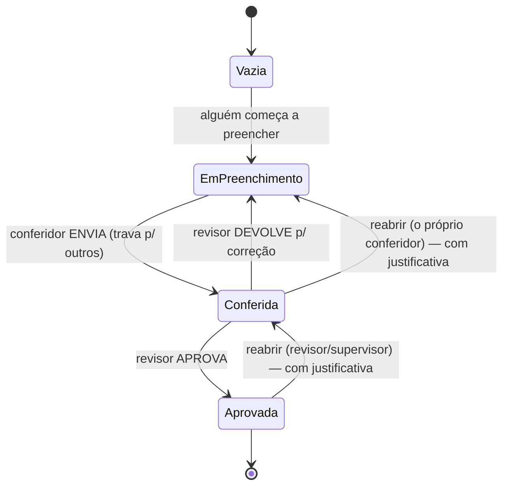
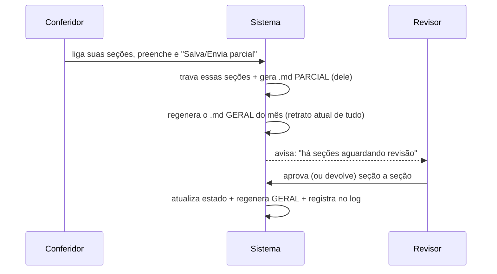

# MAPA — Fluxo Colaborativo por Seção (relatórios parciais × geral)
## Documento de análise e desenho (v1 — 20/07/2026) · o "miolo" do sistema

> **É desenho, não código.** Descreve como várias pessoas preenchem partes diferentes do mesmo
> mês, com trava, conferência e aprovação **por seção**, gerando **relatórios parciais** que se
> consolidam num **relatório geral**. Amarra permissões (MAPA_PERMISSOES) e armazenamento
> (MAPA_ARMAZENAMENTO). Substitui o fluxo atual (rascunho→revisão→publicado do checklist inteiro).

---

## 1. Ideia central (em uma frase)
O relatório do mês **não é um bloco único**: é a **soma de seções**, e **cada seção tem seu próprio
ciclo de vida e seu dono** (quem a conferiu). O **relatório geral** é sempre o retrato atual de todas
as seções juntas; os **parciais** são recortes (uma pessoa, um conjunto de seções).

## 2. Dois conceitos que NÃO se confundem
- **Seção "não se aplica" (oculta)** — configurada pelo Admin por ponto (já existe: `hiddenSections`).
  Ex.: um ponto que não tem Lojinha não vê a seção do Almoxarifado. Isso é **fixo** para o ponto.
- **Escopo de trabalho do usuário** — quais seções *aplicáveis* a pessoa vai preencher **agora**
  (liga/desliga para gerar o **parcial** dela). Isso é **por pessoa/sessão**, não do ponto.
> São coisas diferentes: uma esconde o que não existe; a outra organiza quem faz o quê.

---

## 3. Ciclo de vida de uma SEÇÃO (máquina de estados)

### Estados, cores e etiquetas (tom sóbrio/moderno)
| Estado | Cor/visual | Etiqueta | Quem edita |
|---|---|---|---|
| **Vazia** | neutra (clara), sem destaque | — (campo em branco) | qualquer conferidor da localidade |
| **Em preenchimento** | cor viva normal (como hoje) | "Em preenchimento por [X]" | conferidores da localidade |
| **Conferida (aguardando)** | **cinza dessaturado/frio** + 🔒 | "Conferida por [X] — aguardando revisão" | só [X] (travada p/ outros) |
| **Aprovada** | **cinza de tom mais vivo/quente** + ✓ | "Conferida por [X] · aprovada por [Y]" | ninguém (bloqueada, concluída) |

> **Todos** os usuários da localidade **enxergam** o estado e as etiquetas (transparência), mas só
> quem tem permissão **age**. Conferidor não vê localidade de outros (regra de sigilo — MAPA_PERMISSOES).

---

## 4. Quem faz o quê (amarra com permissões)
- **Conferir** uma seção: conferidor da **sua** localidade. Ao **enviar**, trava a seção para os demais.
- **Aprovar / devolver** uma seção: revisor (não pode aprovar a **própria** conferência — trava
  anti-autoaprovação). Cada seção pode ser aprovada por um revisor **diferente**; um revisor pode
  aprovar várias.
- **Reabrir**: conferidor só o que **ele** conferiu; revisor o que revisou; supervisor o da sua área;
  superusuário tudo. Reabertura (fora de rascunho) **exige justificativa** e vai ao **log**.
- **Supervisor**: acompanha e vê tudo da sua área; coordena a equipe de revisores.

---

## 5. Parcial × Geral (como se consolidam)

- Ao salvar um parcial: (a) as seções dele **travam**; (b) gera o **.md parcial**; (c) **regenera o
  geral** (versão completa do mês). **PDF** é gerado na hora; **1ª impressão salva no Drive**;
  **reimpressão não gera versão**.
- **Situação do mês** (rótulo): *Vazio · Em preenchimento · Parcialmente conferido · Aguardando
  revisão · Parcialmente aprovado · Concluído (tudo aprovado)*.

---

## 6. Página de Arquivo/Logs (tabela de meses)
Cada linha: **[MÊS DE REFERÊNCIA] · [SITUAÇÃO] · [🔍 abrir mês]**. Paginação **10–100 linhas**.
Abrindo o mês:
- **(a) Metadados:** Mês · Fechamento até · Código · Situação · Conferido por (lista) · Aprovado por (lista).
- **(a) Relatórios (links):**
  - **Geral (nível 0)** — consolidado.
  - **Por Parte (nível 1)** — ACPI-REG, EAPI-REG (agrupa as seções da parte).
  - **Por Seção (nível 2)** — cada seção com seus itens.
- **(b) Ações (conforme permissão/escopo):** **Reabrir** · **Aprovar** · **Ver**.
- **Quem vê o quê:**
  - **Conferidor:** só o **geral da sua localidade** e os **parciais já aprovados** da sua localidade.
    Seção não conferida = **campo em branco**; conferida e não aprovada = **"aguardando aprovação"**.
  - **Revisor:** além disso, os que **aguardam** avaliação na equipe dele.
  - **Supervisor/Admin/Superusuário:** conforme o domínio (local/regional/geral).

---

## 7. Restauração (recap — detalhe pleno no MAPA_ARMAZENAMENTO)
- Conferidor restaura **só o que ele conferiu**; revisor/supervisor podem mais.
- Restaurar **fora de rascunho** exige **justificativa**; **alerta** quando afeta seções de mais de
  uma pessoa (mostra partes/seções/itens); reversão global pode ser **corrigida por seção** depois.
- Toda restauração vai ao **log** e **avisa** o conferidor afetado.

---

## 8. Coisas que infiro que você vai precisar (novas sugestões)
1. **Devolver para correção (rejeitar com nota).** Você citou "aprovar"; um fluxo de revisão sério
   também precisa **devolver** a seção ao conferidor com um comentário do porquê. Já incluí no estado.
2. **Painel de progresso do mês.** Uma barra "X de 14 seções aprovadas", com destaque para o **prazo
   dia 20** — para o supervisor ver de relance o que falta.
3. **Reatribuição em caso de abandono.** Se alguém trava uma seção e some, o admin/supervisor pode
   **reabrir/reatribuir** (com log) — senão a seção fica presa.
4. **Notificações** (e-mail via Apps Script): seção enviada → avisa revisor; aprovada/devolvida →
   avisa conferidor; reaberta/restaurada → avisa afetados.
5. **Aprovação em lote** (um revisor aprova várias seções de uma vez, com a mesma trava anti-autoaprovação).
6. **Comentários por item/seção** (histórico de conversa) — útil para conferência à distância.
7. **Trava anti-conflito** já resolvida pelo próprio fluxo (seção enviada = só o dono edita).

---

## 9. Impacto no que já existe (honestidade)
- **Substitui** o fluxo atual (rascunho→revisão→publicado do checklist inteiro) por **estado por
  seção**. É a mudança mais profunda do sistema — mexe na tela do checklist, no relatório e no
  armazenamento. Por isso será feita **em várias sub-rodadas pequenas** quando chegarmos à
  implementação.
- **Aproveita** o que já temos: "Atribuir seção", presença online, operações em bloco por seção,
  relatório .md/PDF, e a identificação nova.

---

## 10. Decisões — FECHADAS pelo dono (20/07/2026)
1. ✅ **Uma seção tem UM conferidor por vez** (o que enviou).
2. ✅ **Aprovação:** **1 revisor** por padrão; poder exigir mais de um fica configurável no futuro.
3. ✅ **"Devolver para correção"** entra desde já no desenho.
4. ✅ **Rótulos de situação do mês** aprovados (Seção 5).
5. ✅ **Painel de progresso do mês** (barra + prazo dia 20) incluído.
