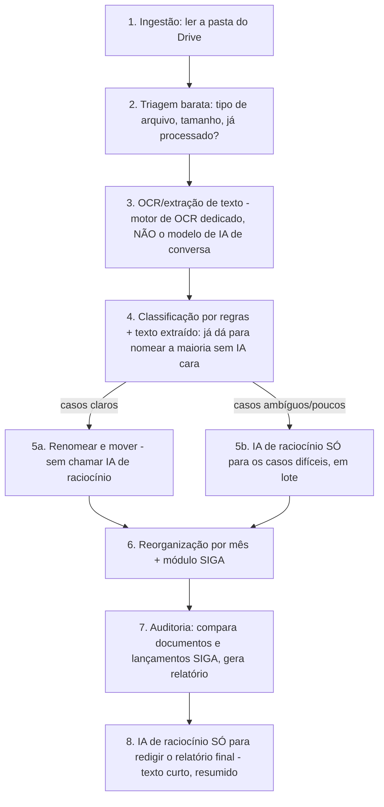

# MAPA — Módulo de IA para Documentação (Drive, OCR, organização e auditoria)
## Documento de análise e desenho (v2 — 21/07/2026) · é desenho, não código

> **Para que serve:** um módulo (paralelo ao sistema de checklist, integrado a ele ou construído
> depois) que permite a um **conferidor** guardar **toda a documentação física de um ponto**
> (notas, extratos, documentos escaneados) numa pasta do **Google Drive**, e uma **IA**:
> 1. **lê e reconhece** o conteúdo de cada arquivo (inclusive imagem, via OCR);
> 2. **renomeia** cada arquivo com um **padrão legível por humano** (dá para saber do que se
>    trata só pelo nome, sem abrir, e anexar no **SIGA** no lugar certo);
> 3. **reorganiza a pasta** por **mês de competência** → **módulo do SIGA**;
> 4. **gera um relatório de conferência**, como se fosse um **conferidor humano**, apontando
>    tudo que estiver **em desacordo** com as normas internas (documento faltando, carimbo
>    faltando, assinatura faltando, rubrica no lugar de assinatura, conta que não bate,
>    lançamento sem documento, documento sem lançamento, etc.).
>
> **Contexto crítico:** os arquivos contêm **dados extremamente sigilosos** (documentos
> financeiros e pessoais de um ponto de atendimento). **Tudo aqui precisa seguir a LGPD à
> risca.** E o uso de IA precisa ser **econômico**: o objetivo é que **todo** o trabalho de IA
> deste módulo, num mês, **consuma menos tokens do que uma janela de 5h do Claude Pro** — ou
> seja, tem que ser **barato e eficiente**, não um "IA lê tudo palavra por palavra".

---

## 1. O problema em números (por que "eficiência" é a palavra-chave)
- Centenas, às vezes **milhares**, de imagens escaneadas **sem OCR** por ponto/mês.
- Poucos PDFs (extratos bancários etc., também sem OCR).
- Alguns arquivos de texto/XML (notas fiscais eletrônicas).
- **Se cada imagem for enviada inteira para um modelo de IA "de visão" a cada operação**
  (reconhecer + renomear + auditar), o custo explode rápido — é o principal risco deste módulo.
- **Conclusão:** este módulo **não pode ser "IA ingênua"**. Precisa de uma arquitetura em
  **camadas**, onde a IA cara (visão/raciocínio) só é chamada **quando realmente precisa**, e
  o grosso do trabalho é feito por **passos determinísticos e baratos** (OCR local/dedicado,
  regras, comparação de dados).

---

## 2. Arquitetura em camadas (do mais barato ao mais caro)



### Por que isso economiza tokens (o "pulo do gato")
1. **OCR não é trabalho de "IA generativa cara".** Existem motores de OCR dedicados (rodando no
   Apps Script/servidor ou via uma API de OCR específica) que **só extraem texto** — muito mais
   baratos que mandar a imagem para um modelo de conversa "olhar e descrever".
2. **A maior parte da classificação é regra, não IA.** Depois do OCR, um extrato bancário tem
   palavras-chave óbvias ("saldo", "extrato", nome do banco); uma nota fiscal eletrônica em XML
   já vem com **campos estruturados** (não precisa nem de IA — é leitura direta do XML). Só
   documentos **realmente ambíguos** (ex.: escaneado torto, carimbo sujo, sem cabeçalho claro)
   precisam da IA "pensar".
3. **A IA de raciocínio trabalha em LOTE, com texto já extraído — nunca com a imagem crua
   repetida.** Em vez de 1.000 chamadas (uma por imagem), agrupamos o **texto já extraído** de
   várias dezenas de documentos numa única chamada, pedindo para a IA classificar/nomear todos
   de uma vez. Isso reduz drasticamente o número de chamadas.
4. **Cache de decisões.** Um tipo de documento que já foi visto e resolvido (ex.: "Termo de
   Verificação do Caixa, mesmo layout de sempre") vira uma **regra aprendida**, e da próxima vez
   nem precisa da IA — é reconhecido por padrão/regra.
5. **O relatório final é gerado com dados já estruturados** (lista do que falta, o que não bate)
   — a IA só **redige o texto** a partir de uma tabela pronta, não analisa tudo do zero.

> **Meta prática:** o **grosso do custo** deste módulo deve estar no **OCR** (que é barato e
> previsível por página) — a **IA de raciocínio cara** deve ser usada em **poucas dezenas de
> chamadas por mês**, cada uma processando **muitos documentos de uma vez**, não um documento
> por chamada.

---

## 3. Passo 2 — Renomeação (nome CURTO e legível — decisão em aberto, com amostra real analisada)
Você nos passou uma amostra real de **~140 nomes de arquivo** já em uso hoje. Ela mudou bastante
o desenho — o padrão longo original (`AAAA-MM_MODULO_TIPO_DESCRICAO_SEQ`) foi **rejeitado por
você por ficar grande demais**. Da amostra, identifico três problemas concretos que o módulo
precisa resolver, além de nomear:

### 3.1 Problema real #1 — codificação de caracteres quebrada (mojibake)
Muitos nomes têm caracteres corrompidos: `Jos‚` (deveria ser **José**), `joÆo` (deveria ser
**João**), `ReuniÆo` (deveria ser **Reunião**), `LOCOMO€ÇO` (deveria ser **LOCOMOÇÃO**),
`assembl‚ias & reuniäes` (deveria ser **assembleias & reuniões**). Isso acontece quando um
arquivo foi salvo/renomeado misturando codificações (Windows-1252 × UTF-8). **O módulo de IA
precisa normalizar isso** — reconhecer o padrão de corrupção e **corrigir para UTF-8 correto**
como parte do próprio processo de renomeação (não é opcional, é higiene básica de dado).

### 3.2 Problema real #2 — a data no início atrapalha
Você apontou que **a data logo no começo do nome dificulta** — porque o mais importante para
organizar é **para qual pasta/categoria o documento vai**, não a data (a data já vira parte do
**caminho da pasta**, ver Seção 4). Então a **data sai do início do nome do arquivo** e a
identificação da **categoria/pasta de destino** vem primeiro na lógica de nomeação (ainda que o
nome do arquivo em si possa manter uma data curta, se fizer sentido, mas não como primeiro campo
obrigatório).

### 3.3 Problema real #3 — nomes duplicados
A amostra tem vários arquivos com `(1)` no nome (ex.: `form (1).jpg`, `nfc-e (1).jpg`) — sinal de
duplicação/reenvio. **Confirmado (Seção 8):** quando o nome final calculado bater com um já
existente na pasta de destino, o módulo **insere um caractere/campo diferenciador automático**
(ex.: um sufixo sequencial `_02`, `_03`) — nunca sobrescreve nem perde arquivo.

### 3.4 Padrão de nome — ainda EM ABERTO, mas mais restrito
`[DECISÃO ADIADA — confirmado por você]` O formato definitivo continua **para depois do módulo
estar funcionando**, testado com amostra real. O que já está fechado:
- **Curto** (você rejeitou o padrão longo).
- **Sem mojibake** (Seção 3.1).
- **Sem a data como primeiro campo** (Seção 3.2).
- **Com diferenciador automático em duplicatas** (Seção 3.3).
- Regras por tipo de documento já registradas na v1 continuam válidas como **requisito**, não
  como formato fechado: conta → número da conta (plano de contas); comprovante → valor
  financeiro; cheque → número do cheque; cartão de débito pré-pago → ID do cartão.

---

## 4. Passo 3 — Estrutura de pastas (reorganização no Drive)

### 4.1 Hierarquia de pastas — de cima para baixo
Você deixou claro que **vários usuários diferentes trabalham numa única pasta raiz da
Regional**, então a hierarquia precisa refletir isso desde o topo:

```
📁 [Regional] /
  📁 [Localidade 1] /
    📁 [Ponto de Atendimento 1] /
      📁 Fechamento 2026 /
        📁 2026_05 - maio /
          📁 Produtos_Serviços /
          📁 Piedade /
            📁 R.Att.Sigiloso /
            📁 R.Att.Música /
            📁 R.Att.Regular /
          📁 Viagem /
            📁 Adiantamento /            (envelope de adiantamento)
            📁 Prestação de Contas /     (documentação da prestação de contas)
          📁 Tesouraria /
            📁 Cartões /
            📁 Caixas e Bancos /
            📁 Contas a Pagar /
            📁 Transferência de Numerários /
            📁 Fech. Piedade /
        📁 2026_06 - junho / ...
    📁 [Ponto de Atendimento 2] / ...
  📁 [Localidade 2] / ...
```
- **Cada localidade** tem sua própria pasta na raiz da Regional; **cada ponto de atendimento**
  tem sua pasta dentro da localidade — isolamento estrutural que já ajuda no sigilo (reforçado
  pelas permissões de acesso ao Drive, não só pelo sistema).
- Dentro do mês, as **categorias/subpastas seguem os módulos reais do seu fluxo** (Produtos e
  Serviços, Piedade com 3 subtipos de atendimento, Viagem com a distinção
  adiantamento×prestação, Tesouraria com 5 subtipos) — exatamente como você descreveu.

### 4.2 Estrutura é customizável (por quem tem alçada)
**Confirmado:** o **superusuário** (em qualquer abrangência) e o **administrador regional**
(dentro da sua Regional) podem **editar a estrutura padrão de pastas** — criar, renomear ou
remover categorias/subpastas dentro do seu domínio. É um "editor de estrutura de pastas",
irmão conceitual do editor de checklist (Fase 1) — muda a **árvore de destino**, não o texto do
formulário.

### 4.3 Opção de "modo simples" — tudo numa pasta só
**Confirmado:** existe a opção de **não subdividir por categoria** — jogar tudo dentro da pasta
do mês (`.../2026_05 - maio/`), sem as subpastas de módulo. Útil para quem prefere simplicidade
ou está começando a usar o módulo. É uma **configuração por ponto/localidade**, escolhida por
quem tem alçada (Seção 4.2).

### 4.4 Prévia por amostragem (antes de mexer em qualquer coisa)
**Confirmado:** antes de mover/renomear em massa, o módulo mostra uma **prévia geral com
amostragem** — não necessariamente todo arquivo um por um (seria muita informação), mas um
**esquema representativo** de como a pasta vai ficar (quantos arquivos por categoria, exemplos
de nome antes→depois). O conferidor confirma antes da execução real.

### 4.5 Concorrência — vários usuários mexendo na mesma pasta raiz (requisito de segurança)
Você chamou atenção para um risco real: **muitos usuários diferentes atuando na mesma árvore de
pastas da Regional ao mesmo tempo** — o que pode causar **duas pessoas renomeando/movendo o
mesmo arquivo ao mesmo tempo**, ou um processamento em lote batendo de frente com outro. O
desenho precisa de mecanismos específicos:
1. **Trava por lote/pasta durante o processamento.** Enquanto o módulo está processando uma
   pasta (prévia ou execução), essa pasta fica **"ocupada"** — outro usuário só pode consultar,
   não disparar outro processamento na mesma pasta ao mesmo tempo (evita corrida).
2. **Fila, não bloqueio duro.** Se dois usuários pedirem processamento da mesma pasta quase
   junto, o segundo pedido **entra numa fila** (aviso: "já há um processamento em andamento
   nesta pasta, você será avisado quando puder rodar o seu") — em vez de simplesmente falhar.
3. **Identificação de quem mexeu em quê** — todo evento de renomear/mover grava **quem fez**,
   **quando**, **antes→depois** (mesmo princípio do log de auditoria já usado no resto do
   sistema) — essencial para o desfazer (Seção 5.2) e para investigar conflitos.
> `[SUPOSIÇÃO]` O Google Drive em si não tem "trava de arquivo" nativa fácil de usar por API para
> este cenário; a trava lógica (item 1) precisa ser implementada no nosso controle (Firebase),
> não no Drive — a ser validado tecnicamente na implementação.

---

## 5. Passo 4 — Quem pode renomear/mover, e como desfazer

### 5.1 Permissão para renomear/mover (confirmado)
- **Qualquer usuário com acesso** (conferidor do ponto, e supervisores/administradores dentro
  do seu domínio) pode **renomear qualquer grupo de documentos** e **mover automaticamente**
  para a pasta padrão — não é restrito a um único "dono" do ponto.
- **Desfazer E refazer, com prazo (confirmado):** todo desfazer pode ser **refeito** — ou seja,
  o histórico é uma **pilha undo/redo** (como num editor de texto), não um "desfazer que apaga a
  possibilidade de voltar". Enquanto a ação estiver dentro da janela de tempo, o usuário pode ir
  e voltar (desfazer → refazer → desfazer) livremente.
  - **Conferidor:** pode desfazer/refazer/alterar as **próprias** renomeações/movimentações,
    dentro de uma **janela de tempo** (a definir — sugestão: 24–72h, configurável).
  - **Supervisor:** idem para as ações **dos seus supervisionados** (domínio — MAPA_PERMISSOES).
  - **Superusuário:** desfazer/refazer qualquer ação, sempre.
- Cada desfazer **e** cada refazer **vão ao log** (o que, por quem, quando).

---

## 6. Passo 5 — O relatório de auditoria (o "conferidor-IA")
Depois de organizado, o módulo **compara documentos × lançamentos do SIGA** e aponta:
- **Falta de documento** de um tipo exigido num processo (ex.: processo sem o extrato correspondente).
- **Falta de carimbo/assinatura** (ou presença de **rubrica** onde deveria ter **assinatura por
  extenso** — via OCR + comparação de padrão visual, não é 100% garantido, então o relatório
  marca isso como "**verificar**", não como certeza absoluta).
- **Inconsistência contábil** (contas que não batem, valores divergentes entre documento e SIGA).
- **Lançamento sem documento físico** (tem no SIGA, não tem o papel).
- **Documento sem lançamento** (tem o papel, não tem no SIGA).

> **Postura do relatório:** a IA **aponta e sinaliza para revisão humana** — ela **não decide**
> que algo está errado de forma definitiva. Linguagem do tipo "possível falta de X — verificar"
> em vez de "está errado". Quem decide e assina a conferência final é **sempre uma pessoa**.

### 6.1 Nível de detalhe — os DOIS juntos (confirmado)
A auditoria **completa e válida** exige **resumo por processo + detalhamento item a item**
**no mesmo relatório** — um não substitui o outro para fins de validação total. Mas:
- **O conferidor pode optar por gerar só um dos dois** (só o resumo, ou só o detalhado) — nesse
  caso, o sistema **rotula automaticamente** esse relatório como **"parcial — não definitivo"**,
  deixando claro que não vale como auditoria completa.
- **Dentro de um relatório parcial**, o conferidor pode escolher: **gerar o PDF só das seções
  que ele mesmo conferiu**, ou **incluir também** as seções já conferidas por outras pessoas
  (mesmo princípio de parcial×geral do `MAPA_FLUXO_POR_SECAO`, aplicado aqui à documentação).

### 6.2 Este é um MÓDULO do mesmo sistema (confirmado)
Você confirmou: **mesmo sistema**, arquitetura modular. Módulos já identificados:
1. **Relatório** (o checklist de compliance, já existente).
2. **Documentação** (este módulo — Drive/OCR/renomeação/auditoria).
3. **Editor/conversor de PDF** — evolução de um **script que você já tem pronto** (a integrar;
   preciso conhecer esse script antes de desenhar a integração — ver Seção 8).
4. **(outros módulos futuros)** — a arquitetura deve deixar espaço para crescer.
> Isso **fecha** a pergunta 6 da v1 deste documento (satélite × mesmo sistema): é o **mesmo
> sistema**, um módulo a mais.

---

## 7. LGPD — não é opcional, é a espinha dorsal do desenho
1. **Minimização:** a IA só processa o que precisa para o objetivo (nomear/organizar/auditar);
   não deve **extrair e guardar** dados pessoais sensíveis (CPF, número de conta completo,
   assinatura) em nenhum lugar além do necessário para o nome do arquivo (e mesmo aí, evitar).
2. **Nomes de arquivo sem dado sensível desnecessário.** Prefira "extrato-bancario" a
   "extrato-cpf-xxxxx"; se precisar diferenciar, usar um **código interno** (não o CPF cru).
3. **Onde ficam os dados durante o processamento:** o texto extraído por OCR **passa** pela IA
   (para classificar/nomear) mas **não deve ficar armazenado** em log do provedor de IA além do
   necessário — usar, quando disponível, configurações de **não retenção** / **zero data
   retention** do provedor (Claude e Gemini têm opções empresariais nesse sentido — a confirmar
   qual plano/API oferece isso; é um `[LACUNA]` técnico a validar antes de implementar).
4. **Controle de acesso:** só o **conferidor dono** do ponto (e supervisores/superusuário do
   domínio, mesma regra de sigilo do resto do sistema) pode disparar o processamento e ver o
   relatório de auditoria.
5. **Log de auditoria** de cada rodada de processamento (quem rodou, quando, quantos arquivos,
   resumo) — sem guardar o conteúdo sensível no log, só metadados.
6. **Retenção e descarte:** os documentos ficam no **Drive do próprio ponto/regional** (não em
   um servidor nosso) — o sistema **acessa**, não **copia para fora**. Isso reduz a superfície
   de risco de vazamento (coerente com o desenho de armazenamento do `MAPA_ARMAZENAMENTO`).
7. **Base legal:** processar documentação financeira/administrativa de uma entidade religiosa
   para fins de conferência interna é uma finalidade legítima e específica — mas recomendo
   **formalizar** isso (um aviso interno de que documentos são processados por IA para
   organização/conferência), para transparência com quem entrega/gera esses documentos.

> `[LACUNA]` Este ponto (retenção de dados pelo provedor de IA, contratos de processamento de
> dados/DPA) precisa de checagem técnica específica **antes** de implementar — não é algo que eu
> deva prometer sem confirmar a política vigente de cada provedor no momento da implementação.

---

## 8. Orçamento de tokens (o requisito "menos que uma janela de 5h do Claude Pro")
- **Meta:** todo o processamento de IA (reconhecimento de ambíguos + redação do relatório) de
  **um mês inteiro**, mesmo com **milhares de imagens**, deve consumir **menos tokens do que o
  limite de uma janela de uso de 5h do Claude Pro**.
- **Como isso é viável, na prática (graças à arquitetura em camadas da Seção 2):**
  - OCR **não conta como tokens de IA de raciocínio** — é outro serviço, custo separado e menor.
  - IA de raciocínio só entra para **casos ambíguos** (uma fração pequena do total) e **para
    redigir o relatório final** (texto curto, a partir de dados já prontos).
  - Processamento **em lote** (várias dezenas de documentos por chamada) em vez de 1-por-1.
- **Salvaguarda:** um **teto de gasto/tokens configurável** (igual ao proposto em `MAPA_IA_v1`)
  específico para este módulo, com **alerta antes de estourar** e opção de **pausar** o
  processamento de um lote grande para revisão manual.
- `[SUPOSIÇÃO]` "Uma janela de 5h do Claude Pro" é uma referência de **ordem de grandeza** para
  guiar o orçamento, não uma métrica técnica exata (são sistemas de cobrança diferentes: Claude
  Pro é assinatura com limite de uso; a API deste módulo é paga por token). Na implementação,
  vamos converter isso num **número real de tokens/mês** como meta de engenharia.

---

## 9. Decisões

### ✅ Confirmadas por você (21/07/2026)
- **Padrão de nome:** rejeitado o modelo longo; nome deve ser **curto**, **sem mojibake**, **sem
  data no início**, com **diferenciador automático em duplicatas** (Seção 3).
- **Estrutura de pastas:** Regional → Localidade → Ponto → `Fechamento AAAA/AAAA_MM - mês` →
  categorias (Produtos_Serviços, Piedade com 3 subtipos, Viagem com 2 subtipos, Tesouraria com
  5 subtipos) — Seção 4.1.
- **Estrutura é customizável** pelo superusuário (qualquer abrangência) e administrador regional
  (na sua Regional) — Seção 4.2.
- **Modo simples** (tudo numa pasta só do mês, sem subpastas) disponível como opção — Seção 4.3.
- **Prévia por amostragem** antes de mexer em qualquer coisa (não item-a-item, um esquema
  representativo) — Seção 4.4.
- **Quem pode disparar/renomear/mover:** qualquer usuário com acesso ao ponto, e supervisores/
  administradores no seu domínio — não fica restrito a um único "dono" — Seção 5.1.
- **Desfazer com prazo:** conferidor desfaz o que é seu; supervisor desfaz de seus
  supervisionados; superusuário desfaz tudo — Seção 5.1.
- **Relatório de auditoria:** resumo + item-a-item **juntos** valem como auditoria completa;
  gerar só um dos dois vira **"parcial — não definitivo"**; dentro do parcial, o conferidor
  escolhe imprimir só o que ele conferiu ou incluir o que outros já conferiram — Seção 6.1.
- **Mesmo sistema, arquitetura modular** (Relatório · Documentação · Editor/conversor de PDF ·
  futuros módulos) — Seção 6.2.

### ❓ Ainda em aberto
1. **Padrão definitivo de nome do arquivo** — só fecha depois de testar com amostra real no
   módulo funcionando (Seção 3.4) — decisão sua, adiada por você mesmo, não uma pendência minha.
2. **Janela de tempo para desfazer** (sugeri 24–72h configurável) — confirmar um número.
3. ~~**O script de editor/conversor de PDF**~~ ✅ **RESOLVIDO:** você me enviou os 4 scripts;
   a análise completa e a proposta do módulo estão em **`MAPA_MODULO_PDF_v1.md`** (a versão mais
   atual é o "Gestor de Documentos v5.0"; o plano é reembalá-lo como módulo simples integrado).

---

## 10. Impacto e ordem (honestidade)
- Este é um módulo **grande e sensível** (dados críticos, custo de IA, integração com Drive e
  potencialmente com o SIGA). **Não é** parte do fluxo do checklist em si — é complementar.
- Recomendo tratá-lo como uma **fase própria**, **depois** da Fase 0 (permissões/segurança) já
  estar valendo, porque ele herda as mesmas regras de sigilo por localidade **e** a estrutura
  Regional→Localidade→Ponto precisa estar madura antes (Seção 4.1 depende disso).
- **Não faz sentido implementar OCR/IA de documentos antes de resolver a arquitetura de
  segurança e permissões do sistema principal** — a base de "quem pode ver o quê" é a mesma.
- A **trava de concorrência** (Seção 4.5) é um requisito novo e não-trivial — deve ser desenhada
  junto com o módulo de permissões (Fase 0), não depois.

---

## 11. Resumo de uma linha
> **Um "conferidor-IA" que lê a pasta do Drive de um ponto, usa OCR barato (não IA cara) para a
> maior parte do trabalho, renomeia e reorganiza os arquivos por mês/módulo do SIGA, e gera um
> relatório de auditoria apontando o que está fora das normas — tudo dentro da LGPD, com um
> orçamento de tokens pensado para caber em bem menos do que uma janela de uso do Claude Pro.**
