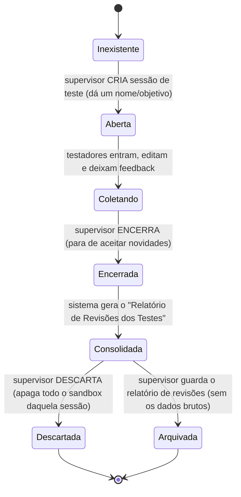

# MAPA — Modo de Teste / Homologação (sandbox isolado)
## Documento de análise e desenho (v1 — 21/07/2026) · é desenho, não código

> **Para que serve:** permitir que o **supervisor** ligue um **modo de teste**, no qual
> **testadores** usam o sistema **de verdade** (inclusive o editor do relatório, com todas as
> edições possíveis) e deixam **feedback**. Depois, o supervisor pede um **relatório das
> revisões** e uma **proposta de melhorias** com base nos testes.
>
> **Regra de ouro (inviolável):** os **dados de teste** e os **relatórios feitos pelos
> testadores NUNCA se misturam com os relatórios oficiais.** São mundos separados.

---

## 1. A ideia em uma frase
O modo de teste é um **universo paralelo** do sistema: mesma cara, mesmas telas, mas gravando
tudo em um **espaço separado** do banco (um "cofre de testes"). Quando o teste acaba, o
supervisor colhe os feedbacks e recebe um **relatório consolidado das revisões** — e pode
**jogar fora todo o material de teste** com um clique, sem tocar em nada oficial.

---

## 2. Por que "separado" tem que ser separado DE VERDADE
Não basta um aviso na tela dizendo "isto é teste". A separação precisa acontecer **no banco de
dados**, senão um erro de código poderia gravar um relatório de teste em cima de um real.

- **Espaço oficial:** `/reports/...`, `/checklists/...` (onde a vida real acontece).
- **Espaço de teste:** `/sandbox/{sessaoDeTeste}/reports/...`, `/sandbox/{sessaoDeTeste}/checklists/...`
  (um galho totalmente à parte da árvore do Firebase).

> **Consequência prática:** mesmo que alguém, dentro do modo de teste, aperte "gerar relatório",
> "salvar", "aprovar seção" — **tudo cai dentro de `/sandbox/...`**. É impossível, por construção,
> um dado de teste aparecer na lista de relatórios oficiais, porque eles vivem em endereços
> diferentes. A **Security Rule** do Firebase reforça isso (ver Seção 7).

---

## 3. Ciclo de vida de uma SESSÃO DE TESTE (máquina de estados)

- **Aberta/Coletando:** aparece uma **faixa/etiqueta bem visível** no topo ("MODO DE TESTE —
  nada aqui é oficial") para ninguém se confundir.
- **Encerrada:** os testadores não editam mais; vira "somente leitura".
- **Consolidada:** o supervisor recebe o relatório (Seção 5).
- **Descartada:** o galho `/sandbox/{sessao}` inteiro é apagado. **Zero resíduo.**
- **Arquivada:** guarda-se **apenas o relatório de revisões** (um `.md` leve), **não** os
  relatórios-brinquedo dos testadores.

---

## 4. Quem faz o quê (amarra com o módulo de permissões)
- **Ligar/desligar o modo de teste:** **supervisor** (de qualquer nível) ou superusuário.
  É o mesmo botão liga-desliga da supervisão, mas para o escopo "teste".
- **Ser testador:** qualquer usuário que o supervisor **convide** para a sessão de teste.
  Dentro dela, o testador tem **poderes ampliados** (pode usar o editor do relatório por
  inteiro), porque **não há risco** — está tudo no sandbox.
- **Deixar feedback:** todo testador. O feedback fica **preso à sessão de teste** e ao ponto
  do sistema onde ele estava (tela/seção/item), para o supervisor saber do que a pessoa falava.
- **Pedir o relatório de revisões:** supervisor/superusuário.
- **Descartar:** supervisor/superusuário (com **dupla verificação**, como toda exclusão do sistema).

> **Sigilo:** um testador vê apenas a **sua** sessão de teste. Sessões de teste de outras
> equipes/áreas não aparecem — mesma regra de domínio das permissões oficiais.

---

## 5. O "Relatório de Revisões dos Testes" (o entregável)
Quando o supervisor pede, o sistema monta **um documento** (`.md` + PDF) com:

1. **Cabeçalho:** nome/objetivo da sessão, período, quem participou, quantos feedbacks.
2. **Feedbacks organizados** por tela/seção/item, cada um com: quem, quando, o que disse,
   e (se houver) o "antes → depois" da edição que a pessoa fez no editor.
3. **Resumo das mudanças propostas:** uma lista do que os testadores **alteraram** nos
   relatórios-brinquedo (sugestões concretas de como o relatório oficial poderia ficar).
4. **Proposta consolidada:** um bloco "Sugestões priorizadas" — o que apareceu com mais
   frequência, o que parece rápido, o que é grande. *(Se o módulo de IA estiver ligado —
   ver `MAPA_IA_*` —, esse resumo pode ser redigido pela IA a partir dos feedbacks; sem IA,
   o sistema apenas agrupa e lista.)*

> **Importante:** este relatório é **sobre os testes** (uma ata de homologação). Ele **não é**
> um relatório de compliance e **não entra** na lista oficial. Fica numa aba própria
> ("Testes / Homologação").

---

## 6. Descarte e retenção (sem lixo acumulado)
- **Descarte manual, com dupla verificação** (nunca automático) — coerente com a política de
  exclusão do `MAPA_ARMAZENAMENTO_E_EDITOR`.
- **Aviso de espaço:** dados de teste **contam** para a cota do BaaS enquanto existem; por isso
  o painel de armazenamento mostra o sandbox **separado** ("Testes: X MB") e sugere descartar
  sessões encerradas antigas.
- **Sugestão inferida (nova):** oferecer **auto-lembrete** — "esta sessão de teste está encerrada
  há 30 dias; deseja descartar?" — **lembrete**, não exclusão automática.

---

## 7. Segurança (o que garante a separação de verdade)
Regra de ouro só é real se a **Security Rule** do Firebase garantir. Desenho da regra:

- `/sandbox` só é legível/gravável por quem está **na sessão de teste** correspondente
  (lista de participantes) **ou** é supervisor/superusuário do domínio.
- **Nada** em código-cliente pode redirecionar uma gravação oficial para `/sandbox` ou
  vice-versa: são caminhos distintos e as telas de teste **sempre** montam o caminho com o
  prefixo `/sandbox/{sessao}`.
- O "gerar/salvar/aprovar" dentro do modo de teste usa **as mesmas funções**, só que recebendo
  o **prefixo do sandbox** — isso evita duplicar código e reduz risco de bug (uma única porta,
  dois destinos).

> `[SUPOSIÇÃO]` As Security Rules por localidade (Fase 0 / P0.2) já vão existir quando
> implementarmos isto; o bloco `/sandbox` entra como um **espelho** delas com a lista de
> testadores no lugar dos conferidores.

---

## 8. Impacto no que já existe (honestidade)
- **Não mexe** no fluxo oficial. É uma **camada por cima**: um "modo" que troca o destino das
  gravações e pinta a faixa de aviso.
- **Reaproveita** o editor de relatório, o fluxo por seção e o gerador de PDF — todos passam a
  aceitar um **prefixo de destino** (oficial ou sandbox). Essa é a única mudança estrutural, e
  é pequena.
- **Depende de:** módulo de permissões (Fase 0) e do fluxo por seção (Fase 3). Por isso, na
  ordem de implementação, o modo de teste entra **depois** desses — provavelmente como um
  item da **Fase 5 (Supervisão)** ou início da Fase 6.

---

## 9. Decisões que preciso confirmar com você
1. **Nome das sessões de teste:** o supervisor dá um nome livre (ex.: "Teste de campo — julho")
   ou o sistema numera sozinho ("Teste #1")? *(sugiro: nome livre + data automática.)*
2. **Convite de testadores:** o supervisor escolhe de uma lista de usuários existentes, ou pode
   convidar por e-mail alguém de fora? *(sugiro: só usuários já cadastrados, por simplicidade e
   sigilo.)*
3. **Feedback:** um campo de texto livre basta, ou você quer também uma **nota/estrela** e uma
   **categoria** (ex.: "erro", "sugestão", "dúvida")? *(sugiro: texto + categoria; nota é opcional.)*
4. **A IA redige a proposta?** Se sim, entra a decisão do provedor (Seção do `MAPA_IA`).

---

## 10. Resumo de uma linha
> **Modo de teste = um sistema-gêmeo que grava tudo num cofre à parte (`/sandbox`), com faixa de
> aviso, feedback preso ao contexto, um relatório de revisões ao final e descarte manual — sem
> nunca encostar num relatório oficial.**
