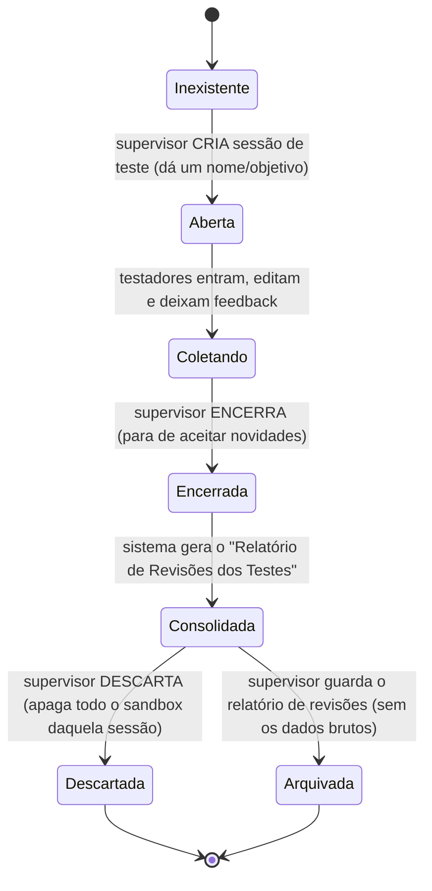

# MAPA — Modo de Teste / Homologação (sandbox isolado)
## Documento de análise e desenho (v2 — 21/07/2026) · é desenho, não código

> **Para que serve:** permitir que o **supervisor** ligue um **modo de teste**, no qual cada
> **testador** tem um **ambiente próprio e privado**, usa o sistema **de verdade** (inclusive o
> editor do relatório, com todas as edições possíveis), deixa **feedback** e produz uma **versão
> por escrito** do relatório. Depois, o **superusuário** pode **importar** o ambiente de um teste
> específico como base para a versão oficial — editando, mesclando, juntando, acrescentando ou
> removendo — com **ou sem** auxílio de uma **IA integrada (Claude, Gemini ou outra)**.
>
> **Regra de ouro (inviolável):** os **dados de teste** e os **relatórios feitos pelos
> testadores NUNCA se misturam com os relatórios oficiais.** São mundos separados. E cada
> testador só enxerga o **seu próprio** ambiente.

---

## 0. Objetivos do teste (o que queremos colher)
1. **Identificar falhas** (o que quebra / dá erro).
2. **Identificar dificuldades** (o que confunde / trava o uso).
3. **Identificar vulnerabilidades** (o que expõe dado ou permite ação indevida).
4. **Levantar necessidades** (o que falta).
5. **Receber sugestões, críticas e elogios** (feedback livre).
6. **⭐ O mais importante — receber uma VERSÃO POR ESCRITO**, editada **dentro do sistema** por
   cada testador: o relatório como *ele* acha que deveria ser. É a matéria-prima que o
   superusuário depois transforma na versão oficial aprimorada.

---

## 1. A ideia em uma frase
O modo de teste é um **universo paralelo** do sistema: mesma cara, mesmas telas, mas gravando
tudo em um **espaço separado** do banco (um "cofre de testes"). Quando o teste acaba, o
supervisor colhe os feedbacks e recebe um **relatório consolidado das revisões** — e pode
**jogar fora todo o material de teste** com um clique, sem tocar em nada oficial.

---

## 2. Por que "separado" tem que ser separado DE VERDADE
Não basta um aviso na tela dizendo "isto é teste". A separação precisa acontecer **no banco de
dados**, senão um erro de código poderia gravar um relatório de teste em cima de um real.

- **Espaço oficial:** `/reports/...`, `/checklists/...` (onde a vida real acontece).
- **Espaço de teste:** cada testador tem uma **gaveta própria** dentro da sessão:
  `/sandbox/{sessaoDeTeste}/testers/{uidDoTestador}/reports/...` (e `/checklists/...`).
  Um galho totalmente à parte da árvore do Firebase, **subdividido por testador**.

> **Consequência prática (dupla isolação):**
> 1. **Teste × oficial:** mesmo que alguém, dentro do modo de teste, aperte "gerar relatório",
>    "salvar", "aprovar seção" — **tudo cai em `/sandbox/...`**, nunca em `/reports`.
> 2. **Testador × testador:** o que cada testador faz cai **só na gaveta dele**
>    (`.../testers/{uid}/...`). Um testador **não vê** o ambiente do outro. Só o **supervisor
>    que criou o teste** enxerga cada gaveta, separadamente.
>
> É impossível, por construção, um dado vazar entre esses espaços, porque eles vivem em
> endereços diferentes. A **Security Rule** do Firebase reforça isso (ver Seção 7).

---

## 3. Ciclo de vida de uma SESSÃO DE TESTE (máquina de estados)

- **Aberta/Coletando:** aparece uma **faixa/etiqueta bem visível** no topo ("MODO DE TESTE —
  nada aqui é oficial") para ninguém se confundir.
- **Encerrada:** os testadores não editam mais; vira "somente leitura".
- **Consolidada:** o supervisor recebe o relatório (Seção 5).
- **Descartada:** o galho `/sandbox/{sessao}` inteiro é apagado. **Zero resíduo.**
- **Arquivada:** guarda-se **apenas o relatório de revisões** (um `.md` leve), **não** os
  relatórios-brinquedo dos testadores.

---

## 4. Quem faz o quê (amarra com o módulo de permissões)
- **Ligar/desligar o modo de teste:** **supervisor** (de qualquer nível) ou superusuário.
  É o mesmo botão liga-desliga da supervisão, mas para o escopo "teste". **Quem cria a sessão
  vira o "dono" dela** e é o único (fora o superusuário) a enxergar as gavetas dos testadores.
- **Ser testador:** qualquer usuário que o supervisor **convide** para a sessão de teste.
  Dentro dela, o testador tem **poderes ampliados** (pode usar o editor do relatório por
  inteiro), porque **não há risco** — está tudo na **gaveta dele** no sandbox.
- **Deixar feedback + versão escrita:** todo testador, **na própria gaveta**. Fica **preso à
  sessão** e ao ponto do sistema (tela/seção/item), para o supervisor saber do que se falava.
- **Pedir o relatório de revisões:** o **supervisor dono** da sessão / superusuário.
- **Importar / mesclar um teste na versão oficial:** **só o superusuário** (Seção 5-B).
- **Descartar:** supervisor dono / superusuário (com **dupla verificação**, como toda exclusão).

> **Sigilo (reforçado nesta v2):**
> - Um **testador** vê apenas a **sua própria gaveta** — nem a de outro testador, nem a lista.
> - O **supervisor dono** vê **cada gaveta separadamente** (é o painel de acompanhamento).
> - Um **outro supervisor** (que não criou a sessão) **não** vê a sessão.
> - O **superusuário** vê tudo (é quem depois importa/mescla).

### Tabela de visibilidade
| Papel | Vê a sessão? | Vê a gaveta de um testador? | Vê todas as gavetas? |
|---|---|---|---|
| Testador da sessão | sim (a sua) | só a **própria** | não |
| Supervisor que **criou** a sessão | sim | sim (cada uma) | **sim, em separado** |
| Outro supervisor | **não** | não | não |
| Superusuário | sim | sim | sim (+ importar/mesclar) |

---

## 5-A. O "Relatório de Revisões dos Testes" (o entregável de leitura)
Quando o supervisor pede, o sistema monta **um documento** (`.md` + PDF) com:

1. **Cabeçalho:** nome/objetivo da sessão, período, quem participou, quantos feedbacks.
2. **Feedbacks organizados** por tela/seção/item, cada um com: quem, quando, categoria
   (falha / dificuldade / vulnerabilidade / necessidade / sugestão / crítica / elogio),
   e (se houver) o "antes → depois" da edição que a pessoa fez no editor.
3. **Uma coluna por testador** com a **versão escrita** que cada um produziu (a matéria-prima
   principal — objetivo ⭐ da Seção 0).
4. **Proposta consolidada:** um bloco "Sugestões priorizadas" — o que apareceu com mais
   frequência, o que parece rápido, o que é grande. *(Se o módulo de IA estiver ligado —
   ver `MAPA_IA_v1` —, esse resumo pode ser redigido pela IA a partir dos feedbacks; sem IA,
   o sistema apenas agrupa e lista.)*

> **Importante:** este relatório é **sobre os testes** (uma ata de homologação). Ele **não é**
> um relatório de compliance e **não entra** na lista oficial. Fica numa aba própria
> ("Testes / Homologação").

## 5-B. Importar e mesclar um teste na versão oficial (**só o superusuário**)
Este é o passo em que o trabalho dos testes **vira melhoria de verdade**. O superusuário abre
uma sessão encerrada e trabalha num **"estúdio de consolidação"**:

1. **Importar como base:** escolhe **o ambiente de um testador específico** (uma gaveta) e o
   traz como **ponto de partida** — sem ainda tocar no oficial (fica num rascunho de trabalho).
2. **Editar livremente:** ajusta textos, itens, seções — é o editor completo.
3. **Juntar / mesclar / acrescentar / remover:** pode **combinar** partes de **várias** gavetas
   (ex.: a seção X do testador A + a seção Y do testador B), acrescentar itens novos ou remover
   o que não presta. O sistema mostra, seção a seção, **de qual testador** veio cada trecho
   (rastreabilidade) e marca conflitos (dois testadores mudaram a mesma seção de formas
   diferentes) para o superusuário decidir.
4. **Com ou sem IA:** a qualquer momento o superusuário pode pedir à IA para **sugerir uma
   fusão** ("junte o melhor de A, B e C"), **redigir** um texto unificado, ou **apontar
   divergências**. A IA **propõe**; o superusuário **aprova**. Provedor de IA **sempre
   selecionável** (Claude, Gemini ou outra — ver `MAPA_IA_v1`).
5. **Liberar versão aprimorada:** só ao final, com uma confirmação explícita, o resultado é
   **publicado** — vira a nova **definição de checklist** oficial (via editor da Fase 1) e/ou o
   modelo padrão de relatório. **Nada** entra no oficial sem esse "liberar".

> **Rastreabilidade:** o registro guarda "esta versão oficial nasceu da sessão de teste *T*,
> a partir das gavetas de *fulano/beltrano*, mesclada em tal data pelo superusuário" — vai ao
> **log de auditoria**.
>
> `[SUPOSIÇÃO]` O alvo natural do "liberar" é a **definição do checklist** (Fase 1) e/ou o
> **modelo de relatório** — não um relatório de um mês específico. Confirmar com você (Seção 9).

---

## 6. Descarte e retenção (sem lixo acumulado)
- **Descarte manual, com dupla verificação** (nunca automático) — coerente com a política de
  exclusão do `MAPA_ARMAZENAMENTO_E_EDITOR`.
- **Aviso de espaço:** dados de teste **contam** para a cota do BaaS enquanto existem; por isso
  o painel de armazenamento mostra o sandbox **separado** ("Testes: X MB") e sugere descartar
  sessões encerradas antigas.
- **Sugestão inferida (nova):** oferecer **auto-lembrete** — "esta sessão de teste está encerrada
  há 30 dias; deseja descartar?" — **lembrete**, não exclusão automática.

---

## 7. Segurança (o que garante a separação de verdade)
Regra de ouro só é real se a **Security Rule** do Firebase garantir. Desenho da regra:

- **A gaveta `/sandbox/{sessao}/testers/{uid}`** só é gravável/legível pelo **próprio testador
  daquele `uid`**, pelo **supervisor dono** da sessão e pelo **superusuário**. Um testador não
  consegue ler a gaveta de outro (a regra compara o `uid` do caminho com o `uid` de quem pede).
- **Nada** em código-cliente pode redirecionar uma gravação oficial para `/sandbox` ou
  vice-versa: são caminhos distintos e as telas de teste **sempre** montam o caminho com o
  prefixo `/sandbox/{sessao}/testers/{meuUid}`.
- **Importar/mesclar** (5-B) só é permitido ao **superusuário**, e a gravação do resultado no
  oficial passa pela mesma regra de escrita oficial (nada burla o caminho normal de publicação).
- O "gerar/salvar/aprovar" dentro do modo de teste usa **as mesmas funções**, só que recebendo
  o **prefixo do sandbox** — isso evita duplicar código e reduz risco de bug (uma única porta,
  dois destinos).

> `[SUPOSIÇÃO]` As Security Rules por localidade (Fase 0 / P0.2) já vão existir quando
> implementarmos isto; o bloco `/sandbox` entra como um **espelho** delas com a lista de
> testadores no lugar dos conferidores.

---

## 8. Impacto no que já existe (honestidade)
- **Não mexe** no fluxo oficial. É uma **camada por cima**: um "modo" que troca o destino das
  gravações e pinta a faixa de aviso.
- **Reaproveita** o editor de relatório, o fluxo por seção e o gerador de PDF — todos passam a
  aceitar um **prefixo de destino** (oficial ou sandbox). Essa é a única mudança estrutural, e
  é pequena.
- **Depende de:** módulo de permissões (Fase 0) e do fluxo por seção (Fase 3). Por isso, na
  ordem de implementação, o modo de teste entra **depois** desses — provavelmente como um
  item da **Fase 5 (Supervisão)** ou início da Fase 6.

---

## 9. Decisões que preciso confirmar com você
1. **Nome das sessões de teste:** o supervisor dá um nome livre (ex.: "Teste de campo — julho")
   ou o sistema numera sozinho ("Teste #1")? *(sugiro: nome livre + data automática.)*
2. **Convite de testadores:** o supervisor escolhe de uma lista de usuários existentes, ou pode
   convidar por e-mail alguém de fora? *(sugiro: só usuários já cadastrados, por simplicidade e
   sigilo.)*
3. **Feedback:** um campo de texto livre basta, ou você quer também uma **nota/estrela** e uma
   **categoria** (ex.: "erro", "sugestão", "dúvida")? *(sugiro: texto + categoria; nota é opcional.)*
4. **A IA redige a proposta / faz a fusão (5-B)?** Se sim, provedor **sempre selecionável**
   (Claude, Gemini, outra) — decisão detalhada em `MAPA_IA_v1`.
5. **Alvo do "liberar" (5-B):** a versão aprimorada substitui a **definição de checklist** (o
   modelo, Fase 1) e/ou o **modelo de relatório**? *(sugiro: a definição de checklist é o alvo
   principal; confirmar.)*
6. **O testador pode ver o próprio "antes → depois"** e reeditar durante a sessão aberta? *(sugiro:
   sim, enquanto a sessão está "Coletando".)*

---

## 10. Resumo de uma linha
> **Modo de teste = um sistema-gêmeo onde cada testador tem uma gaveta privada (`/sandbox/{sessao}/
> testers/{uid}`), só o supervisor-dono vê cada uma, e depois o superusuário importa/mescla o
> melhor de um ou vários testes — com ou sem IA (Claude/Gemini/outra) — para liberar uma versão
> oficial aprimorada, sem nunca encostar nos relatórios reais durante o teste.**
