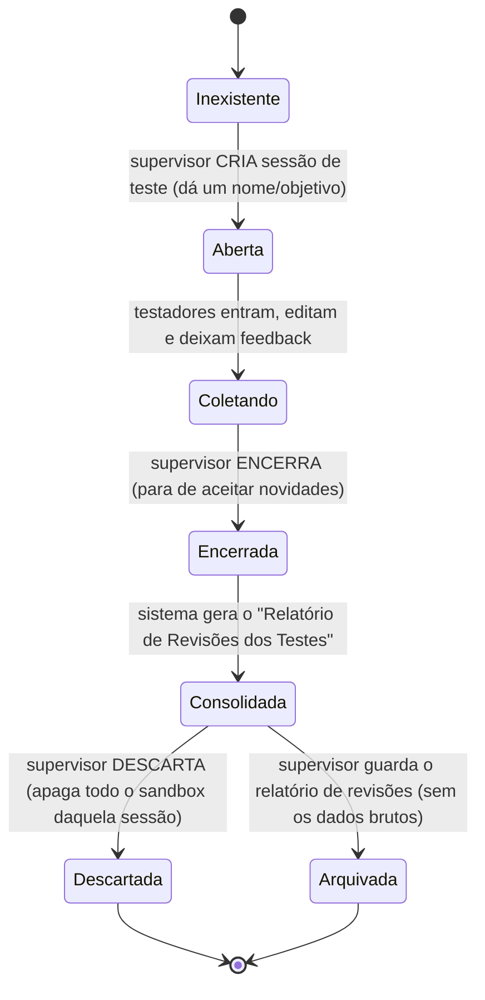

# MAPA — Modo de Teste / Homologação (sandbox isolado)
## Documento de análise e desenho (v4 — 21/07/2026) · é desenho, não código

> **Para que serve:** permitir que o **supervisor** ligue um **modo de teste**, no qual cada
> **testador** tem um **ambiente próprio e privado**, usa o sistema **de verdade** (inclusive o
> editor do relatório, com todas as edições possíveis), deixa **feedback** e produz uma **versão
> por escrito** do relatório. Depois, o **superusuário** pode **importar** o ambiente de um teste
> específico como base para a versão oficial — editando, mesclando, juntando, acrescentando ou
> removendo — com **ou sem** auxílio de uma **IA integrada (Claude, Gemini ou outra)**.
>
> **Regra de ouro (inviolável):** os **dados de teste** e os **relatórios feitos pelos
> testadores NUNCA se misturam com os relatórios oficiais.** São mundos separados. E cada
> testador só enxerga o **seu próprio** ambiente.

---

## 0. Objetivos do teste (o que queremos colher)
1. **Identificar falhas** (o que quebra / dá erro).
2. **Identificar dificuldades** (o que confunde / trava o uso).
3. **Identificar vulnerabilidades** (o que expõe dado ou permite ação indevida).
4. **Levantar necessidades** (o que falta).
5. **Receber sugestões, críticas e elogios** (feedback livre).
6. **⭐ O mais importante — receber uma VERSÃO POR ESCRITO do FORMULÁRIO DE CHECKLIST** (o
   formulário da auditoria em si — partes/seções/itens), editada **dentro do sistema** por cada
   testador. Não é só preencher respostas: o testador pode **reescrever de verdade o formulário**:
   - **criar** partes, seções ou itens novos;
   - **reescrever/ajustar** o texto, a denominação e a nomenclatura de um item existente;
   - **remover** itens, seções ou **partes inteiras** que não fazem mais sentido;
   - **reordenar, fundir dois itens em um, desmembrar um item em vários** *(sugestão nova —
     aceita, ver Seção 5-B)*.
   É a matéria-prima que o superusuário depois usa para montar a versão oficial aprimorada
   (Seção 5-B).
7. **Testar o fluxo inteiro, não só o texto** — ver Seção 4-B (usuários reais e virtuais).

---

## 1. A ideia em uma frase
O modo de teste é um **universo paralelo** do sistema: mesma cara, mesmas telas, mas gravando
tudo em um **espaço separado** do banco (um "cofre de testes"). Quando o teste acaba, o
supervisor colhe os feedbacks e recebe um **relatório consolidado das revisões** — e pode
**jogar fora todo o material de teste** com um clique, sem tocar em nada oficial.

---

## 2. Por que "separado" tem que ser separado DE VERDADE
Não basta um aviso na tela dizendo "isto é teste". A separação precisa acontecer **no banco de
dados**, senão um erro de código poderia gravar um relatório de teste em cima de um real.

- **Espaço oficial:** `/reports/...`, `/checklists/...` (onde a vida real acontece).
- **Espaço de teste:** cada testador tem uma **gaveta própria** dentro da sessão:
  `/sandbox/{sessaoDeTeste}/testers/{uidDoTestador}/reports/...` (e `/checklists/...`).
  Um galho totalmente à parte da árvore do Firebase, **subdividido por testador**.

> **Consequência prática (dupla isolação):**
> 1. **Teste × oficial:** mesmo que alguém, dentro do modo de teste, aperte "gerar relatório",
>    "salvar", "aprovar seção" — **tudo cai em `/sandbox/...`**, nunca em `/reports`.
> 2. **Testador × testador:** o que cada testador faz cai **só na gaveta dele**
>    (`.../testers/{uid}/...`). Um testador **não vê** o ambiente do outro. Só o **supervisor
>    que criou o teste** enxerga cada gaveta, separadamente.
>
> É impossível, por construção, um dado vazar entre esses espaços, porque eles vivem em
> endereços diferentes. A **Security Rule** do Firebase reforça isso (ver Seção 7).

---

## 3. Ciclo de vida de uma SESSÃO DE TESTE (máquina de estados)

- **Aberta/Coletando:** aparece uma **faixa/etiqueta bem visível** no topo ("MODO DE TESTE —
  nada aqui é oficial") para ninguém se confundir.
- **Encerrada:** os testadores não editam mais; vira "somente leitura".
- **Consolidada:** o supervisor recebe o relatório (Seção 5).
- **Descartada:** o galho `/sandbox/{sessao}` inteiro é apagado. **Zero resíduo.**
- **Arquivada:** guarda-se **apenas o relatório de revisões** (um `.md` leve), **não** os
  relatórios-brinquedo dos testadores.

---

## 3-B. Metadados da sessão (identificação, organização e busca)
Cada sessão de teste é criada com **nome livre** (ex.: "Teste de campo — julho") e carrega os
seguintes metadados, gravados automaticamente ou preenchidos na criação:

| Metadado | Origem | Uso |
|---|---|---|
| **Nome** (livre) | digitado pelo supervisor | identificação humana |
| **Data + hora de criação** | automático | diferenciar sessões no mesmo dia (podem ser várias) |
| **Código do arquivo/sessão** | gerado automático (ex.: `TST-2026-07-21-03`) | referência rápida para o superusuário citar/localizar |
| **Supervisor responsável** | quem criou | dono da sessão (Seção 4) |
| **Testador(es)** | lista de quem foi convidado/entrou | ver quem participou |
| **Última modificação** | automático, a cada ação | saber se a sessão está "viva" ou parada |
| **Estado** | automático (Seção 3) | Aberta/Coletando/Encerrada/Consolidada/Descartada/Arquivada |
| **Contagem de feedbacks** | automático | visão rápida de volume |

**Na tela de listagem de sessões** (que o supervisor-dono e o superusuário veem), esses
metadados viram:
- **Colunas ordenáveis** (clicar no cabeçalho da coluna ordena por aquele critério — nome, data,
  supervisor, estado, última modificação etc.);
- **Filtro/busca** por qualquer um desses campos (ex.: buscar por supervisor, por período, por
  código, por estado).

> `[SUPOSIÇÃO]` A listagem segue o mesmo padrão visual de outras listagens do sistema (paginação
> 10–100, como a página de Arquivo/Logs do `MAPA_FLUXO_POR_SECAO`) — reaproveita componente, não
> inventa um novo estilo de tela.

---

## 4. Quem faz o quê (amarra com o módulo de permissões)
- **Ligar/desligar o modo de teste:** **supervisor** (de qualquer nível) ou superusuário.
  É o mesmo botão liga-desliga da supervisão, mas para o escopo "teste". **Quem cria a sessão
  vira o "dono" dela** e é o único (fora o superusuário) a enxergar as gavetas dos testadores.
- **Ser testador:** qualquer usuário que o supervisor **convide** para a sessão de teste — pode
  ser alguém **já cadastrado** no sistema, ou (novidade confirmada) **alguém de fora, convidado
  por e-mail**. Dentro dela, o testador tem **poderes ampliados** (pode usar o editor do
  relatório por inteiro), porque **não há risco** — está tudo na **gaveta dele** no sandbox.
  - **Convite externo (por e-mail) exige uma declaração de ciência, assinada dentro do
    sistema por reautenticação Google (confirmado).** Antes de enviar o convite, o
    **supervisor** lê a declaração de que **a responsabilidade por qualquer vazamento de
    dados** — principalmente informação crítica/sigilosa — **é exclusivamente dele**,
    **inclusive** se o vazamento vier de uma ação de um testador que ele próprio
    cadastrou/convidou, e **confirma digitando a senha da conta Google** (a mesma tela de
    reautenticação usada no login) — funcionando como uma **assinatura eletrônica** do aceite.
    O registro grava: **texto exato aceito** (versão/hash), **conta Google confirmada**, **data
    e hora**, e (se disponível) **IP/dispositivo** — tudo no **log de auditoria**, permanente.
  - `[LACUNA jurídica]` Essa reautenticação tem valor de **assinatura eletrônica simples**
    (reconhecida no direito brasileiro para atos privados, útil para provar quem aceitou e
    quando), mas **não equivale** a uma **assinatura digital certificada ICP-Brasil** (presunção
    legal mais forte). Para o uso interno aqui, é suficiente; se algum dia isso precisar valer
    numa disputa judicial séria, recomendo confirmação jurídica antes de confiar só nisso.
  - **Por que isso é seguro apesar do convite externo:** o convidado só entra na **gaveta**
    daquele supervisor (sandbox), nunca no sistema oficial — mas como ainda é dado sensível
    (pode conter exemplos reais durante o teste), a responsabilização formal é necessária.
- **Deixar feedback + versão escrita:** todo testador, **na própria gaveta**. Fica **preso à
  sessão** e ao ponto do sistema (tela/seção/item), para o supervisor saber do que se falava.
- **Pedir o relatório de revisões:** o **supervisor dono** da sessão / superusuário.
- **Importar / mesclar um teste na versão oficial:** **só o superusuário** (Seção 5-B).
- **Descartar:** supervisor dono / superusuário (com **dupla verificação**, como toda exclusão).

> **Sigilo (reforçado nesta v2):**
> - Um **testador** vê apenas a **sua própria gaveta** — nem a de outro testador, nem a lista.
> - O **supervisor dono** vê **cada gaveta separadamente** (é o painel de acompanhamento).
> - Um **outro supervisor** (que não criou a sessão) **não** vê a sessão.
> - O **superusuário** vê tudo (é quem depois importa/mescla).

### Tabela de visibilidade
| Papel | Vê a sessão? | Vê a gaveta de um testador? | Vê todas as gavetas? |
|---|---|---|---|
| Testador da sessão | sim (a sua) | só a **própria** | não |
| Supervisor que **criou** a sessão | sim | sim (cada uma) | **sim, em separado** |
| Outro supervisor | **não** | não | não |
| **Superusuário** | sim | sim | **sim, sempre — de todo mundo, sem exceção** |

---

## 4-B. Usuários reais e "usuários virtuais" (testar o fluxo inteiro, sozinho ou em grupo)
Além de deixar feedback e reescrever o formulário, o testador precisa conseguir **simular o
fluxo colaborativo inteiro** (conferir → enviar → aprovar/devolver — ver `MAPA_FLUXO_POR_SECAO`)
mesmo que esteja testando **sozinho**. Por isso, **dentro da própria gaveta**, o testador ganha
dois poderes extras:

1. **Convidar usuários reais para a sua gaveta.** O testador pode trazer outras pessoas para
   dentro do **seu** ambiente de teste e **atribuir a elas qualquer cargo/função** (ex.: colocar
   um colega como "revisor" para experimentar o fluxo de aprovação de verdade, com duas pessoas
   reais). Isso é diferente de "ser testador da sessão" (Seção 4) — é o testador **compondo o
   elenco dentro do seu próprio teste**.
2. **Criar usuários virtuais (fictícios) — até 10 por gaveta.** O testador pode criar contas de
   mentira (ex.: "Conferidor Teste 1", "Revisor Teste 2") **só dentro da sua gaveta**, e alternar
   entre elas para **agir sozinho como se fosse várias pessoas com cargos diferentes** — testando
   o fluxo decisório completo (enviar uma seção como um "conferidor virtual", depois trocar para
   um "revisor virtual" e aprovar/devolver) sem precisar de mais gente disponível. **Limite: 10
   usuários virtuais por gaveta** (confirmado — evita bagunça difícil de revisar depois).

> **Por que isso importa:** o objetivo não é só corrigir o **texto** do checklist — é testar se
> o **fluxo de trabalho e as decisões** (quem pode aprovar o quê, travas, devoluções) fazem
> sentido na prática. Usuários virtuais permitem isso **mesmo com um testador sozinho**.
>
> **Isolamento:** usuários virtuais e convites feitos por um testador **só existem e só agem
> dentro da gaveta dele** (`/sandbox/{sessao}/testers/{uid}/...`). Não viram usuários reais do
> sistema, não recebem acesso a nada oficial, e desaparecem com o descarte da sessão.
> **Superusuário continua vendo tudo isso também**, gaveta por gaveta.

---

## 5-A. O "Relatório de Revisões dos Testes" (o entregável de leitura)
Quando o supervisor pede, o sistema monta **um documento** (`.md` + PDF) com:

1. **Cabeçalho:** nome/objetivo da sessão, período, quem participou, quantos feedbacks.
2. **Feedbacks organizados** por tela/seção/item, cada um com: quem, quando, **texto**,
   **categoria** (falha / dificuldade / vulnerabilidade / necessidade / sugestão / crítica /
   elogio), **nota opcional de 0 a 5 estrelas** (confirmado), e (se houver) o "antes → depois"
   da edição que a pessoa fez no editor.
3. **Uma coluna por testador** com a **versão escrita** que cada um produziu (a matéria-prima
   principal — objetivo ⭐ da Seção 0).
4. **Proposta consolidada:** um bloco "Sugestões priorizadas" — o que apareceu com mais
   frequência, o que parece rápido, o que é grande. *(Se o módulo de IA estiver ligado —
   ver `MAPA_IA_v1` —, esse resumo pode ser redigido pela IA a partir dos feedbacks; sem IA,
   o sistema apenas agrupa e lista.)*

> **Importante:** este relatório é **sobre os testes** (uma ata de homologação). Ele **não é**
> um relatório de compliance e **não entra** na lista oficial. Fica numa aba própria
> ("Testes / Homologação").

## 5-B. Importar e mesclar um teste na versão oficial (**só o superusuário**)
Este é o passo em que o trabalho dos testes **vira melhoria de verdade**. O superusuário abre
uma sessão encerrada e trabalha num **"estúdio de consolidação"**:

1. **Importar como base:** escolhe **o ambiente de um testador específico** (uma gaveta) e o
   traz como **ponto de partida** — sem ainda tocar no oficial (fica num rascunho de trabalho).
2. **Editar livremente:** ajusta textos, itens, seções — é o editor completo.
3. **Juntar / mesclar / acrescentar / remover:** pode **combinar** partes de **várias** gavetas
   (ex.: a seção X do testador A + a seção Y do testador B), acrescentar itens novos ou remover
   o que não presta. O sistema mostra, seção a seção, **de qual testador** veio cada trecho
   (rastreabilidade) e marca conflitos (dois testadores mudaram a mesma seção de formas
   diferentes) para o superusuário decidir.
4. **Com ou sem IA:** a qualquer momento o superusuário pode pedir à IA para **sugerir uma
   fusão** ("junte o melhor de A, B e C"), **redigir** um texto unificado, ou **apontar
   divergências**. A IA **propõe**; o superusuário **aprova**. Provedor de IA **sempre
   selecionável** (Claude, Gemini ou outra — ver `MAPA_IA_v1`).
5. **Liberar versão aprimorada:** só ao final, com uma confirmação explícita, o resultado é
   **publicado** — vira a nova **definição de checklist** oficial (via editor da Fase 1) e/ou o
   modelo padrão de relatório. **Nada** entra no oficial sem esse "liberar".

> **Rastreabilidade:** o registro guarda "esta versão oficial nasceu da sessão de teste *T*,
> a partir das gavetas de *fulano/beltrano*, mesclada em tal data pelo superusuário" — vai ao
> **log de auditoria**.
>
> `[SUPOSIÇÃO]` O alvo natural do "liberar" é a **definição do checklist** (Fase 1) e/ou o
> **modelo de relatório** — não um relatório de um mês específico. Confirmar com você (Seção 9).

---

## 6. Descarte e retenção — política de "lixeira" (confirmado, v4)
O "descarte" (Seção 3) **não é exclusão imediata e definitiva**. Funciona em **dois estágios**:

1. **"Descartar" (1º estágio) — some para o testador e para o supervisor comum.** A sessão sai
   da lista normal (para quem a usava), mas **não é apagada**: vai para uma **pasta "Lixeira"**,
   claramente identificada, que **reúne os documentos de todos os testes descartados de todas
   as sessões**. Essa Lixeira é **sempre acessível ao superusuário** — nunca ao testador nem ao
   supervisor comum.
2. **Exclusão definitiva (2º estágio) — só o superusuário, manual.** Uma sessão na Lixeira pode
   ser **apagada de verdade** quando: (a) passarem **6 meses** (prazo **variável/configurável**)
   desde que foi para a Lixeira; **ou** (b) o espaço do Firebase estiver ficando cheio (ligado ao
   painel de armazenamento do `MAPA_ARMAZENAMENTO`); **ou** (c) o superusuário **pedir
   manualmente**, a qualquer momento. Em qualquer um dos três casos, a exclusão definitiva é
   **sempre um ato manual do superusuário** (nunca automática) — coerente com a política geral
   de exclusão do `MAPA_ARMAZENAMENTO_E_EDITOR` (dupla verificação).

> **Por que dois estágios:** protege contra descarte por engano (a sessão fica recuperável na
> Lixeira) e ainda assim evita acúmulo indefinido de dado de teste ocupando espaço/sigilo
> desnecessariamente.

- **Aviso de espaço:** dados de teste (incluindo a Lixeira) **contam** para a cota do BaaS
  enquanto existem; o painel de armazenamento mostra o sandbox **separado** ("Testes: X MB" /
  "Lixeira de testes: Y MB").
- **Auto-lembrete ao superusuário:** "há sessões na Lixeira há mais de 6 meses (ou perto do
  prazo configurado); deseja excluir definitivamente?" — **lembrete**, a decisão final é sempre
  manual.

---

## 7. Segurança (o que garante a separação de verdade)
Regra de ouro só é real se a **Security Rule** do Firebase garantir. Desenho da regra:

- **A gaveta `/sandbox/{sessao}/testers/{uid}`** só é gravável/legível pelo **próprio testador
  daquele `uid`**, pelo **supervisor dono** da sessão e pelo **superusuário**. Um testador não
  consegue ler a gaveta de outro (a regra compara o `uid` do caminho com o `uid` de quem pede).
- **Nada** em código-cliente pode redirecionar uma gravação oficial para `/sandbox` ou
  vice-versa: são caminhos distintos e as telas de teste **sempre** montam o caminho com o
  prefixo `/sandbox/{sessao}/testers/{meuUid}`.
- **Importar/mesclar** (5-B) só é permitido ao **superusuário**, e a gravação do resultado no
  oficial passa pela mesma regra de escrita oficial (nada burla o caminho normal de publicação).
- O "gerar/salvar/aprovar" dentro do modo de teste usa **as mesmas funções**, só que recebendo
  o **prefixo do sandbox** — isso evita duplicar código e reduz risco de bug (uma única porta,
  dois destinos).

> `[SUPOSIÇÃO]` As Security Rules por localidade (Fase 0 / P0.2) já vão existir quando
> implementarmos isto; o bloco `/sandbox` entra como um **espelho** delas com a lista de
> testadores no lugar dos conferidores.

---

## 8. Impacto no que já existe (honestidade)
- **Não mexe** no fluxo oficial. É uma **camada por cima**: um "modo" que troca o destino das
  gravações e pinta a faixa de aviso.
- **Reaproveita** o editor de relatório, o fluxo por seção e o gerador de PDF — todos passam a
  aceitar um **prefixo de destino** (oficial ou sandbox). Essa é a única mudança estrutural, e
  é pequena.
- **Depende de:** módulo de permissões (Fase 0) e do fluxo por seção (Fase 3). Por isso, na
  ordem de implementação, o modo de teste entra **depois** desses — provavelmente como um
  item da **Fase 5 (Supervisão)** ou início da Fase 6.

---

## 9. Decisões — TODAS confirmadas por você (21/07/2026)
- **Ambiente único e privado por testador** — cada um só vê o próprio (Seção 2/4).
- **Só o supervisor-dono vê cada gaveta, em separado** (Seção 4, tabela de visibilidade).
- **Superusuário sempre vê tudo, de todo mundo, sem exceção** (reforçado na tabela).
- **Importar/mesclar/juntar/acrescentar/remover pelo superusuário**, com ou sem IA — **Claude e
  Gemini sempre disponíveis** + espaço para outra IA (Seção 5-B; detalhado em `MAPA_IA_v1`).
- **Alvo do "liberar" = a definição do checklist** (o modelo/formulário oficial, Fase 1).
- **Testador pode incluir usuários reais na própria gaveta e atribuir qualquer cargo/função,
  e também criar usuários virtuais (até 10)** para simular sozinho o fluxo completo (Seção 4-B).
- **Objetivo ampliado:** o testador pode reescrever o formulário inteiro — criar/remover
  partes, seções, itens; renomear; ajustar redação (Seção 0).
- **Nome da sessão:** livre, com metadados automáticos completos — data+hora de criação, código
  de referência, supervisor, testador(es), última modificação, estado, contagem de feedbacks —
  todos **ordenáveis e filtráveis** na listagem (Seção 3-B).
- **Convite de testador:** usuário já cadastrado, **ou** externo por e-mail — neste caso, o
  supervisor assina uma **declaração de responsabilidade exclusiva** sobre vazamentos, inclusive
  os causados por quem ele convidou, registrada no log (Seção 4).
- **Feedback:** texto + categoria + **nota opcional de 0 a 5 estrelas** (Seção 5-A).
- **Testador pode ver o próprio "antes → depois"** e reeditar enquanto a sessão está
  "Coletando" (Seção 3/4-B).
- **Descarte em dois estágios (Lixeira):** descartar tira da vista do testador/supervisor comum
  mas guarda numa Lixeira só do superusuário; exclusão definitiva é manual, após 6 meses
  (variável), por espaço, ou por pedido — nunca automática (Seção 6).

---

## 10. Resumo de uma linha
> **Modo de teste = um sistema-gêmeo onde cada testador tem uma gaveta privada (`/sandbox/{sessao}/
> testers/{uid}`), rica em metadados buscáveis, só o supervisor-dono vê cada uma (superusuário
> vê tudo, sempre), e depois o superusuário importa/mescla o melhor de um ou vários testes — com
> ou sem IA (Claude/Gemini/outra) — para liberar uma versão oficial aprimorada; descarte vai
> primeiro para uma Lixeira do superusuário, exclusão definitiva sempre manual.**
