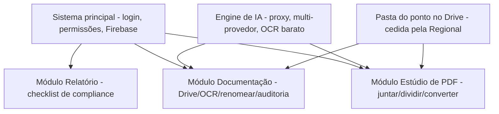
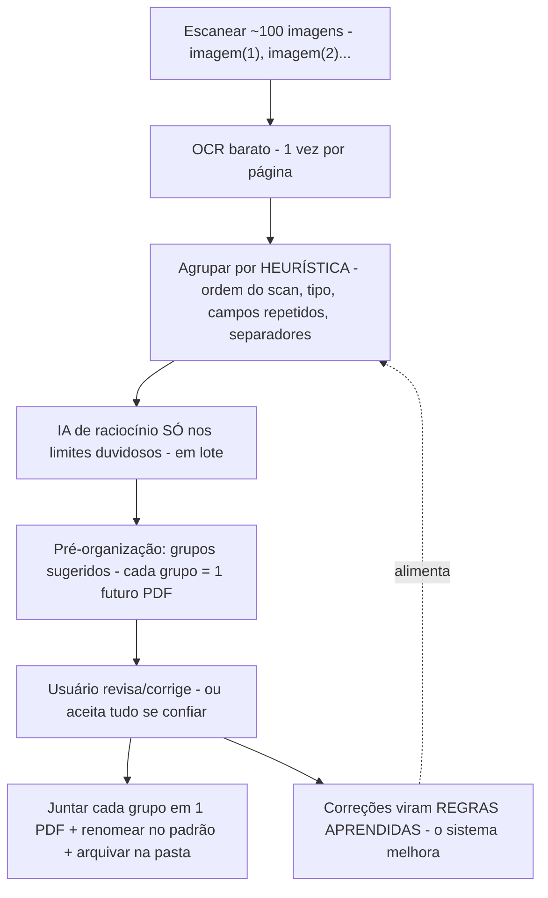

# MAPA — Módulo "Estúdio de PDF" (a versão simples e integrada do seu Gestor de Documentos)
## Documento de análise e desenho (v4 — 22/07/2026) · é desenho, não código
> **Nome do módulo confirmado pelo dono: "Estúdio de PDF".**

> **Origem:** você criou, em conversas anteriores, **4 versões** de uma ferramenta de PDF/Drive
> (em Google Apps Script). Pediu que eu analisasse as 4, identificasse a mais atual, resgatasse
> suas necessidades e propusesse **uma solução que entregue tudo, mas fácil de usar** — no
> espírito do **iLovePDF**, porém **integrada à pasta do Google Drive do ponto de atendimento**
> (pasta com permissões, cedida e gerida pela Regional).
>
> **Honestidade (importante):** eu **não tenho acesso às outras conversas do Claude** onde esses
> scripts nasceram — cada conversa é isolada. Então **reconstruí suas necessidades a partir dos
> próprios scripts** (changelogs, comentários, nomes de campos) e do que você me contou nesta
> sessão. Se eu tiver interpretado algo errado, você corrige.

---

## 1. As 4 versões que você me enviou (linhagem)
Analisando os cabeçalhos e o código, vejo uma **evolução clara** de uma mesma ferramenta:

| # | Nome do arquivo | Versão real (no código) | O que faz | Como gera o PDF |
|---|---|---|---|---|
| **4** | *Criador de PDF a partir de Imagens* | (sem versão — a **mais antiga**) | **Só imagens → PDF**. Reordenar, enquadrar, alinhar, override por página, preview ao vivo | **Google Slides** (servidor) |
| **3** | *Organizador / Criador de PDF Profissional* | **v4.1** | Imagens **+ Office/GDoc/Markdown/texto → PDF** | PDF-lib (navegador) |
| **2** | *Gestor de Documentos* | **v5.0** | Tudo do v4.1 **+ Estúdio de Divisão + salvar no Drive + ações pós-salvar + esqueleto do renomeador (Gemini)** | PDF-lib (navegador) |
| **1** | *Manual Operacional Piedade SIGA* | — | **Não é ferramenta de PDF** — gera um Google Doc com as normas do fluxo | (gera Doc) |

### 1.1 Conclusão: a versão mais atual e completa é a **#2 (Gestor de Documentos v5.0)**
É a evolução das outras. As versões 3 e 4 já estão **contidas** nela (com mais recursos). O
script #1 é outra coisa (as **normas** — valiosíssimo para o módulo de auditoria, ver
`MAPA_IA_DOCUMENTACAO_v1`, não para o PDF).

> **Detalhe técnico que vale registrar:** a versão mais antiga (#4) gera PDF via **Google Slides
> no servidor** (posicionamento preciso, mas pesado e lento); as versões novas (#3, #2) geram
> **100% no navegador via PDF-lib** (mais rápido, sem custo de servidor, sem cota). **A escolha
> das versões novas é a correta** e vamos mantê-la.

---

## 2. Suas necessidades, reconstruídas a partir dos scripts
Do que os 4 scripts revelam que você precisa (e foi refinando ao longo das versões):

1. **Juntar** vários arquivos do Drive num PDF único, **na ordem que você define** (arrastar,
   mover, inverter).
2. **Converter** para PDF quase tudo: imagens, Word/Excel/PowerPoint, Google Docs/Sheets/Slides,
   Markdown, texto.
3. **Controlar como cada página fica**: tamanho do papel (A4/A3/A5/Letter/Legal), orientação,
   enquadramento (caber, preencher, ajustar largura/altura, escala manual), alinhamento — e
   poder **mudar isso página por página** (override), com **pré-visualização ao vivo**.
4. **Dividir** um PDF: separar páginas, agrupar, exportar como arquivo único / um por página /
   por grupos, em PDF/PNG/JPEG.
5. **Salvar direto no Drive**, com opção do que fazer com os originais (manter / mover para
   "TEMP" / lixeira) — e **renomear**.
6. **Renomear em lote com IA** (o esqueleto com Gemini Vision) seguindo o padrão institucional
   `{conta} - {tipo} - {subTipo} - {origem} - {id_conta} - {data}`. *(Você disse: este não
   ficou pronto e nem foi testado.)*

> **Ou seja:** você quer um **"iLovePDF particular"** — juntar, dividir, converter, organizar e
> renomear — **dentro do Drive do ponto**, sem enviar documento sigiloso para um site de fora.

---

## 3. O problema real: ficou **poderoso, mas difícil**
Você mesmo disse: a última versão funciona, mas "**ficou um pouco complexo, exigindo uma certa
curva de aprendizado**". Analisando a interface, entendo **por que**:

1. **Muitos controles à mostra ao mesmo tempo** — papel, orientação, enquadramento, 2
   alinhamentos, escala, override por página, zoom, padrão de nomeação… tudo na tela de uma vez.
   Um usuário comum (um diácono que só quer "juntar estes 5 documentos num PDF") **se perde**.
2. **Fala em "linguagem de designer"** — "enquadramento contain/cover", "fit width", "override
   null-based" — em vez de tarefas ("juntar", "dividir").
3. **Cada usuário precisa implantar o app para si** (`access: MYSELF`, `executeAs:
   USER_DEPLOYING`) e **re-autorizar permissões** manualmente após cada deploy (o próprio código
   tem instruções de "vá no editor do GAS, execute a função manualmente para autorizar"). Isso é
   **inviável** para leigos e para escala (dezenas de pontos).
4. **A chave do Gemini fica no navegador** (o usuário digita a chave na tela) — **falha de
   segurança** que contraria o princípio que já fechamos (chave de IA só no servidor/proxy).

---

## 4. A solução proposta: **"Estúdio de PDF"**, um MÓDULO do sistema principal
A ideia central: **manter todo o poder que você já construiu, mas escondê-lo atrás de tarefas
simples** — e **integrar ao sistema principal** (mesmo login, mesmas permissões, mesma pasta do
Drive do ponto), acabando com a "cada um implanta o seu".

### 4.1 Tela inicial = tarefas, não controles (o jeito iLovePDF)
Em vez de abrir cheia de opções, a tela inicial mostra **botões grandes de tarefa**:

```
┌──────────────────────────────────────────────────────────────┐
│  📎 JUNTAR        ✂️ DIVIDIR        🔄 CONVERTER               │
│  documentos       um PDF em         Word/Excel/imagem          │
│  num só PDF       partes            para PDF                   │
│                                                                │
│  🏷️ RENOMEAR      🗜️ COMPRIMIR      🖼️ IMAGEM → PDF            │
│  com ajuda de IA  reduzir tamanho   rápido                     │
│                                                                │
│  ✏️ EDITAR PDF    ✍️ ASSINAR                                   │
│  texto/marcas/    em lote, com      (ver Seções 4.2 e 4.3)     │
│  assinatura       certificado                                  │
└──────────────────────────────────────────────────────────────┘
```
- O usuário **escolhe a tarefa** e só então vê **os poucos controles daquela tarefa**.
- Todo o resto (enquadramento avançado, override por página, escala manual…) fica num
  **"⚙ Opções avançadas"** recolhido — quem precisa, abre; quem não precisa, nem vê. **Confirmado
  pelo dono:** o modo avançado existe, **mas também precisa ser fácil e intuitivo** (não pode ser
  um painel confuso — controles agrupados, com nomes claros e ajuda ao passar o mouse).
- **Assistentes passo-a-passo** (1: escolha os arquivos → 2: ordene → 3: pronto), com
  **pré-visualização** sempre visível.
- **Tarefas confirmadas (22/07):** Juntar, Dividir, Converter, Renomear, Imagem→PDF,
  **Comprimir** — todas sim. **+ Editar PDF** (Seção 4.2) e **+ Assinar** (Seção 4.3), que são
  maiores e têm ressalvas próprias.

### 4.2 EDITAR PDF — "tão bom quanto o Sejda" (com honestidade sobre o alcance)
**Pedido do dono:** uma ferramenta de **editar PDF** — mas **só se ficar tão boa quanto o editor
do Sejda** (sejda.com/pt). Motivo real: em processos do SIGA, se esquecer de baixar o comprovante
de uma etapa intermediária, o documento se perde (ex.: **transferência entre departamentos = 3
passos, cada um imprime o comprovante e assina**). Então precisa poder **completar, marcar e
assinar** documentos com liberdade.

Aqui preciso ser **muito honesto**, porque "editar PDF" esconde **duas coisas bem diferentes**:

| Tipo de edição | Dificuldade | Viável no nosso orçamento? |
|---|---|---|
| **(A) Adicionar por cima:** texto novo, caixas, destaque, "borracha" (whiteout), imagem, carimbo, assinatura, números de página, preencher formulários | **Média** — dá para fazer bem com PDF-lib + uma camada de desenho sobre a página | ✅ **Sim.** É a maior parte do que o Sejda faz e cobre o seu caso (completar/assinar comprovantes) |
| **(B) Editar o texto que já está "impresso" dentro do PDF** (mudar uma palavra que já faz parte do arquivo, refluindo o parágrafo) | **Alta** — o Sejda faz de forma limitada; é tecnicamente difícil e nem o Sejda acerta sempre | ⚠️ **Parcial/arriscado.** Recomendo **não** prometer paridade total aqui |

> **Proposta honesta:** entregamos o tipo **(A) com qualidade Sejda** (que resolve o seu problema
> dos comprovantes — adicionar texto, carimbo e assinatura, apagar/cobrir, inserir/remover/girar
> páginas, preencher campos). O tipo **(B)** — reescrever texto embutido — fica como **"quando
> possível"**, sem promessa de igualar o Sejda, porque seria superestimar. `[LACUNA]` confirmar
> na implementação até onde o (B) é viável sem comprometer o resto.

> **Nota de segurança:** editar/assinar acontece **sobre o documento**, e toda alteração relevante
> (quem editou, quando) vai ao **log** — coerente com o resto do sistema.

### 4.3 ASSINAR PDFs em lote (assinatura digital) — análise honesta e em camadas
**Pergunta do dono:** em quase todo processo, **3 diáconos** precisam assinar ao menos um
documento. Dá para integrar um **assinador digital autenticado** (gov.br, ou **assinatura
qualificada com certificado ICP-Brasil**) e assinar **um bloco de PDFs de uma vez** — ex.:
selecionar uma pasta com 80 PDFs e, numa **única ação**, assinar todos automaticamente, um a um —
em vez de subir arquivo por arquivo (como no gov.br), que é lento?

**Resposta curta:** **é possível assinar em lote**, sim — essa parte é a fácil. O que **não** é
simples (e onde preciso ser honesto) é **onde a "identidade digital" mora** e **como o navegador
a alcança**. Vou separar em camadas, do mais simples ao mais forte:

#### 4.3.1 Antes de tudo: hoje a assinatura é FÍSICA (isto é uma mudança de processo)
Pelo seu próprio manual (script #1), hoje os documentos são **impressos, assinados à caneta por
3 diáconos e escaneados**. Ou seja: assinar digitalmente **substituiria** a assinatura física —
é uma **decisão institucional** (a CCB/ADM aceita assinatura digital no lugar da física para
esses documentos?), não só técnica. **Preciso que você confirme isso antes**, porque muda tudo:
- **Se a assinatura continua física:** o Estúdio de PDF **não precisa** de assinador ICP-Brasil.
  O que importa é o **módulo de verificação** conferir se o documento escaneado **tem** as
  assinaturas/carimbos (Seção 4.3.5).
- **Se vamos migrar para digital:** aí sim entram as camadas abaixo.

#### 4.3.2 As três "identidades" possíveis (e o que cada uma exige)
| Opção | Força jurídica | Onde a "chave" mora | Assina em lote sem subir 1 a 1? |
|---|---|---|---|
| **Assinatura eletrônica simples** (nossa, via reautenticação Google + hash + carimbo de tempo) | Baixa/média (vale p/ uso interno) | No nosso sistema | ✅ Fácil e total — nós controlamos |
| **gov.br** (assinatura avançada) | Média/alta | Nuvem do governo | ⚠️ Só via **API oficial** (exige ser **integrador credenciado** — processo formal com o ITI); o portal comum é 1 a 1 |
| **ICP-Brasil qualificada** (certificado A1 arquivo, ou A3 token/cartão) | **Alta** (presunção legal máxima) | A1 = arquivo; A3 = dentro do token físico | ✅ Em lote **é possível**, mas exige um **componente local** no PC (extensão/app que fala com o token) |

#### 4.3.3 O detalhe técnico decisivo (por que não é "só clicar")
- **Certificado A3 (token/cartão — o mais comum e seguro):** a chave **nunca sai do token**. Um
  site na nuvem **não consegue** falar direto com um token USB. Precisa de um **componente local**
  instalado no PC do diácono (uma extensão de navegador tipo *Web PKI*, ou um app assinador de
  mesa). **Com** esse componente, dá para **assinar os 80 de uma vez** localmente (o token assina
  um hash de cada arquivo em sequência; pode pedir o PIN uma vez ou a cada arquivo, conforme o
  token). O nosso sistema **prepara o lote** e **entrega os assinados de volta** à pasta.
- **Certificado A1 (arquivo .pfx):** a chave é um arquivo. Assinar 80 em lote é trivial — **mas**
  alguém teria que **carregar a chave privada** onde a assinatura acontece. Se for no servidor,
  é **risco sério** (entregar a chave privada). Recomendo, se A1, assinar **localmente** também,
  não no servidor.
- **gov.br:** assinar em lote pela **API** exige **credenciamento oficial** (não é "ligar um
  botão"); o portal público (assinador.iti.br) é **um por vez** — exatamente a lentidão que você
  quer evitar.

#### 4.3.4 A realidade dos "3 diáconos"
Cada diácono tem **a sua própria** identidade digital. Então "assinar 80 de uma vez" é **por
assinante**: o diácono A assina o lote dele, depois o B, depois o C. Dá para orquestrar isso como
uma **fila de assinaturas** ("faltam as assinaturas de B e C"), mas são **3 sessões**, não 1
clique coletivo. Isso é **inerente** a qualquer assinatura com validade jurídica — não é
limitação nossa.

#### 4.3.5 Recomendação em fases (honesta e sem prometer demais)
1. **Fase A — já resolve muito e é barata:** implementar a **assinatura eletrônica simples**
   nossa (reautenticação Google + hash + carimbo de tempo + registro no log), **em lote**,
   reusando o mecanismo que já desenhamos para os termos (`MAPA_MODO_TESTE_v1`). Serve para
   documentos internos e para acelerar o fluxo. **`[LACUNA jurídica]` confirmar se a ADM aceita
   isso** no lugar da assinatura física para cada tipo de documento.
2. **Fase B — se precisar de validade forte:** integrar **ICP-Brasil A3 via componente local**
   (ex.: uma extensão de navegador de assinatura), com o sistema **preparando e devolvendo o
   lote**. É a que entrega o "seleciono 80 e assino todos" com peso jurídico máximo. Exige uma
   ferramenta de assinatura local (algumas são comerciais — a avaliar custo).
3. **gov.br por API:** só se a instituição quiser trilhar o **credenciamento** oficial — é um
   projeto à parte, mais burocrático.

> `[LACUNA importante]` Assinatura com validade jurídica é área sensível. Nada aqui deve ser
> tratado como certeza legal sem **confirmação de um advogado** e da **ADM/CCB** sobre o que é
> aceito para cada documento. Meu papel é dizer o que é **tecnicamente possível** — a decisão de
> validade é jurídica/institucional.

#### 4.3.6 Ligação com a verificação documental (você lembrou bem)
O **módulo de verificação** (`MAPA_IA_DOCUMENTACAO_v1`, Seção 6) **precisa** detectar **assinatura
faltando** (quando deveria haver) e **carimbo faltando** (idem), além de **rubrica no lugar de
assinatura por extenso**. Isso **já está** naquele desenho e é **reforçado aqui**: seja a
assinatura física (o verificador confere no escaneado) ou digital (o verificador confere se o PDF
tem as N assinaturas digitais esperadas), a regra "faltou assinatura/carimbo → apontar" vale nos
dois mundos.

### 4.4 Integração com o Drive do ponto (o ponto-chave que faltava)
- O módulo **já sabe qual é a pasta do ponto** (a pasta cedida e gerida pela Regional), porque
  isso vem das **permissões do sistema principal** (Regional → Localidade → Ponto — ver
  `MAPA_IA_DOCUMENTACAO_v1`, Seção 4). O usuário **não precisa colar URL/ID** de pasta como nos
  scripts antigos — ele já está "dentro" da pasta certa.
- **Salvar** cai direto na subpasta correta (mês/categoria), reaproveitando a estrutura de
  pastas que já desenhamos no módulo de documentação.
- **Fim do "cada um implanta o seu":** o sistema principal é **um só**, publicado uma vez; o
  acesso ao Drive é resolvido pelas permissões e pelo backend — o usuário só **usa**, não
  configura nem re-autoriza nada.

### 4.5 O renomeador com IA — consertado
- **A chave da IA sai do navegador** e vai para o **proxy** (Apps Script servidor), como já
  decidido em `MAPA_IA_v1`. O usuário **nunca** digita chave nenhuma.
- **Multi-provedor** (Claude e Gemini sempre + gancho para outra), como fechamos.
- **Reaproveita o cérebro da renomeação** do módulo de documentação (OCR barato antes de IA
  cara, padrão de nome, correção de mojibake, diferenciador de duplicatas — `MAPA_IA_DOCUMENTACAO_v1`,
  Seção 3). Ou seja: **o "Renomear" do Estúdio de PDF e o renomeador automático do módulo de
  documentação são a MESMA engine**, só com portas de entrada diferentes.

### 4.6 Geração de PDF — mantém o que já funciona
- **PDF no navegador (PDF-lib/PDF.js)** — barato, rápido, sem cota de servidor, como no v5.0.
- **Aproveita o `calculateFit()`/`calculateLayout()`** que você já depurou (preview idêntico ao
  resultado) — é um código bom, não se joga fora.
- **Desfazer com refazer** (pilha undo/redo) — coerente com o que você pediu para o módulo de
  documentação (`MAPA_IA_DOCUMENTACAO_v1`, Seção 5.1).

---

## 5. Como isso conversa com o resto do sistema (arquitetura modular)
Confirma o que você já decidiu: **é tudo o mesmo sistema, em módulos.** O Estúdio de PDF é o
**módulo "Editor/conversor de PDF"** já previsto em `MAPA_IA_DOCUMENTACAO_v1`, Seção 6.2.


- **M2 (Documentação)** e **M3 (Estúdio de PDF)** compartilham a **mesma engine de IA** e a
  **mesma pasta do Drive** — não se duplica nada.
- O **manual (script #1)** vira a **fonte de normas** do "conferidor-IA" em M2.

---

## 6. Impacto, esforço e honestidade
- **Boa notícia:** você **já tem 80% do motor pronto e testado** (geração de PDF, divisão,
  conversão, preview). O trabalho é mais de **reembalar** (UI simples + integração) do que de
  criar do zero.
- **Trabalho real:** (a) redesenhar a UI para "tarefa-primeiro"; (b) integrar ao login/permissões/
  Drive do sistema principal (tirar o "cada um implanta o seu"); (c) mover a chave de IA para o
  proxy; (d) terminar o renomeador reusando a engine de M2.
- **Onde entra na ordem:** depois da **Fase 0** (permissões/segurança) e junto/depois de **M2**
  (documentação), porque compartilham engine e pasta. Não faz sentido antes.
- `[LACUNA]` A migração de "app pessoal do Apps Script" para "módulo do sistema web" precisa de
  uma decisão técnica sobre **como o sistema acessa o Drive** (via Apps Script como hoje, ou via
  API do Drive pelo backend). Isso a gente fecha na hora de implementar M3.

---

## 6-B. Integração renomeador + Estúdio de PDF: o "pipeline escanear → arquivar" (análise)
> **Pergunta do dono (22/07):** ao escanear ~100+ documentos de uma vez (que saem como
> `imagem(1)`, `imagem(2)`…), muitos pertencem ao **mesmo processo** e devem virar **um único
> PDF**. O renomeador poderia **identificar quais vão juntos**, **pré-organizar** os grupos,
> o usuário **autoriza**, e um **mecanismo de aprendizado** faria o sistema **acertar cada vez
> mais** — até o dia em que o usuário **confia e aceita tudo sem conferir**. É possível? Cabe no
> orçamento de tokens? Facilita ou complica?

### 6B.1 Veredito curto
- **Facilita o objetivo maior** (mais automação, menos erro, menos trabalho manual). É a
  evolução natural que **une** o módulo de Documentação (M2) e o Estúdio de PDF (M3) num só
  **pipeline**: *escanear → agrupar → juntar → renomear → arquivar na pasta certa.*
- **Acrescenta complexidade na construção** — mas **justificada**, porque reusa engines que já
  vamos ter (OCR, renomeador, junção de PDF). Não é um sistema novo; é um **maestro** ligando os
  que já existem.
- **Cabe no orçamento de tokens**, sim — **porque agrupar quase não usa IA cara** (Seção 6B.3).

### 6B.2 O fluxo proposto (o "pipeline")


### 6B.3 Por que agrupar quase NÃO gasta token (o ponto central)
Agrupar **não é** "mandar a IA olhar 100 imagens e decidir". Na prática, **a ordem do scanner e
o texto já extraído pelo OCR resolvem a maioria** — de graça (regras, sem IA de raciocínio):

1. **Ordem do escaneamento = sinal fortíssimo.** Você coloca os documentos de um processo
   **juntos** no scanner. Logo, `imagem(5), (6), (7)` quase sempre são o mesmo processo. A
   sequência já é 70–80% da resposta.
2. **Transição de tipo = fronteira.** Depois do OCR, o sistema sabe o tipo de cada página
   (form, nfc-e, extrato…). Um padrão como *form → nfc-e → **form** → nfc-e* indica **dois**
   processos de locomoção (cada `form` inicia um). Isso é **regra**, não IA.
3. **Campos repetidos = mesmo grupo.** Mesmo nome ("dede"), mesmo valor ("$150"), mesma data
   caindo em páginas vizinhas → mesmo processo. Comparar texto é **de graça**.
4. **Similaridade visual barata.** Um "hash perceptual" da imagem agrupa páginas parecidas
   (mesmo formulário) **sem IA** — é cálculo local.
5. **A IA cara entra SÓ nos empates** — quando as regras ficam em dúvida sobre onde um processo
   termina e outro começa. E mesmo aí, **em lote e só com o texto** (nunca reprocessando a
   imagem). São **poucas** decisões por lote.

> **Conclusão de custo:** o gasto pesado continua sendo o **OCR** (1 vez por página, barato e
> previsível — já contávamos com ele no `MAPA_IA_DOCUMENTACAO_v1`). O **agrupamento** adiciona
> **quase nada** de token. Cabe folgado no orçamento de "menos que uma janela de 5h do Claude Pro".

### 6B.4 O mecanismo de aprendizado — possível, e barato (com honestidade)
Sim, é possível o sistema "aprender" com suas correções — mas é importante **como**:

- **✅ O jeito certo (barato): aprender REGRAS, não treinar um modelo.** Cada vez que você
  corrige um agrupamento, o sistema guarda isso como uma **regra/modelo daquele ponto**. Ex.:
  *"neste ponto, locomoção = 1 form + 1 nfc-e"*, *"documentos de viagem vêm sempre com um
  envelope na frente"*. Vira uma **biblioteca de padrões** que cresce por ponto e por tipo de
  documento. **Custo de token: praticamente zero** (é bookkeeping, não IA).
- **✅ Reforço leve na IA (few-shot):** as suas últimas correções entram como **exemplos** no
  pedido à IA ("veja como este usuário agrupou casos parecidos"). Custa **pouquíssimos** tokens
  e melhora muito o acerto nos casos difíceis.
- **❌ O que NÃO vamos fazer (caro e desnecessário):** "treinar/afinar um modelo de IA próprio"
  (fine-tuning). Isso seria caro, lento e fora do orçamento. **Não precisamos** — as duas
  técnicas acima já entregam o "aprende e acerta cada vez mais" que você quer.

> **Resultado:** com o tempo, a taxa de acerto sobe, os grupos vêm cada vez mais prontos, e você
> pode ir baixando a guarda — até o ponto de **aceitar tudo de uma vez** (Seção 6B.5).

### 6B.5 Como chegar ao "confiar e aceitar tudo" com segurança (grau de confiança)
Para você poder um dia aceitar sem conferir **sem risco**, proponho um **grau de confiança** por
grupo (sugestão nova, não estava no seu pedido):

- Cada grupo sugerido recebe uma **nota de confiança** (alta / média / baixa), por cores.
- **Modo assistido (início):** você confere tudo.
- **Modo semiautomático:** o sistema **aceita sozinho** os grupos de **alta confiança** e só
  **pergunta** nos de baixa. Você revisa cada vez menos.
- **Modo confiança total:** aceita tudo — mas **sempre reversível** (desfazer/refazer, como já
  fechamos), e **sempre com um relatório do que foi feito**. Nunca é um caminho sem volta.

> Assim a "confiança" é **conquistada gradualmente e medível**, não um salto no escuro.

### 6B.6 Folha separadora — DOIS tipos + estratégia de treinamento que se auto-elimina (confirmado)
Um truque físico, poderoso e **de custo de IA ~zero**: ao escanear, **colocar uma folha
separadora** entre um processo e outro. O sistema **detecta essa folha** como **fronteira
definitiva** — acerto perto de 100%, sem depender de IA para achar o limite. **Confirmados dois
tipos**, para dois momentos diferentes:

**(a) Folha EM BRANCO — separador "não sei o tipo".**
Para quando o auxiliar da Piedade **não sabe exatamente** a que processo/tipo cada bloco
pertence. Ela só diz "**aqui termina um, começa outro**" — marca a fronteira **sem rotular**.
Detecção trivial (página quase toda branca), custo zero. O sistema agrupa certo; a classificação
do tipo fica para o OCR/heurística/IA depois.

**(b) Folha com QR — separador "sei o tipo".**
Separa **e identifica** o que vem a seguir. Requisitos confirmados para essa folha:
1. **QR code** (legível por máquina) — carrega: "fronteira de processo" + **tipo dos documentos
   que vêm até o próximo separador** + (opcional) **categoria/pasta de destino**.
2. **Cabeçalho/título visível bem grande** — para **ninguém achar que é rascunho e jogar fora**
   (ex.: "★ FOLHA SEPARADORA DO SISTEMA — NÃO DESCARTAR").
3. **Identificação humana, por extenso**, de **exatamente que tipo** de documentos devem vir
   até o próximo separador (ex.: "A seguir: LOCOMOÇÃO DE DIÁCONO — 1 formulário + 1 cupom NFC-e").
   Assim a própria folha **orienta quem está montando a pilha** antes de escanear.

**A sacada (confirmada por você): o separador é um TREINADOR que se auto-elimina.**
O separador dá **muito trabalho humano extra** (imprimir, intercalar), então **não é para durar
para sempre**. A estratégia:
- Cada digitalização **com** separadores é um **gabarito perfeito** (a "resposta certa"): o
  sistema sabe, sem dúvida, quais páginas formam cada processo e de que tipo são.
- Isso vira **dado de treino rotulado** — de graça — que alimenta o **aprendizado de regras**
  (Seção 6B.4) e os **exemplos few-shot**. O sistema aprende os padrões **daquele ponto** com
  exemplos impecáveis.
- Conforme o **grau de confiança** (Seção 6B.5) do agrupamento **sem** separador sobe e se
  mantém alto, o sistema **avisa**: *"já acerto sozinho os processos deste tipo — você pode
  parar de usar o separador aqui"*. O andaime **cai sozinho**, tipo por tipo, ponto por ponto.
- **Sempre reversível:** se um dia o acerto cair (documento novo, mudança de padrão), é só
  **voltar a usar o separador** por um tempo para retreinar.

> **Por que isso é ótimo:** o mesmo esforço humano que **organiza hoje** também **ensina o
> sistema a não precisar mais dele amanhã**. O trabalho extra tem prazo de validade.

> `[SUPOSIÇÃO]` A leitura de QR e a detecção de página em branco são técnicas consagradas em
> digitalização em massa; a geração da folha (com QR + cabeçalho + texto) é simples. Detalhes
> técnicos (biblioteca de QR, limiar de "página branca") ficam para a implementação.

### 6B.7 Facilita ou complica? (honestidade final)
- **Para você (uso):** facilita **muito** — de "escanear e passar horas separando/juntando/
  renomeando à mão" para "escanear, olhar a sugestão, aprovar". É o maior ganho de automação de
  todo o projeto.
- **Para a construção:** adiciona uma **camada de agrupamento** e o **aprendizado de regras** —
  é trabalho real, mas **reusa** OCR + renomeador + junção de PDF que já estão no plano. Não
  duplica sistema.
- **Risco a respeitar:** errar um **agrupamento** é mais sério que errar um **nome** (junta
  documento errado no PDF). Por isso o **grau de confiança** (6B.5), a **autorização** e o
  **desfazer/refazer** são obrigatórios, principalmente no começo.
- **Conclusão:** **vale a pena** e está **alinhada ao objetivo maior**. Recomendo tratar o
  agrupamento como parte do **mesmo pipeline** M2+M3, não como um módulo à parte.

### 6B.8 Editor de separadores (confirmado — com modelo de permissão)
Como vamos usar **folhas com QR**, o dono pediu um **editor de separadores**. Desenho:
- O usuário recebe uma **galeria de separadores prontos** (modelos padrão).
- Ele pode **criar novos separadores a partir dos modelos**, ajustando elementos conforme a
  própria necessidade: **pasta de destino**, **padrão de renomeação** de um grupo, **inserir um
  tipo de processo novo**, texto do cabeçalho, etc. Ao salvar, o sistema **gera o QR + o
  cabeçalho + o texto** e disponibiliza para **imprimir**.
- **Modelo de permissão (confirmado):**
  - **Separadores PADRÃO:** só o **superusuário** cria/edita/remove (são o "oficial", como a
    definição do checklist — governança central).
  - **Usuário comum (conferidor/admin no seu domínio):** **não altera** os padrão, mas **cria os
    seus próprios** (derivados), para o seu ponto/necessidade. Ficam no escopo dele.
- **Coerência:** é o mesmo princípio "padrão central intocável × derivados locais" que já usamos
  no checklist (Fase 1) e na estrutura de pastas (`MAPA_IA_DOCUMENTACAO_v1`, Seção 4.2).
- **Rastreável:** o QR do separador pode conter um **código de versão**, para o sistema saber
  qual separador (e quais regras) foi usado — útil para o aprendizado (Seção 6B.4).

---

## 7. Decisões

### ✅ Confirmadas por você (22/07/2026)
1. **Nome do módulo:** **"Estúdio de PDF"**.
2. **Tarefas:** Juntar, Dividir, Converter, Renomear, Imagem→PDF, **Comprimir** — todas sim.
   **+ Editar PDF** (com ressalva de alcance, Seção 4.2) e **+ Assinar em lote** (Seção 4.3).
3. **Modo avançado:** existe, **mas também fácil e intuitivo** (não pode ser painel confuso).
5. **Pipeline escanear→arquivar (Seção 6-B):** aprovado — agrupamento automático + aprendizado +
   grau de confiança.
6. **Folha separadora (6B.6):** dois tipos (branco / QR+cabeçalho+texto) + estratégia de
   treinamento auto-eliminável. **+ Editor de separadores** (6B.8): padrão só do superusuário;
   usuário cria derivados no seu escopo.

### 💡 Minha recomendação para a pergunta 4 (você estava em dúvida)
**Pergunta:** o módulo aparece como **aba/menu fixo** no sistema, ou como ferramenta que **abre
"por cima"** ao mexer nos documentos do mês? Qual é mais fácil e menos complexo?

**Recomendo a opção "aba/menu fixo" como casa principal**, pelos motivos:
- **Mais fácil de aprender:** o usuário sabe que "as ferramentas de PDF ficam **sempre no mesmo
  lugar**". Ferramenta que aparece/some conforme o contexto **confunde** o leigo.
- **Menos complexo de construir:** um ponto de entrada único é mais simples que integrar o
  Estúdio dentro de várias telas.
- **Sem perder a conveniência:** onde fizer sentido (ex.: na tela dos documentos de um mês),
  colocamos **atalhos** que **levam** ao Estúdio já com aqueles arquivos carregados — o melhor
  dos dois mundos, sem a complexidade de "abrir por cima".

> Ou seja: **casa fixa no menu + atalhos contextuais que apontam para ela.** Confirme se topa.

### ❓ Ainda em aberto (dependem de decisão sua/institucional)
7. **Assinatura digital (Seção 4.3):** primeiro preciso saber — **a ADM/CCB aceita assinatura
   digital no lugar da física** para esses documentos? E, se sim, qual nível: nossa **simples**
   (Fase A), **ICP-Brasil A3** com componente local (Fase B), ou **gov.br** via credenciamento?
8. **Editar PDF (Seção 4.2):** confirmar que o alcance tipo **(A)** (adicionar texto/marcas/
   assinatura/carimbo, apagar, mexer em páginas, preencher formulário) já atende — deixando o
   tipo **(B)** (reescrever texto embutido) como "quando possível", sem promessa de igualar Sejda.

---

## 8. Resumo de uma linha
> **Pegar a sua melhor versão (Gestor de Documentos v5.0), esconder a complexidade atrás de
> botões de tarefa (estilo iLovePDF), plugar no login/permissões/Drive do sistema principal (fim
> do "cada um implanta o seu"), tirar a chave de IA do navegador, e reusar a mesma engine de IA
> do módulo de documentação — tudo como um módulo a mais do mesmo sistema. E, por cima disso, um
> pipeline "escanear → agrupar (barato, por heurística) → juntar em PDF → renomear → arquivar",
> que aprende com suas correções e vai pedindo cada vez menos conferência — sem estourar o
> orçamento de tokens. Com Editar PDF (qualidade Sejda para adicionar/marcar/assinar) e
> Assinatura em lote (da nossa simples à ICP-Brasil, conforme a ADM aceitar), sempre honesto
> sobre o que é técnico e o que é decisão jurídica/institucional.**
