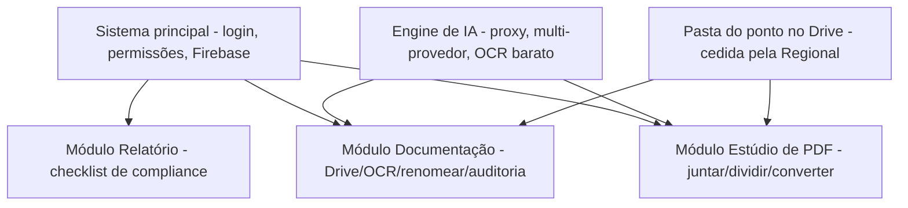
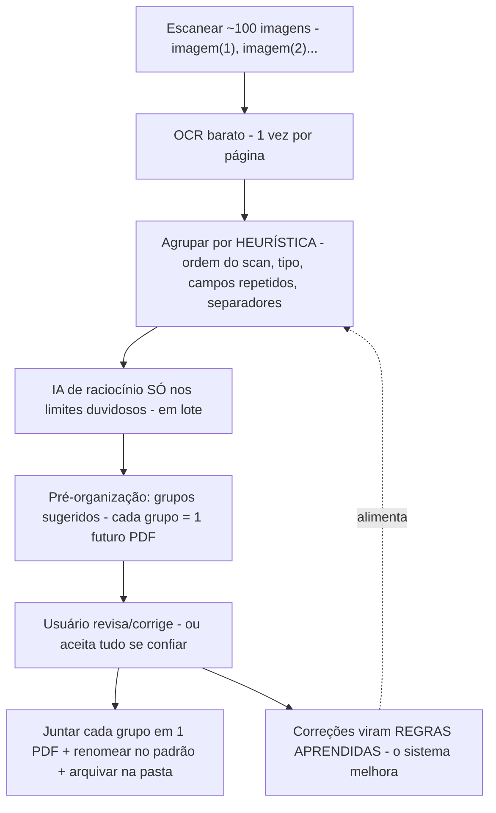

# MAPA — Módulo "Estúdio de PDF" (a versão simples e integrada do seu Gestor de Documentos)
## Documento de análise e desenho (v2 — 22/07/2026) · é desenho, não código

> **Origem:** você criou, em conversas anteriores, **4 versões** de uma ferramenta de PDF/Drive
> (em Google Apps Script). Pediu que eu analisasse as 4, identificasse a mais atual, resgatasse
> suas necessidades e propusesse **uma solução que entregue tudo, mas fácil de usar** — no
> espírito do **iLovePDF**, porém **integrada à pasta do Google Drive do ponto de atendimento**
> (pasta com permissões, cedida e gerida pela Regional).
>
> **Honestidade (importante):** eu **não tenho acesso às outras conversas do Claude** onde esses
> scripts nasceram — cada conversa é isolada. Então **reconstruí suas necessidades a partir dos
> próprios scripts** (changelogs, comentários, nomes de campos) e do que você me contou nesta
> sessão. Se eu tiver interpretado algo errado, você corrige.

---

## 1. As 4 versões que você me enviou (linhagem)
Analisando os cabeçalhos e o código, vejo uma **evolução clara** de uma mesma ferramenta:

| # | Nome do arquivo | Versão real (no código) | O que faz | Como gera o PDF |
|---|---|---|---|---|
| **4** | *Criador de PDF a partir de Imagens* | (sem versão — a **mais antiga**) | **Só imagens → PDF**. Reordenar, enquadrar, alinhar, override por página, preview ao vivo | **Google Slides** (servidor) |
| **3** | *Organizador / Criador de PDF Profissional* | **v4.1** | Imagens **+ Office/GDoc/Markdown/texto → PDF** | PDF-lib (navegador) |
| **2** | *Gestor de Documentos* | **v5.0** | Tudo do v4.1 **+ Estúdio de Divisão + salvar no Drive + ações pós-salvar + esqueleto do renomeador (Gemini)** | PDF-lib (navegador) |
| **1** | *Manual Operacional Piedade SIGA* | — | **Não é ferramenta de PDF** — gera um Google Doc com as normas do fluxo | (gera Doc) |

### 1.1 Conclusão: a versão mais atual e completa é a **#2 (Gestor de Documentos v5.0)**
É a evolução das outras. As versões 3 e 4 já estão **contidas** nela (com mais recursos). O
script #1 é outra coisa (as **normas** — valiosíssimo para o módulo de auditoria, ver
`MAPA_IA_DOCUMENTACAO_v1`, não para o PDF).

> **Detalhe técnico que vale registrar:** a versão mais antiga (#4) gera PDF via **Google Slides
> no servidor** (posicionamento preciso, mas pesado e lento); as versões novas (#3, #2) geram
> **100% no navegador via PDF-lib** (mais rápido, sem custo de servidor, sem cota). **A escolha
> das versões novas é a correta** e vamos mantê-la.

---

## 2. Suas necessidades, reconstruídas a partir dos scripts
Do que os 4 scripts revelam que você precisa (e foi refinando ao longo das versões):

1. **Juntar** vários arquivos do Drive num PDF único, **na ordem que você define** (arrastar,
   mover, inverter).
2. **Converter** para PDF quase tudo: imagens, Word/Excel/PowerPoint, Google Docs/Sheets/Slides,
   Markdown, texto.
3. **Controlar como cada página fica**: tamanho do papel (A4/A3/A5/Letter/Legal), orientação,
   enquadramento (caber, preencher, ajustar largura/altura, escala manual), alinhamento — e
   poder **mudar isso página por página** (override), com **pré-visualização ao vivo**.
4. **Dividir** um PDF: separar páginas, agrupar, exportar como arquivo único / um por página /
   por grupos, em PDF/PNG/JPEG.
5. **Salvar direto no Drive**, com opção do que fazer com os originais (manter / mover para
   "TEMP" / lixeira) — e **renomear**.
6. **Renomear em lote com IA** (o esqueleto com Gemini Vision) seguindo o padrão institucional
   `{conta} - {tipo} - {subTipo} - {origem} - {id_conta} - {data}`. *(Você disse: este não
   ficou pronto e nem foi testado.)*

> **Ou seja:** você quer um **"iLovePDF particular"** — juntar, dividir, converter, organizar e
> renomear — **dentro do Drive do ponto**, sem enviar documento sigiloso para um site de fora.

---

## 3. O problema real: ficou **poderoso, mas difícil**
Você mesmo disse: a última versão funciona, mas "**ficou um pouco complexo, exigindo uma certa
curva de aprendizado**". Analisando a interface, entendo **por que**:

1. **Muitos controles à mostra ao mesmo tempo** — papel, orientação, enquadramento, 2
   alinhamentos, escala, override por página, zoom, padrão de nomeação… tudo na tela de uma vez.
   Um usuário comum (um diácono que só quer "juntar estes 5 documentos num PDF") **se perde**.
2. **Fala em "linguagem de designer"** — "enquadramento contain/cover", "fit width", "override
   null-based" — em vez de tarefas ("juntar", "dividir").
3. **Cada usuário precisa implantar o app para si** (`access: MYSELF`, `executeAs:
   USER_DEPLOYING`) e **re-autorizar permissões** manualmente após cada deploy (o próprio código
   tem instruções de "vá no editor do GAS, execute a função manualmente para autorizar"). Isso é
   **inviável** para leigos e para escala (dezenas de pontos).
4. **A chave do Gemini fica no navegador** (o usuário digita a chave na tela) — **falha de
   segurança** que contraria o princípio que já fechamos (chave de IA só no servidor/proxy).

---

## 4. A solução proposta: **"Estúdio de PDF"**, um MÓDULO do sistema principal
A ideia central: **manter todo o poder que você já construiu, mas escondê-lo atrás de tarefas
simples** — e **integrar ao sistema principal** (mesmo login, mesmas permissões, mesma pasta do
Drive do ponto), acabando com a "cada um implanta o seu".

### 4.1 Tela inicial = tarefas, não controles (o jeito iLovePDF)
Em vez de abrir cheia de opções, a tela inicial mostra **botões grandes de tarefa**:

```
┌──────────────────────────────────────────────────────────────┐
│  📎 JUNTAR        ✂️ DIVIDIR        🔄 CONVERTER               │
│  documentos       um PDF em         Word/Excel/imagem          │
│  num só PDF       partes            para PDF                   │
│                                                                │
│  🏷️ RENOMEAR      🗜️ COMPRIMIR      🖼️ IMAGEM → PDF            │
│  com ajuda de IA  (reduzir tamanho) rápido                     │
└──────────────────────────────────────────────────────────────┘
```
- O usuário **escolhe a tarefa** e só então vê **os poucos controles daquela tarefa**.
- Todo o resto (enquadramento avançado, override por página, escala manual…) fica num
  **"⚙ Opções avançadas"** recolhido — quem precisa, abre; quem não precisa, nem vê.
- **Assistentes passo-a-passo** (1: escolha os arquivos → 2: ordene → 3: pronto), com
  **pré-visualização** sempre visível.

### 4.2 Integração com o Drive do ponto (o ponto-chave que faltava)
- O módulo **já sabe qual é a pasta do ponto** (a pasta cedida e gerida pela Regional), porque
  isso vem das **permissões do sistema principal** (Regional → Localidade → Ponto — ver
  `MAPA_IA_DOCUMENTACAO_v1`, Seção 4). O usuário **não precisa colar URL/ID** de pasta como nos
  scripts antigos — ele já está "dentro" da pasta certa.
- **Salvar** cai direto na subpasta correta (mês/categoria), reaproveitando a estrutura de
  pastas que já desenhamos no módulo de documentação.
- **Fim do "cada um implanta o seu":** o sistema principal é **um só**, publicado uma vez; o
  acesso ao Drive é resolvido pelas permissões e pelo backend — o usuário só **usa**, não
  configura nem re-autoriza nada.

### 4.3 O renomeador com IA — consertado
- **A chave da IA sai do navegador** e vai para o **proxy** (Apps Script servidor), como já
  decidido em `MAPA_IA_v1`. O usuário **nunca** digita chave nenhuma.
- **Multi-provedor** (Claude e Gemini sempre + gancho para outra), como fechamos.
- **Reaproveita o cérebro da renomeação** do módulo de documentação (OCR barato antes de IA
  cara, padrão de nome, correção de mojibake, diferenciador de duplicatas — `MAPA_IA_DOCUMENTACAO_v1`,
  Seção 3). Ou seja: **o "Renomear" do Estúdio de PDF e o renomeador automático do módulo de
  documentação são a MESMA engine**, só com portas de entrada diferentes.

### 4.4 Geração de PDF — mantém o que já funciona
- **PDF no navegador (PDF-lib/PDF.js)** — barato, rápido, sem cota de servidor, como no v5.0.
- **Aproveita o `calculateFit()`/`calculateLayout()`** que você já depurou (preview idêntico ao
  resultado) — é um código bom, não se joga fora.
- **Desfazer com refazer** (pilha undo/redo) — coerente com o que você pediu para o módulo de
  documentação (`MAPA_IA_DOCUMENTACAO_v1`, Seção 5.1).

---

## 5. Como isso conversa com o resto do sistema (arquitetura modular)
Confirma o que você já decidiu: **é tudo o mesmo sistema, em módulos.** O Estúdio de PDF é o
**módulo "Editor/conversor de PDF"** já previsto em `MAPA_IA_DOCUMENTACAO_v1`, Seção 6.2.


- **M2 (Documentação)** e **M3 (Estúdio de PDF)** compartilham a **mesma engine de IA** e a
  **mesma pasta do Drive** — não se duplica nada.
- O **manual (script #1)** vira a **fonte de normas** do "conferidor-IA" em M2.

---

## 6. Impacto, esforço e honestidade
- **Boa notícia:** você **já tem 80% do motor pronto e testado** (geração de PDF, divisão,
  conversão, preview). O trabalho é mais de **reembalar** (UI simples + integração) do que de
  criar do zero.
- **Trabalho real:** (a) redesenhar a UI para "tarefa-primeiro"; (b) integrar ao login/permissões/
  Drive do sistema principal (tirar o "cada um implanta o seu"); (c) mover a chave de IA para o
  proxy; (d) terminar o renomeador reusando a engine de M2.
- **Onde entra na ordem:** depois da **Fase 0** (permissões/segurança) e junto/depois de **M2**
  (documentação), porque compartilham engine e pasta. Não faz sentido antes.
- `[LACUNA]` A migração de "app pessoal do Apps Script" para "módulo do sistema web" precisa de
  uma decisão técnica sobre **como o sistema acessa o Drive** (via Apps Script como hoje, ou via
  API do Drive pelo backend). Isso a gente fecha na hora de implementar M3.

---

## 6-B. Integração renomeador + Estúdio de PDF: o "pipeline escanear → arquivar" (análise)
> **Pergunta do dono (22/07):** ao escanear ~100+ documentos de uma vez (que saem como
> `imagem(1)`, `imagem(2)`…), muitos pertencem ao **mesmo processo** e devem virar **um único
> PDF**. O renomeador poderia **identificar quais vão juntos**, **pré-organizar** os grupos,
> o usuário **autoriza**, e um **mecanismo de aprendizado** faria o sistema **acertar cada vez
> mais** — até o dia em que o usuário **confia e aceita tudo sem conferir**. É possível? Cabe no
> orçamento de tokens? Facilita ou complica?

### 6B.1 Veredito curto
- **Facilita o objetivo maior** (mais automação, menos erro, menos trabalho manual). É a
  evolução natural que **une** o módulo de Documentação (M2) e o Estúdio de PDF (M3) num só
  **pipeline**: *escanear → agrupar → juntar → renomear → arquivar na pasta certa.*
- **Acrescenta complexidade na construção** — mas **justificada**, porque reusa engines que já
  vamos ter (OCR, renomeador, junção de PDF). Não é um sistema novo; é um **maestro** ligando os
  que já existem.
- **Cabe no orçamento de tokens**, sim — **porque agrupar quase não usa IA cara** (Seção 6B.3).

### 6B.2 O fluxo proposto (o "pipeline")


### 6B.3 Por que agrupar quase NÃO gasta token (o ponto central)
Agrupar **não é** "mandar a IA olhar 100 imagens e decidir". Na prática, **a ordem do scanner e
o texto já extraído pelo OCR resolvem a maioria** — de graça (regras, sem IA de raciocínio):

1. **Ordem do escaneamento = sinal fortíssimo.** Você coloca os documentos de um processo
   **juntos** no scanner. Logo, `imagem(5), (6), (7)` quase sempre são o mesmo processo. A
   sequência já é 70–80% da resposta.
2. **Transição de tipo = fronteira.** Depois do OCR, o sistema sabe o tipo de cada página
   (form, nfc-e, extrato…). Um padrão como *form → nfc-e → **form** → nfc-e* indica **dois**
   processos de locomoção (cada `form` inicia um). Isso é **regra**, não IA.
3. **Campos repetidos = mesmo grupo.** Mesmo nome ("dede"), mesmo valor ("$150"), mesma data
   caindo em páginas vizinhas → mesmo processo. Comparar texto é **de graça**.
4. **Similaridade visual barata.** Um "hash perceptual" da imagem agrupa páginas parecidas
   (mesmo formulário) **sem IA** — é cálculo local.
5. **A IA cara entra SÓ nos empates** — quando as regras ficam em dúvida sobre onde um processo
   termina e outro começa. E mesmo aí, **em lote e só com o texto** (nunca reprocessando a
   imagem). São **poucas** decisões por lote.

> **Conclusão de custo:** o gasto pesado continua sendo o **OCR** (1 vez por página, barato e
> previsível — já contávamos com ele no `MAPA_IA_DOCUMENTACAO_v1`). O **agrupamento** adiciona
> **quase nada** de token. Cabe folgado no orçamento de "menos que uma janela de 5h do Claude Pro".

### 6B.4 O mecanismo de aprendizado — possível, e barato (com honestidade)
Sim, é possível o sistema "aprender" com suas correções — mas é importante **como**:

- **✅ O jeito certo (barato): aprender REGRAS, não treinar um modelo.** Cada vez que você
  corrige um agrupamento, o sistema guarda isso como uma **regra/modelo daquele ponto**. Ex.:
  *"neste ponto, locomoção = 1 form + 1 nfc-e"*, *"documentos de viagem vêm sempre com um
  envelope na frente"*. Vira uma **biblioteca de padrões** que cresce por ponto e por tipo de
  documento. **Custo de token: praticamente zero** (é bookkeeping, não IA).
- **✅ Reforço leve na IA (few-shot):** as suas últimas correções entram como **exemplos** no
  pedido à IA ("veja como este usuário agrupou casos parecidos"). Custa **pouquíssimos** tokens
  e melhora muito o acerto nos casos difíceis.
- **❌ O que NÃO vamos fazer (caro e desnecessário):** "treinar/afinar um modelo de IA próprio"
  (fine-tuning). Isso seria caro, lento e fora do orçamento. **Não precisamos** — as duas
  técnicas acima já entregam o "aprende e acerta cada vez mais" que você quer.

> **Resultado:** com o tempo, a taxa de acerto sobe, os grupos vêm cada vez mais prontos, e você
> pode ir baixando a guarda — até o ponto de **aceitar tudo de uma vez** (Seção 6B.5).

### 6B.5 Como chegar ao "confiar e aceitar tudo" com segurança (grau de confiança)
Para você poder um dia aceitar sem conferir **sem risco**, proponho um **grau de confiança** por
grupo (sugestão nova, não estava no seu pedido):

- Cada grupo sugerido recebe uma **nota de confiança** (alta / média / baixa), por cores.
- **Modo assistido (início):** você confere tudo.
- **Modo semiautomático:** o sistema **aceita sozinho** os grupos de **alta confiança** e só
  **pergunta** nos de baixa. Você revisa cada vez menos.
- **Modo confiança total:** aceita tudo — mas **sempre reversível** (desfazer/refazer, como já
  fechamos), e **sempre com um relatório do que foi feito**. Nunca é um caminho sem volta.

> Assim a "confiança" é **conquistada gradualmente e medível**, não um salto no escuro.

### 6B.6 Ideia extra que aumenta MUITO o acerto e quase não custa: folha separadora
Um truque físico, poderoso e **de custo de IA ~zero**: ao escanear, **coloque uma folha
separadora** entre um processo e outro (uma folha colorida, ou com um **QR/código** impresso, ou
até uma **folha em branco**). O sistema **detecta essa folha** como **fronteira definitiva** de
processo — acerto perto de 100%, sem depender de IA para achar o limite.
- Variante sem imprimir nada: **página em branco** como separador (detecção trivial).
- Variante robusta: **folha com QR** que pode até **já dizer** a categoria/pasta de destino do
  próximo processo. `[SUPOSIÇÃO]` a validar na implementação, mas é técnica consagrada em
  digitalização em massa.

### 6B.7 Facilita ou complica? (honestidade final)
- **Para você (uso):** facilita **muito** — de "escanear e passar horas separando/juntando/
  renomeando à mão" para "escanear, olhar a sugestão, aprovar". É o maior ganho de automação de
  todo o projeto.
- **Para a construção:** adiciona uma **camada de agrupamento** e o **aprendizado de regras** —
  é trabalho real, mas **reusa** OCR + renomeador + junção de PDF que já estão no plano. Não
  duplica sistema.
- **Risco a respeitar:** errar um **agrupamento** é mais sério que errar um **nome** (junta
  documento errado no PDF). Por isso o **grau de confiança** (6B.5), a **autorização** e o
  **desfazer/refazer** são obrigatórios, principalmente no começo.
- **Conclusão:** **vale a pena** e está **alinhada ao objetivo maior**. Recomendo tratar o
  agrupamento como parte do **mesmo pipeline** M2+M3, não como um módulo à parte.

---

## 7. Decisões que preciso confirmar com você
1. **Nome do módulo:** "Estúdio de PDF"? "Ferramentas de PDF"? "Organizador de Documentos"?
2. **Lista inicial de tarefas** (Seção 4.1): Juntar, Dividir, Converter, Renomear, Imagem→PDF —
   está boa? Quer **Comprimir** (reduzir tamanho)? Quer **assinar/carimbar** PDF no futuro?
3. **"Modo avançado" existe?** Confirmo que mantemos todo o poder atual escondido num botão de
   opções avançadas (recomendo **sim** — não perder o que você já construiu).
4. **Onde este módulo aparece:** como uma aba/menu dentro do sistema principal, ou como uma
   ferramenta que se abre "por cima" quando você está mexendo nos documentos de um mês?
5. **Pipeline escanear→arquivar (Seção 6-B):** aprovado seguir com o desenho do agrupamento
   automático + aprendizado de regras + grau de confiança? *(recomendo sim — é o maior ganho de
   automação.)*
6. **Folha separadora (6B.6):** você topa usar folhas separadoras (em branco, coloridas ou com
   QR) na hora de escanear? Isso dispara o acerto para perto de 100% quase sem custo. *(recomendo
   pelo menos a opção de folha em branco.)*

---

## 8. Resumo de uma linha
> **Pegar a sua melhor versão (Gestor de Documentos v5.0), esconder a complexidade atrás de
> botões de tarefa (estilo iLovePDF), plugar no login/permissões/Drive do sistema principal (fim
> do "cada um implanta o seu"), tirar a chave de IA do navegador, e reusar a mesma engine de IA
> do módulo de documentação — tudo como um módulo a mais do mesmo sistema. E, por cima disso, um
> pipeline "escanear → agrupar (barato, por heurística) → juntar em PDF → renomear → arquivar",
> que aprende com suas correções e vai pedindo cada vez menos conferência — sem estourar o
> orçamento de tokens.**
