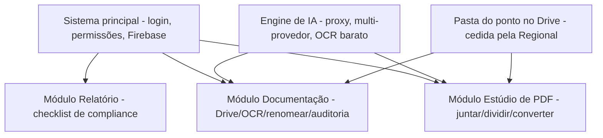

# MAPA — Módulo "Estúdio de PDF" (a versão simples e integrada do seu Gestor de Documentos)
## Documento de análise e desenho (v1 — 22/07/2026) · é desenho, não código

> **Origem:** você criou, em conversas anteriores, **4 versões** de uma ferramenta de PDF/Drive
> (em Google Apps Script). Pediu que eu analisasse as 4, identificasse a mais atual, resgatasse
> suas necessidades e propusesse **uma solução que entregue tudo, mas fácil de usar** — no
> espírito do **iLovePDF**, porém **integrada à pasta do Google Drive do ponto de atendimento**
> (pasta com permissões, cedida e gerida pela Regional).
>
> **Honestidade (importante):** eu **não tenho acesso às outras conversas do Claude** onde esses
> scripts nasceram — cada conversa é isolada. Então **reconstruí suas necessidades a partir dos
> próprios scripts** (changelogs, comentários, nomes de campos) e do que você me contou nesta
> sessão. Se eu tiver interpretado algo errado, você corrige.

---

## 1. As 4 versões que você me enviou (linhagem)
Analisando os cabeçalhos e o código, vejo uma **evolução clara** de uma mesma ferramenta:

| # | Nome do arquivo | Versão real (no código) | O que faz | Como gera o PDF |
|---|---|---|---|---|
| **4** | *Criador de PDF a partir de Imagens* | (sem versão — a **mais antiga**) | **Só imagens → PDF**. Reordenar, enquadrar, alinhar, override por página, preview ao vivo | **Google Slides** (servidor) |
| **3** | *Organizador / Criador de PDF Profissional* | **v4.1** | Imagens **+ Office/GDoc/Markdown/texto → PDF** | PDF-lib (navegador) |
| **2** | *Gestor de Documentos* | **v5.0** | Tudo do v4.1 **+ Estúdio de Divisão + salvar no Drive + ações pós-salvar + esqueleto do renomeador (Gemini)** | PDF-lib (navegador) |
| **1** | *Manual Operacional Piedade SIGA* | — | **Não é ferramenta de PDF** — gera um Google Doc com as normas do fluxo | (gera Doc) |

### 1.1 Conclusão: a versão mais atual e completa é a **#2 (Gestor de Documentos v5.0)**
É a evolução das outras. As versões 3 e 4 já estão **contidas** nela (com mais recursos). O
script #1 é outra coisa (as **normas** — valiosíssimo para o módulo de auditoria, ver
`MAPA_IA_DOCUMENTACAO_v1`, não para o PDF).

> **Detalhe técnico que vale registrar:** a versão mais antiga (#4) gera PDF via **Google Slides
> no servidor** (posicionamento preciso, mas pesado e lento); as versões novas (#3, #2) geram
> **100% no navegador via PDF-lib** (mais rápido, sem custo de servidor, sem cota). **A escolha
> das versões novas é a correta** e vamos mantê-la.

---

## 2. Suas necessidades, reconstruídas a partir dos scripts
Do que os 4 scripts revelam que você precisa (e foi refinando ao longo das versões):

1. **Juntar** vários arquivos do Drive num PDF único, **na ordem que você define** (arrastar,
   mover, inverter).
2. **Converter** para PDF quase tudo: imagens, Word/Excel/PowerPoint, Google Docs/Sheets/Slides,
   Markdown, texto.
3. **Controlar como cada página fica**: tamanho do papel (A4/A3/A5/Letter/Legal), orientação,
   enquadramento (caber, preencher, ajustar largura/altura, escala manual), alinhamento — e
   poder **mudar isso página por página** (override), com **pré-visualização ao vivo**.
4. **Dividir** um PDF: separar páginas, agrupar, exportar como arquivo único / um por página /
   por grupos, em PDF/PNG/JPEG.
5. **Salvar direto no Drive**, com opção do que fazer com os originais (manter / mover para
   "TEMP" / lixeira) — e **renomear**.
6. **Renomear em lote com IA** (o esqueleto com Gemini Vision) seguindo o padrão institucional
   `{conta} - {tipo} - {subTipo} - {origem} - {id_conta} - {data}`. *(Você disse: este não
   ficou pronto e nem foi testado.)*

> **Ou seja:** você quer um **"iLovePDF particular"** — juntar, dividir, converter, organizar e
> renomear — **dentro do Drive do ponto**, sem enviar documento sigiloso para um site de fora.

---

## 3. O problema real: ficou **poderoso, mas difícil**
Você mesmo disse: a última versão funciona, mas "**ficou um pouco complexo, exigindo uma certa
curva de aprendizado**". Analisando a interface, entendo **por que**:

1. **Muitos controles à mostra ao mesmo tempo** — papel, orientação, enquadramento, 2
   alinhamentos, escala, override por página, zoom, padrão de nomeação… tudo na tela de uma vez.
   Um usuário comum (um diácono que só quer "juntar estes 5 documentos num PDF") **se perde**.
2. **Fala em "linguagem de designer"** — "enquadramento contain/cover", "fit width", "override
   null-based" — em vez de tarefas ("juntar", "dividir").
3. **Cada usuário precisa implantar o app para si** (`access: MYSELF`, `executeAs:
   USER_DEPLOYING`) e **re-autorizar permissões** manualmente após cada deploy (o próprio código
   tem instruções de "vá no editor do GAS, execute a função manualmente para autorizar"). Isso é
   **inviável** para leigos e para escala (dezenas de pontos).
4. **A chave do Gemini fica no navegador** (o usuário digita a chave na tela) — **falha de
   segurança** que contraria o princípio que já fechamos (chave de IA só no servidor/proxy).

---

## 4. A solução proposta: **"Estúdio de PDF"**, um MÓDULO do sistema principal
A ideia central: **manter todo o poder que você já construiu, mas escondê-lo atrás de tarefas
simples** — e **integrar ao sistema principal** (mesmo login, mesmas permissões, mesma pasta do
Drive do ponto), acabando com a "cada um implanta o seu".

### 4.1 Tela inicial = tarefas, não controles (o jeito iLovePDF)
Em vez de abrir cheia de opções, a tela inicial mostra **botões grandes de tarefa**:

```
┌──────────────────────────────────────────────────────────────┐
│  📎 JUNTAR        ✂️ DIVIDIR        🔄 CONVERTER               │
│  documentos       um PDF em         Word/Excel/imagem          │
│  num só PDF       partes            para PDF                   │
│                                                                │
│  🏷️ RENOMEAR      🗜️ COMPRIMIR      🖼️ IMAGEM → PDF            │
│  com ajuda de IA  (reduzir tamanho) rápido                     │
└──────────────────────────────────────────────────────────────┘
```
- O usuário **escolhe a tarefa** e só então vê **os poucos controles daquela tarefa**.
- Todo o resto (enquadramento avançado, override por página, escala manual…) fica num
  **"⚙ Opções avançadas"** recolhido — quem precisa, abre; quem não precisa, nem vê.
- **Assistentes passo-a-passo** (1: escolha os arquivos → 2: ordene → 3: pronto), com
  **pré-visualização** sempre visível.

### 4.2 Integração com o Drive do ponto (o ponto-chave que faltava)
- O módulo **já sabe qual é a pasta do ponto** (a pasta cedida e gerida pela Regional), porque
  isso vem das **permissões do sistema principal** (Regional → Localidade → Ponto — ver
  `MAPA_IA_DOCUMENTACAO_v1`, Seção 4). O usuário **não precisa colar URL/ID** de pasta como nos
  scripts antigos — ele já está "dentro" da pasta certa.
- **Salvar** cai direto na subpasta correta (mês/categoria), reaproveitando a estrutura de
  pastas que já desenhamos no módulo de documentação.
- **Fim do "cada um implanta o seu":** o sistema principal é **um só**, publicado uma vez; o
  acesso ao Drive é resolvido pelas permissões e pelo backend — o usuário só **usa**, não
  configura nem re-autoriza nada.

### 4.3 O renomeador com IA — consertado
- **A chave da IA sai do navegador** e vai para o **proxy** (Apps Script servidor), como já
  decidido em `MAPA_IA_v1`. O usuário **nunca** digita chave nenhuma.
- **Multi-provedor** (Claude e Gemini sempre + gancho para outra), como fechamos.
- **Reaproveita o cérebro da renomeação** do módulo de documentação (OCR barato antes de IA
  cara, padrão de nome, correção de mojibake, diferenciador de duplicatas — `MAPA_IA_DOCUMENTACAO_v1`,
  Seção 3). Ou seja: **o "Renomear" do Estúdio de PDF e o renomeador automático do módulo de
  documentação são a MESMA engine**, só com portas de entrada diferentes.

### 4.4 Geração de PDF — mantém o que já funciona
- **PDF no navegador (PDF-lib/PDF.js)** — barato, rápido, sem cota de servidor, como no v5.0.
- **Aproveita o `calculateFit()`/`calculateLayout()`** que você já depurou (preview idêntico ao
  resultado) — é um código bom, não se joga fora.
- **Desfazer com refazer** (pilha undo/redo) — coerente com o que você pediu para o módulo de
  documentação (`MAPA_IA_DOCUMENTACAO_v1`, Seção 5.1).

---

## 5. Como isso conversa com o resto do sistema (arquitetura modular)
Confirma o que você já decidiu: **é tudo o mesmo sistema, em módulos.** O Estúdio de PDF é o
**módulo "Editor/conversor de PDF"** já previsto em `MAPA_IA_DOCUMENTACAO_v1`, Seção 6.2.


- **M2 (Documentação)** e **M3 (Estúdio de PDF)** compartilham a **mesma engine de IA** e a
  **mesma pasta do Drive** — não se duplica nada.
- O **manual (script #1)** vira a **fonte de normas** do "conferidor-IA" em M2.

---

## 6. Impacto, esforço e honestidade
- **Boa notícia:** você **já tem 80% do motor pronto e testado** (geração de PDF, divisão,
  conversão, preview). O trabalho é mais de **reembalar** (UI simples + integração) do que de
  criar do zero.
- **Trabalho real:** (a) redesenhar a UI para "tarefa-primeiro"; (b) integrar ao login/permissões/
  Drive do sistema principal (tirar o "cada um implanta o seu"); (c) mover a chave de IA para o
  proxy; (d) terminar o renomeador reusando a engine de M2.
- **Onde entra na ordem:** depois da **Fase 0** (permissões/segurança) e junto/depois de **M2**
  (documentação), porque compartilham engine e pasta. Não faz sentido antes.
- `[LACUNA]` A migração de "app pessoal do Apps Script" para "módulo do sistema web" precisa de
  uma decisão técnica sobre **como o sistema acessa o Drive** (via Apps Script como hoje, ou via
  API do Drive pelo backend). Isso a gente fecha na hora de implementar M3.

---

## 7. Decisões que preciso confirmar com você
1. **Nome do módulo:** "Estúdio de PDF"? "Ferramentas de PDF"? "Organizador de Documentos"?
2. **Lista inicial de tarefas** (Seção 4.1): Juntar, Dividir, Converter, Renomear, Imagem→PDF —
   está boa? Quer **Comprimir** (reduzir tamanho)? Quer **assinar/carimbar** PDF no futuro?
3. **"Modo avançado" existe?** Confirmo que mantemos todo o poder atual escondido num botão de
   opções avançadas (recomendo **sim** — não perder o que você já construiu).
4. **Onde este módulo aparece:** como uma aba/menu dentro do sistema principal, ou como uma
   ferramenta que se abre "por cima" quando você está mexendo nos documentos de um mês?

---

## 8. Resumo de uma linha
> **Pegar a sua melhor versão (Gestor de Documentos v5.0), esconder a complexidade atrás de
> botões de tarefa (estilo iLovePDF), plugar no login/permissões/Drive do sistema principal (fim
> do "cada um implanta o seu"), tirar a chave de IA do navegador, e reusar a mesma engine de IA
> do módulo de documentação — tudo como um módulo a mais do mesmo sistema.**
