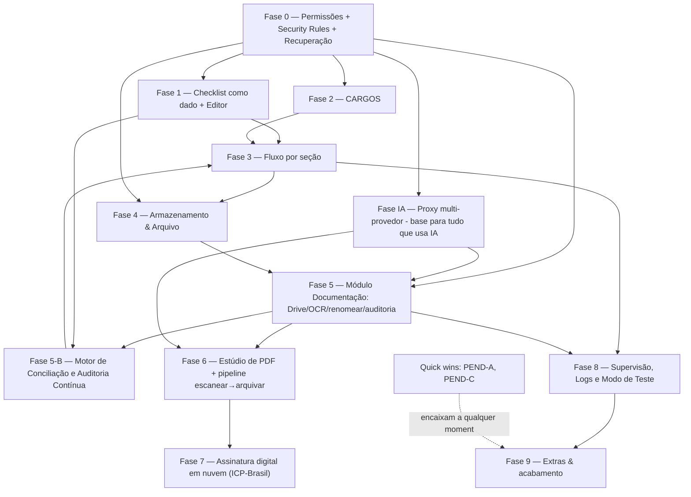

# PLANO MESTRE DE IMPLEMENTAÇÃO
## Ordem de construção de todo o sistema (v2 — 22/07/2026)

> **Para que serve:** agora que o **desenho** de todas as grandes áreas está pronto, este
> documento define **a ordem exata** de implementação — em fases e sub-rodadas pequenas,
> testáveis, sem quebrar o que já funciona. É o mapa para quando **voltarmos a codificar**.
>
> **v2 — o que mudou desde a v1:** entraram no plano os módulos novos desenhados nesta rodada de
> desenho — **modo de teste isolado**, **módulo de IA (multi-provedor)**, **módulo de
> Documentação (Drive/OCR/renomear/auditoria)**, **Estúdio de PDF**, **pipeline
> escanear→arquivar** e **assinatura digital em nuvem**. A ordem foi reorganizada para respeitar
> as dependências entre eles.
>
> **Documentos-fonte** (pasta `docs/`): `REQUISITOS_CONSOLIDADO_CCB_PIA.md` ·
> `MAPA_PERMISSOES_RELATORIOS_v1.md` · `MAPA_ARMAZENAMENTO_E_EDITOR_v1.md` ·
> `MAPA_FLUXO_POR_SECAO_v1.md` · `MAPA_MODO_TESTE_v1.md` · `MAPA_IA_v1.md` ·
> `MAPA_IA_DOCUMENTACAO_v1.md` · `MAPA_MODULO_PDF_v1.md` · `MAPA_CONCILIACAO_AUDITORIA_v1.md` ·
> `CHECKLIST_CONTEUDO.md` · `checklist_def.json`.

---

## Princípios (valem para toda a implementação)
1. **Uma entrega por sub-rodada**, em branch própria, com verificação, e **teste do dono antes do merge**.
2. **Segurança primeiro** — o que protege dado sigiloso vem antes do que é conveniência.
3. **Nunca quebrar o que já funciona** (checagem de guarda + `node --check` + render quando aplicável).
4. **Verificação real** (render de PDF/tela quando fizer sentido), não só "confia".
5. **Tom de UX**: sóbrio, profissional, moderno, com requinte — e **fácil para leigo** em tudo.
6. **IA sempre atrás do proxy** (chave nunca no navegador), **multi-provedor** (Claude/Gemini/outra).
7. **Reuso**: a mesma engine de IA e a mesma pasta do Drive servem vários módulos — não duplicar.

---

## ✅ JÁ ENTREGUE nesta sessão (base sólida, no ar)
TERM-01 (RMA→RML) · PEND-E (botão 📍) · PEND-D (troca de localidade) + busca com teclado ·
cabeçalho do PDF por imagem + versão no rodapé · identificação RRM/RML/Ponto redesenhada ·
PEND-B (pendente automático no relatório) + operações de status em bloco · data de encerramento
padrão hoje · autoria pessoal só na Ajuda · **correção do bug do Fechamento** (Security Rules) ·
organização da documentação em `docs/`.

---

## Mapa de dependências (o que precisa vir antes de quê)

---

## FASE 0 — Fundação de permissões e segurança  *(vem primeiro, é o alicerce)*
- **P0.1** Módulo isolado `PERM`: modelo de dados (`tipo`, `dominio`, `supervisorAtivo`), função
  única `pode(usuario, acao, alvo)`. Migrar `isSuperUser/isSiteAdmin/isPrivileged()` para o novo
  modelo **sem quebrar** o acesso atual. Hierarquia Regional → Localidade → Ponto.
- **P0.2** **Security Rules do Firebase por localidade** — item nº 1 de sigilo (conferidor nunca
  vê outra localidade). Testar com contas de teste.
- **P0.3** Recuperação do superusuário: 2FA + segredo de recuperação (hash) + 2 superusuários
  break-glass (2 supervisores mais ativos em 3 meses, promoção em dupla).
- **P0.4** **Trava de concorrência** (base): mecanismo de "recurso ocupado" + fila, que o módulo
  de Documentação vai precisar (vários usuários na mesma pasta) — desenhado já aqui, na fundação.
- *Checkpoint: parar e validar o sigilo com contas de teste antes de seguir.*

## FASE IA — Proxy de IA multi-provedor  *(base para todo módulo que usa IA)*
- **PIA.1** Proxy (Apps Script) com **adaptadores plugáveis**: Claude e Gemini sempre + gancho
  para outra. Chave(s) só no servidor. Config do superusuário escolhe o provedor.
- **PIA.2** **Teto de gasto/tokens** por mês + alerta antes de estourar + pausar lote.
- **PIA.3** Camada de OCR barato (motor dedicado) separada da IA de raciocínio.
- *Pode andar em paralelo à Fase 1/2, mas é pré-requisito das Fases 5, 6, 7.*

## FASE 1 — Checklist como dado + Editor (resolve ARQ-01)
- **P1.1** Migrar `SECS/ITEMS` → `/appConfig/checklistDef` (semente `checklist_def.json`), com
  **IDs estáveis** e **versão da definição** (meses fechados guardam a versão que usaram).
- **P1.2** Editor do superusuário: árvore Partes→Seções→Itens; criar/editar/renomear; **reordenar
  por setas ▲▼**; **soft-delete**; **rascunho→publicar**; pré-visualizar. É também o **alvo do
  "liberar"** do modo de teste (a versão aprimorada vira nova definição de checklist).

## FASE 2 — CARGOS
- **C1** Listas editáveis (cargos + funções) no Firebase, pré-carregadas. **C2** Perfil: usuário
  escolhe funções que aparecem no relatório. **C3** Admin atribui cargo/funções + cadastro de
  pessoas. **C4** Assinaturas do relatório (5 linhas) — render verificado. **C5** Autocomplete +
  pré-carregar assinantes do último relatório do ponto.

## FASE 3 — Fluxo colaborativo por seção  *(o maior módulo do sistema principal)*
- **P3.1** Estado por seção (vazia→em preenchimento→conferida/travada→aprovada) + cores/etiquetas.
- **P3.2** Enviar/travar seção · **P3.3** Aprovar/**devolver para correção** (anti-autoaprovação).
- **P3.4** Parcial × geral (consolidação; regenera geral ao salvar). **P3.5** Painel de progresso
  do mês (barra + prazo dia 20). *Substitui o fluxo atual. Muitas sub-rodadas pequenas.*

## FASE 4 — Armazenamento & Arquivo
- **P4.1** Guardar `.md` versionado no Firebase (geral + parciais + versões). **P4.2** Backup no
  **Drive da Regional** via Apps Script (isolado por área). **P4.3** **Console de Gestão de
  Armazenamento**: medidor visual (barra/pizza estilo Drive), seletor granular, previsão ao vivo,
  poda só com consentimento, exclusão definitiva (>2 anos, superusuário, dupla verificação),
  legal hold. **P4.4** Alertas de cota (50/75/90/95%) + auto-calibração + capacidade máxima
  (BaaS agnóstico).

## FASE 5 — Módulo de Documentação (Drive/OCR/renomear/auditoria)  *(NOVO — o "conferidor-IA")*
> Fonte: `MAPA_IA_DOCUMENTACAO_v1.md`. Depende de F0 (permissões/pastas), FIA (IA/OCR), F4 (Drive).
- **P5.1** Ingestão + OCR barato + triagem (arquitetura em camadas, para caber no orçamento).
- **P5.2** Estrutura de pastas Regional→Localidade→Ponto→mês→categorias; **editável** por
  superusuário/admin regional; **modo simples** (tudo numa pasta); **prévia por amostragem**.
- **P5.3** Renomeação padronizada (corrige mojibake; sem data no início; diferenciador de
  duplicata) — engine compartilhada com o Estúdio de PDF.
- **P5.4** Renomear/mover com **desfazer E refazer** (pilha undo/redo), escopo por domínio.
- **P5.5** Relatório de auditoria (conferidor-IA): documento/carimbo/assinatura faltando, rubrica
  vs assinatura, contas que não batem, lançamento sem documento e vice-versa — regras vindas do
  **manual operacional** (o "script #1"). Resumo + detalhado = completo; um só = parcial.
- **P5.6** LGPD: minimização, acesso por domínio, log sem conteúdo sensível, dados no Drive do
  próprio ponto. `[LACUNA]` validar retenção/zero-data-retention do provedor de IA.

## FASE 5-B — Motor de Conciliação e Auditoria Contínua  *(NOVO — o "auditor-IA")*
> Fonte: `MAPA_CONCILIACAO_AUDITORIA_v1.md`. Extensão do M5; alimenta as Fases 1 e 3.
- **P5B.1** Extração de dados-chave de cada documento para `.md` estruturado (durante o scan).
- **P5B.2** Testes documento-a-documento (three-way match CCB: envelope + ficha C-1 + recibo +
  DT), conforme as normas do manual (assinaturas, carimbos, prontuário, duplicidade).
- **P5B.3** Conciliação cruzada: lista `.md` × Relatório de Atendimentos do SIGA; Posição
  Financeira × Σ envelopes; **rastreamento banco→caixa→envelope→atendido** × razão/diário/balancete.
- **P5B.4** **Motor de asserções montável** ("perguntas de relacionamento documental"): tipos de
  regra (igualdade, soma, presença em pasta, contagem de assinaturas, ordem de datas, sequência,
  duplicidade) autoráveis como **itens de checklist** (via editor da Fase 1; testável na Fase 8).
- **P5B.5** Camada anti-fraude: Benford + duplicidade + números redondos/abaixo de alçada + mesma
  assinatura + datas fora de ordem → alertas "verificar" (não acusação).
- **P5B.6** Saída exceção-primeiro: placar conciliado×faltando, notificação do que falta,
  **pré-preenche o checklist** com não conformidades e prováveis OK — **humano sempre confirma**.
- *Custo de IA quase zero (a conciliação é matemática determinística; IA só lê ambíguo e redige).*
- `[LACUNA]` depende de exportar os relatórios do SIGA para a pasta; OCR de manuscrito pede
  confirmação humana.

## FASE 6 — Estúdio de PDF + pipeline escanear→arquivar  *(NOVO)*
> Fonte: `MAPA_MODULO_PDF_v1.md`. Reembala o seu "Gestor de Documentos v5.0" como módulo.
- **P6.1** UI tarefa-primeiro (Juntar, Dividir, Converter, Comprimir, Imagem→PDF) + **modo
  avançado fácil**. **Casa fixa no menu + atalhos contextuais.** Fim do "cada um implanta o seu".
- **P6.2** Editar PDF — **Parte A** (adicionar texto/marca/carimbo/assinatura, cobrir, mexer em
  páginas, preencher). **Parte B depois** (trocar texto embutido pela técnica cobrir+reescrever,
  melhor em PDFs nascidos digitais).
- **P6.3** Renomear (reusa engine de F5) com chave de IA no proxy.
- **P6.4** **Pipeline escanear→agrupar→juntar→renomear→arquivar**: agrupamento barato por
  heurística (ordem do scan, tipo, campos, hash) + IA só nos empates; **grau de confiança**;
  **aprendizado de regras** (por ponto) + few-shot.
- **P6.5** **Folhas separadoras** (branco / QR+cabeçalho+texto) + **editor de separadores**
  (padrão só superusuário; usuário cria derivados) + estratégia de treinamento auto-eliminável.

## FASE 7 — Assinatura digital em nuvem (ICP-Brasil)  *(NOVO — depende de F6)*
> Fonte: `MAPA_MODULO_PDF_v1.md`, Seção 4.3. Alvo: assinar em lote **pelo celular**.
- **P7.1** Integração com **provedor de certificado em nuvem** (cotar/testar; ADM referenda).
- **P7.2** Fluxo de **assinatura em lote por assinante** (fila dos 3 diáconos) + arquivamento dos
  assinados. **P7.3** Verificação de assinaturas digitais esperadas (liga com P5.5).
- `[LACUNA jurídica]` confirmar formato (PAdES) e aceitação com ADM/provedor antes de fechar.

## FASE 8 — Supervisão, Logs e Modo de Teste
> Fontes: `MAPA_FLUXO_POR_SECAO_v1.md`, `MAPA_MODO_TESTE_v1.md`.
- **P8.1** Página de arquivo/logs paginada; acesso do supervisor por domínio.
- **P8.2** **Log de auditoria append-only** (quem fez o quê; ninguém apaga).
- **P8.3** **Modo de teste isolado** (`/sandbox/{sessao}/testers/{uid}`): gaveta privada por
  testador; usuários reais/virtuais na gaveta; relatório de revisões; import/mescla pelo
  superusuário (com/sem IA); **lixeira em 2 estágios**; termos assinados por reautenticação
  Google (com IPs/MACs disponíveis).

## FASE 9 — Extras & Acabamento
- **PEND-A** (☁ salvar no Drive do sistema + Drive pessoal no modal) — *quick win*.
- **PEND-C** (verificar/ajustar "Atribuir") — *quick win*.
- **Notificações** (e-mail via Apps Script). **"Ver como" nível menor**. **Limpeza agendada**.
  **ARQ-02** (tirar imagem base64 do `index.html`).
- **Fechamento da sessão**: versão **3.0** no `config.js`, **atualizar status** no consolidado,
  **RESUMO_SESSAO.md**.

---

## Checkpoints e riscos
- **Após a Fase 0** parar e validar o sigilo (Security Rules) com contas de teste — é o alicerce.
- **Fase 3** (fluxo por seção) e **Fase 5+6** (documentação + PDF) são as maiores; cada uma em
  ~6–10 sub-rodadas.
- **Fases 5, 6 e 7** dependem de **custo** (IA e certificado): cotar/testar **antes** de codar o
  caro. O orçamento de tokens (FIA.2) protege contra surpresa.
- **Fase 7** (assinatura) tem `[LACUNA jurídica]` — não fechar sem ADM + provedor (+ jurídico).
- Cada fase termina com **relatório de integridade** e teste do dono.
- Se o escopo mudar, **atualiza-se o desenho** (docs) **antes** de codificar.

---

## Como retomamos a construção
Quando você disser "vamos implementar", começamos pela **Fase 0 / P0.1**, em branch própria, com
teste antes do merge — exatamente como fizemos as rodadas iniciais desta sessão. Até lá, seguimos
livres para **refinar o desenho** sem risco (só documentos).
