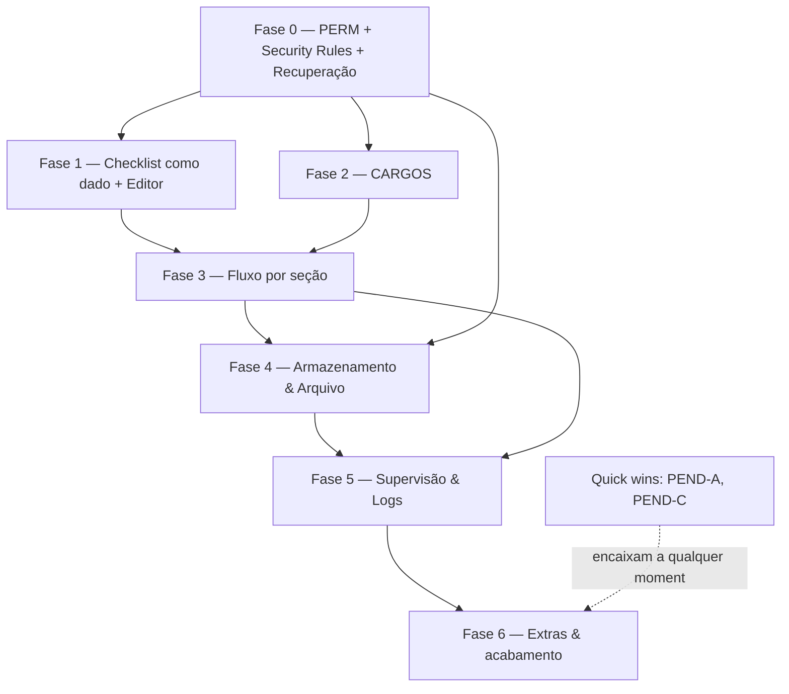

# PLANO MESTRE DE IMPLEMENTAÇÃO
## Ordem de construção de todo o sistema (v1 — 20/07/2026)

> **Para que serve:** agora que o **desenho** das grandes áreas está pronto (permissões, cargos,
> fluxo por seção, armazenamento/BaaS, recuperação, editor de checklist), este documento define
> **a ordem exata** de implementação — em fases e sub-rodadas pequenas, testáveis, sem quebrar o que
> já funciona. É o mapa para quando **voltarmos a codificar**.
>
> **Documentos-fonte** (pasta `docs/`): `REQUISITOS_CONSOLIDADO_CCB_PIA.md` ·
> `MAPA_PERMISSOES_RELATORIOS_v1.md` · `MAPA_ARMAZENAMENTO_E_EDITOR_v1.md` ·
> `MAPA_FLUXO_POR_SECAO_v1.md` · `CHECKLIST_CONTEUDO.md` · `checklist_def.json`.

---

## Princípios (valem para toda a implementação)
1. **Uma entrega por sub-rodada**, em branch própria, com verificação, e **teste do dono antes do merge**.
2. **Segurança primeiro** — o que protege dado sigiloso vem antes do que é conveniência.
3. **Nunca quebrar o que já funciona** (checagem de guarda + `node --check` + render quando aplicável).
4. **Verificação real** (render de PDF/tela quando fizer sentido), não só "confia".
5. **Tom de UX**: sóbrio, profissional, moderno, com requinte — em tudo.

---

## ✅ JÁ ENTREGUE nesta sessão (base sólida, no ar)
TERM-01 (RMA→RML) · PEND-E (botão 📍) · PEND-D (troca de localidade) + busca com teclado ·
cabeçalho do PDF por imagem + versão no rodapé · identificação RRM/RML/Ponto redesenhada ·
PEND-B (pendente automático no relatório) + operações de status em bloco · data de encerramento
padrão hoje · autoria pessoal só na Ajuda · **correção do bug do Fechamento** (Security Rules) ·
organização da documentação em `docs/`.

---

## Mapa de dependências (o que precisa vir antes de quê)

---

## FASE 0 — Fundação de permissões e segurança  *(vem primeiro)*
- **P0.1** Módulo isolado `PERM`: modelo de dados (`tipo`, `dominio`, `supervisorAtivo`), função única
  `pode(usuario, acao, alvo)`. **Migrar** `isSuperUser/isSiteAdmin/isPrivileged()` para o novo modelo
  **sem quebrar** o acesso atual.
- **P0.2** **Security Rules do Firebase por localidade** — o item nº 1 de sigilo (conferidor nunca vê
  outra localidade). Testar com contas de teste.
- **P0.3** Recuperação do superusuário: 2FA (orientação/obrigatório) + segredo de recuperação (hash) +
  2 superusuários break-glass (2 supervisores mais ativos em 3 meses, promoção em dupla).
- *Sem UI nova grande ainda; é fundação.*

## FASE 1 — Checklist como dado + Editor (resolve ARQ-01)
- **P1.1** Migrar `SECS/ITEMS` → `/appConfig/checklistDef` (semente `checklist_def.json`), com **IDs
  estáveis** e **versão da definição** (meses fechados guardam a versão que usaram).
- **P1.2** Editor do superusuário: árvore Partes→Seções→Itens; criar/editar/renomear; **reordenar por
  setas ▲▼**; **soft-delete** (arquivar); **rascunho→publicar**; pré-visualizar.

## FASE 2 — CARGOS
- **C1** Listas editáveis (cargos + funções) no Firebase, pré-carregadas. **C2** Perfil: usuário escolhe
  quais funções aparecem no relatório. **C3** Admin atribui cargo/funções + **cadastro de pessoas**.
  **C4** Assinaturas do relatório (5 linhas) — com render verificado. **C5** Autocomplete + pré-carregar
  assinantes do último relatório do ponto.

## FASE 3 — Fluxo colaborativo por seção  *(o maior módulo)*
- **P3.1** Estado por seção (vazia→em preenchimento→conferida/travada→aprovada) + cores/etiquetas.
- **P3.2** Enviar/travar seção · **P3.3** Aprovar/**devolver para correção** (anti-autoaprovação).
- **P3.4** Parcial × geral (consolidação; regenera geral ao salvar). **P3.5** Painel de progresso do mês.
- *Substitui o fluxo atual rascunho→revisão→publicado. Muitas sub-rodadas pequenas.*

## FASE 4 — Armazenamento & Arquivo
- **P4.1** Guardar `.md` versionado no Firebase (geral + parciais + versões). **P4.2** Backup no **Drive
  da Regional** via Apps Script (isolado por área). **P4.3** **Console de Gestão de Armazenamento**:
  medidor visual (barra/pizza estilo Drive), seletor granular, **previsão ao vivo**, **poda só com
  consentimento**, **exclusão definitiva (>2 anos, superusuário, dupla verificação)**, **legal hold**.
  **P4.4** Alertas de cota (50/75/90/95%) + **auto-calibração** pelo uso real + **capacidade máxima**
  (BaaS agnóstico).

## FASE 5 — Supervisão & Logs
- **P5.1** Página de arquivo/logs: tabela paginada (10–100), metadados, links geral/parte/seção,
  ações por escopo. **P5.2** Acesso do supervisor aos relatórios/versões da equipe (por domínio).
  **P5.3** **Log de auditoria append-only** (quem fez o quê; ninguém apaga).

## FASE 6 — Extras & Acabamento
- **PEND-A** (☁ salvar no Drive do sistema + Drive pessoal no modal de relatório) — *quick win*.
- **PEND-C** (verificar/ajustar "Atribuir") — *quick win*.
- **Notificações** (e-mail via Apps Script). **"Ver como" nível menor**. **Limpeza agendada** (Apps
  Script). **ARQ-02** (tirar a imagem base64 restante do `index.html`).
- **Fechamento da sessão**: versão **3.0** no `config.js`, **atualizar status** no consolidado,
  **RESUMO_SESSAO.md**.

---

## Checkpoints e riscos
- **Após a Fase 0** parar e validar o sigilo (Security Rules) com contas de teste — é o alicerce.
- **Fase 3** é a maior; será quebrada em ~6–10 sub-rodadas.
- Cada fase termina com um **relatório de integridade** e teste do dono.
- Se o escopo mudar de novo, **atualiza-se o desenho** (docs) **antes** de codificar — mantendo o
  método "desenhar → depois construir".

---

## Como retomamos a construção
Quando você disser "vamos implementar", começamos pela **Fase 0 / P0.1**, em branch própria, com
teste antes do merge — exatamente como fizemos as rodadas iniciais desta sessão. Até lá, seguimos
livres para **refinar o desenho** sem risco (só documentos).
